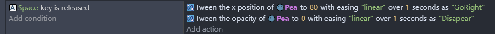
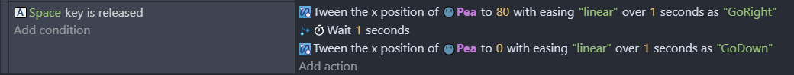
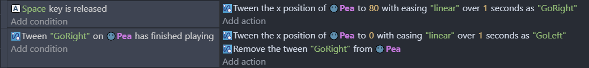
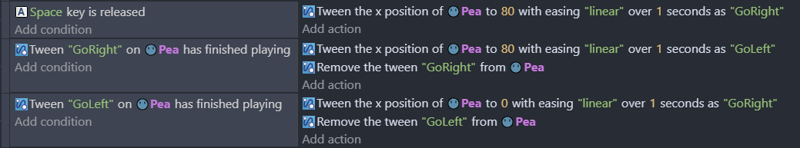

# Tween behavior

The Tween (from inbe**tween**) [behavior](/gdevelop5/behaviors) animates [objects](/gdevelop5/objects) properties over time:

- Position
- Angle
- Size
- Opacity
- Color
- or any other values through variables

!!! note

    [easings.net](https://easings.net/) is an interactive catalog of all easing functions (speed shapes) that can be used by the tween behavior.

## Play tweens simultaneously

Tweens can be played simultaneously simply by adding actions next to each other.

## Chain tweens

Tweens can be delayed to be played one after the other using the **wait** action.

The same result can be achieved using the **tween finished playing** condition. This method should be used when the object may not do the second tween under some conditions.

## Loop tweens

Tweens can be looped by starting back the first tween at the end of a chain.

Some extensions also have built-in looping:
- [Flash](/gdevelop5/extensions/flash)
- [Rectangular movement](/gdevelop5/extensions/rectangle-movement)
- [Ellipse movement](/gdevelop5/extensions/ellipse-movement)
- [Animated Back and Forth Movement](/gdevelop5/extensions/animated-back-and-forth-movement)

## Tween 3D objects

The [3D tween](/gdevelop5/extensions/tween3d) extension has additional actions dedicated to 3D.

## Examples

!!! note

        **See it in action!** 🎮

    Open these examples online.

**Tween Test**

[Open example in GDevelop](https://editor.gdevelop.io/?project=example://tween-test){ .md-button .md-button--primary }

[{ width="320" }](https://editor.gdevelop.io/?project=example://tween-test)

**Tween Animations**

[Open example in GDevelop](https://editor.gdevelop.io/?project=example://tween-animations){ .md-button .md-button--primary }

[{ width="320" }](https://editor.gdevelop.io/?project=example://tween-animations)

**Pairs**

[Open example in GDevelop](https://editor.gdevelop.io/?project=example://pairs){ .md-button .md-button--primary }

{ width="320" }

## Reference

All actions, conditions and expressions are listed in [the tween behavior reference page](/gdevelop5/all-features/tween/reference/).