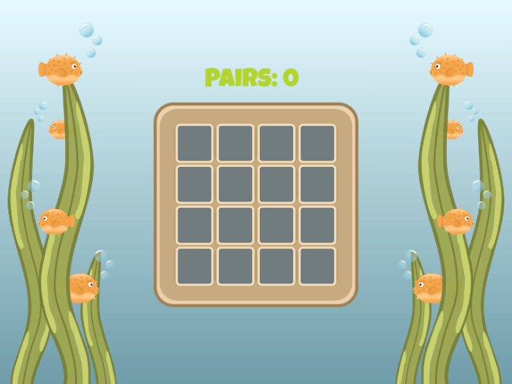

# Tween behavior

 Tweens (from inbe**tween**) let you animate properties of an [object](/gdevelop5/objects) over some time, like its position or size. This [behavior](/gdevelop5/behaviors) comes with various easing effects used when interpolating between the start and end value to create cool effects like shaking user interface buttons or collectibles that slowly fade out after picking them up.

!!! note

    Visit [easings.net](https://easings.net/) to preview various easing effects.

### Usage

To use the tween behavior, you need to add it to an object in the object editor. After that, you can add tweens to your object in the events sheet.

Tweens can be played in a sequence if you want to create more complex animations. This is called "chaining." In the following example, the sprite starts playing a "Tween the scale" animation to shrink it down when it is clicked with the mouse. After the tween has finished, a new tween animation starts to scale it up again. This creates a loop, which makes the sprite pulsate for all eternity. A variation of this can also create platforms that move up and down or enemies patrolling between waypoints.

### Conditions

**Tween exists**

  - **object**: The object the animation should be applied to
  - **behavior**: The tween behavior that is applied to the object
  - **identifier**: A text (string) that is used to identify a tween animation on an object for later use

This condition checks if the given tween has been defined and returns true if it already exists.

**Tween has finished playing**

  - **object**: The object the animation should be applied to
  - **behavior**: The tween behavior that is applied to the object
  - **identifier**: A text (string) that is used to identify a tween animation on an object for later use

This condition checks if the given tween has reached its end position and thus finished playing. Be aware that this condition will not work if you enable the "Destroy this object when tween finishes" setting on the tween action.

**Tween is playing**

  - **object**: The object the animation should be applied to
  - **behavior**: The tween behavior that is applied to the object
  - **identifier**: A text (string) that is used to identify a tween animation on an object for later use

This condition checks if the given tween has been started and is currently playing.

### Actions

**Add object angle tween**

  - **object**: The object the animation should be applied to
  - **behavior**: The tween behavior that is applied to the object
  - **identifier**: A text (string) that is used to identify a tween animation on an object for later use
  - **to angle**: The target angle that the object should reach
  - **easing**: A predefined mathematical function to be used to calculate the value between start and end.
  - **duration**: The time in milliseconds (ms) in which the tween animation will be played from start to end
  - **destroy this object when tween finishes**: The object can be destroyed automatically when the tween reaches its end value.

This action starts an angle tween and rotates the object from its current angle to the target angle.

**Add object color tween**

  - **object**: The object the animation should be applied to
  - **behavior**: The tween behavior that is applied to the object
  - **identifier**: A text (string) that is used to identify a tween animation on an object for later use
  - **to color**: The target color to apply to the object's tint as a text (string) with values separated by semicolons. "255;255;255" means the original color of the sprite (no tint at all)
  - **easing**: A predefined mathematical function to be used to calculate the value between start and end.
  - **duration**: The time in milliseconds (ms) in which the tween animation will be played from start to end
  - **destroy this object when tween finishes**: The object can be destroyed automatically when the tween reaches its end value.

This action starts a color tween and interpolates the object tint from its current color to the target color.

**Add object opacity tween**

  - **object**: The object the animation should be applied to
  - **behavior**: The tween behavior that is applied to the object
  - **identifier**: A text (string) that is used to identify a tween animation on an object for later use
  - **to opacity**: The target opacity to apply to the objects as a number between 0 (invisible) and 255 (completely visible)
  - **easing**: A predefined mathematical function to be used to calculate the value between start and end.
  - **duration**: The time in milliseconds (ms) in which the tween animation will be played from start to end
  - **destroy this object when tween finishes**: The object can be destroyed automatically when the tween reaches its end value.

This action starts an opacity tween and interpolates the object's opacity from its current value to the target opacity.

**Add object position tween**

  - **object**: The object the animation should be played applied to
  - **behavior**: The tween behavior that is applied to the object
  - **identifier**: A text (string) that is used to identify a tween animation on an object for later use
  - **to X**: The target position on the X-axis that the object should reach
  - **to Y**: The target position on the Y-axis that the object should reach
  - **easing**: A predefined mathematical function to be used to calculate the value between start and end.
  - **duration**: The time in milliseconds (ms) in which the tween animation will be played from start to end
  - **destroy this object when tween finishes**: The object can be destroyed automatically when the tween reaches its end value.

This action starts a position tween and moves the object from its current position to the target position.

**Add object position X tween**

  - **object**: The object the animation should be applied to
  - **behavior**: The tween behavior that is applied to the object
  - **identifier**: A text (string) that is used to identify a tween animation on an object for later use
  - **to X**: The target position on the X-axis that the object should reach
  - **easing**: A predefined mathematical function to be used to calculate the value between start and end.
  - **duration**: The time in milliseconds (ms) in which the tween animation will be played from start to end
  - **destroy this object when tween finishes**: The object can be destroyed automatically when the tween reaches its end value.

This action starts a tween for the object's X position and moves the object from its current X position to the target X position.

**Add object position Y tween**

  - **object**: The object the animation should be played applied to
  - **behavior**: The tween behavior that is applied to the object
  - **identifier**: A text (string) that is used to identify a tween animation on an object for later use
  - **to Y**: The target position on the Y-axis, that the object should reach
  - **easing**: A predefined mathematical function to be used to calculate the value between start and end.
  - **duration**: The time in milliseconds (ms) in which the tween animation will be played from start to end
  - **destroy this object when tween finishes**: The object can be destroyed automatically when the tween reaches its end value.

This action starts a tween for the object's Y position and moves the object from its current Y position to the target Y position.

**Add object scale tween**

  - **object**: The object the animation should be applied to
  - **behavior**: The tween behavior that is applied to the object
  - **identifier**: A text (string) that is used to identify a tween animation on an object for later use
  - **to scale X**: The target scale on the X-axis that the object should reach. One is the original scale, two means double scale, and 0.5 is half scale.
  - **to scale Y**: The target scale on the Y-axis, that the object should reach. One is the original scale, two means double scale, and 0.5 is half scale.
  - **easing**: A predefined mathematical function to be used to calculate the value between start and end.
  - **duration**: The time in milliseconds (ms) in which the tween animation will be played from start to end
  - **destroy this object when tween finishes**: The object can be destroyed automatically when the tween reaches its end value.

This action starts a scale tween and scales the object from its current scale to the target scale.

**Add object scale X tween**

  - **object**: The object the animation should be applied to
  - **behavior**: The tween behavior that is applied to the object
  - **identifier**: A text (string) that is used to identify a tween animation on an object for later use
  - **to scale X**: The target scale on the X-axis, that the object should reach. 1 is the original scale, 2 means double scale and 0.5 is half scale.
  - **easing**: A predefined mathematical function to be used to calculate the value between start and end.
  - **duration**: The time in milliseconds (ms) in which the tween animation will be played from start to end
  - **destroy this object when tween finishes**: The object can be destroyed automatically when the tween reaches its end value.

This action starts a tween for the object's X scale and scales the object from its current X scale to the target X scale.

**Add object scale Y tween**

  - **object**: The object the animation should be applied to
  - **behavior**: The tween behavior that is applied to the object
  - **identifier**: A text (string) that is used to identify a tween animation on an object for later use
  - **to scale Y**: The target scale on the Y-axis, that the object should reach. One is the original scale, two means double scale, and 0.5 is half scale.
  - **easing**: A predefined mathematical function to be used to calculate the value between start and end.
  - **duration**: The time in milliseconds (ms) in which the tween animation will be played from start to end
  - **destroy this object when tween finishes**: The object can be destroyed automatically when the tween reaches its end value.

This action starts a tween for the object's Y scale and scales the object from its current Y scale to the target Y scale.

**Add object variable tween**

  - **object**: The object the animation should be applied to
  - **behavior**: The tween behavior that is applied to the object
  - **identifier**: A text (string) that is used to identify a tween animation on an object for later use
  - **object variable**: The variable holding the numeric value to be tweened
  - **from value**: The start value (can be any numerical value)
  - **to value**: The end value (can be any numerical value)
  - **easing**: A predefined mathematical function to be used to calculate the value between start and end.
  - **duration**: The time in milliseconds (ms) in which the tween animation will be played from start to end
  - **destroy this object when tween finishes**: The object can be destroyed automatically when the tween reaches its end value.

This action starts a tween for an object's variable and interpolates the value from start to end.

**Add text size tween**

  - **object**: The text object the animation should be applied to
  - **behavior**: The tween behavior that is applied to the object
  - **identifier**: A text (string) that is used to identify a tween animation on an object for later use
  - **to character size**: The target character size of the text object.
  - **easing**: A predefined mathematical function to be used to calculate the value between start and end.
  - **duration**: The time in milliseconds (ms) in which the tween animation will be played from start to end
  - **destroy this object when tween finishes**: The object can be destroyed automatically when the tween reaches its end value.

    This action starts a tween for the text object's character size and resizes it from its current character size to the target size. \<note important\>Warning: this tween causes the text to be recalculated each frame and can cause lag if used on lots of objects simultaneously.

**Pause a tween**

  - **object**: The object the animation should be applied to
  - **behavior**: The tween behavior that is applied to the object
  - **identifier**: A text (string) that is used to identify a tween animation on an object for later use

This action pauses the given tween at its current value. The tween can later be resumed via the corresponding action.

**Remove a tween**

  - **object**: The object the animation should be applied to
  - **behavior**: The tween behavior that is applied to the object
  - **identifier**: A text (string) that is used to identify a tween animation on an object for later use

    This action removes the given tween from the object. Use this action when you want to chain tween animations to remove the old tween before starting the next one.\<note important\>Warning: This instruction is crucial. If the condition "has finished playing" doesn't seem to trigger your chains, make sure to remove the previous tween before starting the new one.

**Resume a tween**

  - **object**: The object the animation should be applied to
  - **behavior**: The tween behavior that is applied to the object
  - **identifier**: A text (string) that is used to identify a tween animation on an object for later use

This action resumes a previously paused tween.

**Stop a tween**

  - **object**: The object the animation should be applied to
  - **behavior**: The tween behavior that is applied to the object
  - **identifier**: A text (string) that is used to identify a tween animation on an object for later use
  - **jump to end**: Check "Yes" to immediately set the current value equals the end value or "No" to stop the tween in place

This action stops the given tween. Depending on the chosen value in "jump to end", the property will be set to the end value in case of "Yes" or stay at its current value if "No" was chosen.

### Expressions

**Progress of a tween**

  - **object**: The object the animation should be applied to
  - **behavior**: The tween behavior that is applied to the object
  - **identifier**: A text (string) that is used to identify a tween animation on an object for later use

This expression returns the tween's current progress between the start value (0) and end value (1). If the tween's duration were, for example, 1000ms, it would return a progress of 0.5 after 500ms. Use this expression to chain tweens from multiple objects after a certain time has passed.

## Examples

!!! note

        **See it in action!** 🎮

    Open these examples online.

**Tween Test**

[Open example in GDevelop](https://editor.gdevelop.io/?project=example://tween-test){ .md-button .md-button--primary }

**Tween Animations**

[Open example in GDevelop](https://editor.gdevelop.io/?project=example://tween-animations){ .md-button .md-button--primary }

**Pairs**

[Open example in GDevelop](https://editor.gdevelop.io/?project=example://pairs){ .md-button .md-button--primary }

## Reference

All actions, conditions and expressions are listed in [the tween behavior reference page](/gdevelop5/all-features/tween/reference/).