# Contributing to the assets store

You can contribute to GDevelop's Assets Store with royalty free/public domain resources that can be used by everyone for any kind of project, or submit your own game art.
Assets have to be submitted into category and sub-category folders. Images, audio and fonts should be named in plain English as the final user will read them.

GDevelop creators can add assets to the project without having to worry about editing. This means that submitted art, has to follow a number of technical constraints.


## Prepare an asset pack packaging

A pack with an attractive thumbnail makes it more visible, contrasted colors can be used. The thumbnail should reflect the pack's. Thumbnails that put assets in context should be preferred to grids of assets.

- Thumbnail and previews must be 16:9 1280x720 pixels or 1920x1080 in PNG only.
- The thumbnail must be named: `thumbnail.png`.


### Prepare additional packaging for paid packs

Users won't be able to browse the content of a pack before they buy it. Additional images can help them figuring out if a pack suit their needs.
There can be up 9 of them. They must be named `preview1.png`, `preview2.png`, ..., `preview9.png`.

Paid packs also need an extra `pack.json` file located at the root of the pack folder.
It contains the pack's name, description, price in Euro, and the categories.

!!! note

     - Value: 123 = 1.23€ (Euro)
     - Categories: Remove words that don't correspond to your pack.


pack.json
```
{
  "longDescription": "Write the description of your pack here. You can add a new line like this:\nThis is a new line.",
  "tag": "The name of your pack",
  "sellerId": "LEAVE EMPTY",
  "sellerStripeAccountId": "LEAVE EMPTY",
  "prices": [
    {
      "value": 123,
      "name": "default"
    }
  ],
  "categories": ["full-game-pack", "character", "props", "background", "visual-effect", "interface", "prefab", "sounds"]
}
```

!!! note

    Learn more about the selling process on the [selling assets page](/gdevelop5/community/sell-asset-pack-store).


## Package the asset images

In a nutshell: these are the basic rules to submit video game asset images. Make sure that your files respect the following guidelines:

  * Each image frame, has to be a png transparency file
  * Every animation frame has to be the same pixel size as the other animation states
  * Tiles and GUI images have to be properly aligned

!!! note

        Sprite sheets **are not supported**! Each animation frame must **be a separate image**.
    GDevelop does not support image the origin point for different animations yet.


GDevelop's most common sizes for animation assets are:

  * Mobile: 720x1280
  * Desktop: 1280x720
  * Desktop full HD: 1920x1080


## Package images using GDevelop

You can create an asset pack with GDevelop editor following these steps:

- Create an empty scene
- Create objects that use the images
- Right click on **Scene Objects** and choose **Export as a pack**

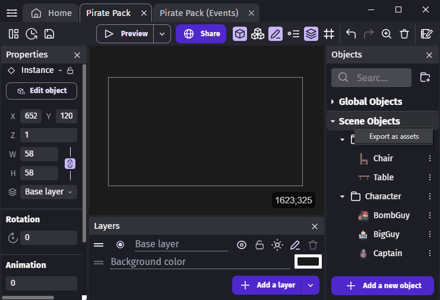

The exported GDO file contains all the objects configuration and the images files that they use.

### Still images

Still images don't need any configuration with GDevelop editor. You can put them in a folder next to the GDO file. You Still have to make sure to follow the [naming best practices](#follow-naming-best-practices).


### Sprites with animations or states

Images that represent a same object at different states should be in the same [Sprite](/gdevelop5/objects/sprite) object as animations.

!!! tip

    Frames of all animations of an object can be imported at once by selecting several files. The editor will detect animation names automatically.

Each state (called **Animation** in the editor) can be animated or not.

Some instances of states:

- Empty or Filled
- Close or Open
- Locked or Unlocked
- On or Off

If your pack contains color variations of the same, it's recommended to create an object for each one.

Collections of images like playing cards should be merged into one object that contains an animation for each card.


### Tiled images

Images that can be used as a pattern should be [Tiled sprites](/gdevelop5/objects/tiled_sprite).


### 9-patches

[Panel Sprite ("9-patch")](/gdevelop5/objects/panel_sprite) is an object where its image is split into 9 pieces or slices and each slice is scaled separately.

Corners should be fit as precisely as possible. This allows to use smaller objects size (where the center reaches 0 pixel).


### Tile maps

[Tile map](/gdevelop5/objects/tilemap) are not supported by the asset store.


### UI assets

Some instances of UI objects that can be included in an asset pack:

- [Button](/gdevelop5/objects/button)
- [Multi-touch joystick](/gdevelop5/objects/multitouch-joystick)
- [Slider](/gdevelop5/objects/slider)
- [Toggle switch](/gdevelop5/objects/toggle-switch)
- [Resource bar](/gdevelop5/objects/resource-bar)


### Organize assets into folders

In the editor, objects can be organized into folder. The asset store will display the same folders and use them as tags to let users search for assets. 

Folders name should not be too specific because it's the purpose of object names. For example, objects "BlueCar" and "RedCar" should be in a folder named "Vehicle" and not "Car" because it allows users to browse every vehicle in the asset store. They can already find cars as the search also use object names.

Some examples of folders names
- Character
- Animal
- Plant
- Vehicle
- Building
- Collectable
- Rock
- Ground
- Wall
- Furniture
- Prop
- Weapon
- Food

!!! note

    When a pack contains a lot of objects, more specific folders can be used.


## Package 3D models

3D models don't need any configuration with GDevelop editor. You send them in an archive directly. You Still have to make sure to follow the [naming best practices](#follow-naming-best-practices).

Supported 3D file formats are:

- .glb
- .blend
- .gltf
- .obj
- .fbx
- .x3d
- .vrml

**Animation names** should be meaningful such as `run`, `jump`, `idle`, etc.

**Dimensions** of 3d models must be consistent across a pack. For instance, props should fit characters hands.

**The point of origin** is important, it will be used as the position and rotation center of object in GDevelop.

**Textures** are supported only in format types that are contained, such as `.glb`, `.blend`, `.fbx`.


!!! note
    
    There's no need to add images preview for the models, the asset store will automatically generate them.


## Package audio

Put your .aac or .wav files (prefer .aac) directly in a folder, with the name to be displayed: `Laser effect.aac`, `Background music.aac`.

!!! warning

        🚨 Careful about the size! Players are sensitive to the size of a game download (especially on mobile and on the web). **Try to keep music file sizes around 1 to 2 MB.  In rare cases, these can be 4 or 5 MB, but not larger.** Consider downgrading the quality a bit to keep the music files around these sizes.
    Sound effects are usually even smaller. If a sound file is larger than 200 or 300 KB, consider downgrading the quality.

`TAGS.md` files will work like for images. Sub folders are also used for tags as described for images.

A great tool to convert audio files to AAC format is [fre:ac](https://www.freac.org/).  fre:ac is free, open-source, and cross-platform.  It can process batches of files, with many options on how they are named and put into folders.

- Choose the encoder called "Fraunhofer FDK AAC Encoder".
- Select "File format > AAC"
- Select "Quality > Set Quality > 3"

This will create high-quality audio files, but using a variable bit rate that won't exceed 96 kbps (assuming stereo input).


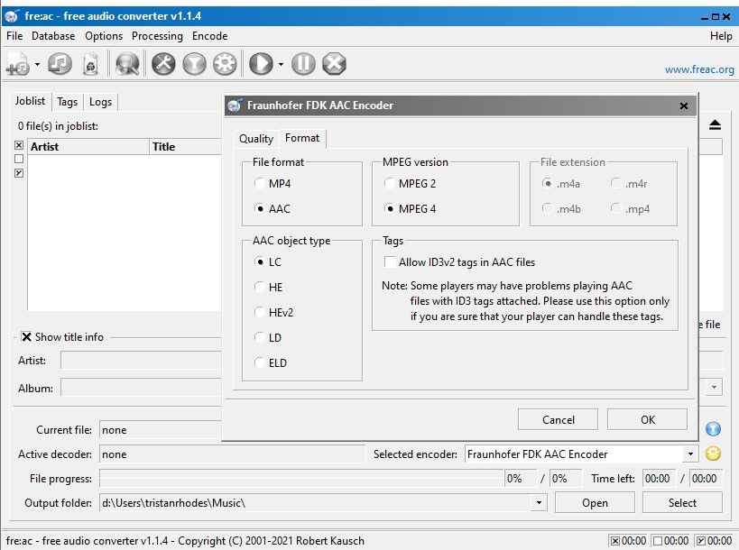

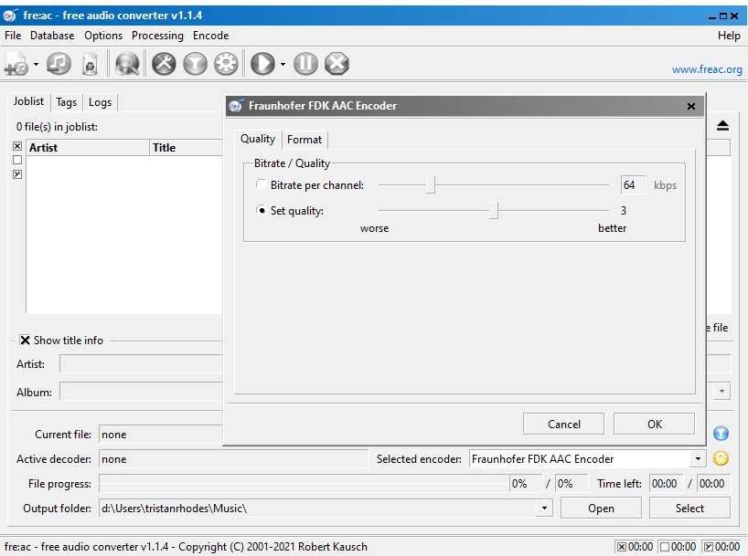

!!! tip

        **How to submit my sounds and music when they are ready?**

    Zip the folder containing them and send them to the GDevelop team on Github by opening an [issue here](https://github.com/4ian/GDevelop/issues/new?assignees=&labels=%F0%9F%93%A6+Asset+Store+submission&template=--asset-store-submission.md&title=).


## Package fonts

Put the fonts in to a `Font` folders.
Formats supported are:

- .ttf
- .otf


## Follow naming best practices

Object (or file) names must be descriptive. They are used by the search engine of the asset store.

Instances of good names:

- Tall Palm Tree
- Desert Background
- Yellow Sport Car

Generic names to avoid:

- Building 5
- Player
- Item 37
- Robert (a proper noun)

If your file names are already set, you don't need to change them unless they are only numbers.

!!! note

    In this last case, you can rename several files at once by selecting them in the file explorer and use a shortcuts (F2 to rename on Windows, Enter on macOS...). The file explorer will automatically add a number suffix to them.


## License

Put a license.txt file in your folder. Make sure to put your name in this license file too (or the name of the original author).
The importer will be adapted to understand the license file.

!!! danger

    Free asset packs with unclear licenses won't be accepted. In this case, you should get in touch with the author for clarifications and ask if they allow redistribution of their assets. The license must:
    
    - Allow to Use the assets for free and for any purpose
    - Allow modifications or derived work
    - State if attribution is required or not

## Something unclear?

Ask a question on [this Trello board](https://trello.com/c/s8RctC9M/2-asset-rules-and-regulations) card. If the rules here are too complicated or are giving you too much work, you can suggest a new rule and we'll see if we can adapt the importer so that it can understand your asset structure.
The goal is to make objects more or less automatically!


## How to send my assets when they are ready?

Zip the folder containing them and send them to the GDevelop team on Github by opening an [issue here](https://github.com/4ian/GDevelop/issues/new?assignees=&labels=%F0%9F%93%A6+Asset+Store+submission&template=--asset-store-submission.md&title=).


## Package objects without using GDevelop (the hard way)

[Entropy](https://gd.games/Entropy) has created a solution to upload, name, and [license](https://wiki.gdevelop.io/gdevelop5/community/sell-asset-pack-store/) your Assets. Go to [this GitHub page](https://github.com/Entr0py404/GDev-Asset-Store-Tool/releases/tag/v1.4) to download the Windows app, and [watch his Twitch](https://www.twitch.tv/videos/1641376379?t=00h02m50s) to see how to use the tool.

### Naming assets

For unanimated sprites, a single image with the name of the object is enough. On the contrary, animated sprites require multiple animated frames, which have to be named properly.
While writing your file names, it is important that you follow a specific naming structure:

```
BaseName_AnimationState_frame#.png
```

For a character called "Red Hero", with 4 frames of a Running animation

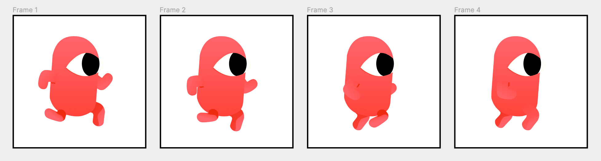

```
RedHero_Run_1.png
RedHero_Run_2.png
RedHero_Run_3.png
RedHero_Run_4.png
```


If the same character is caring a prop, the naming should appear on the Animation State. Not on the Character name.

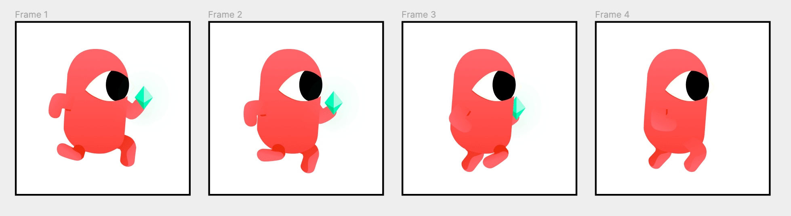
```
RedHero_RunJewel_1.png
RedHero_RunJewel_2.png
RedHero_RunJewel_3.png
RedHero_RunJewel_4.png
```


!!! note

        **A note on animation states:**
    If the **animated** object only has one animation state, there is no need to specify if the animation is "Walk, Idle, Climb, Death..." on the name. An animation index will do: `Jewel_1.png`, `Jewel_2.png`, `Jewel_3.png`.


- If you want to create a **[Tiled sprite](/gdevelop5/objects/tiled_sprite)** (for backgrounds or repeating patterns):
    - Prefix the *base name* by `tiled_`. For example: `tiled_Grass Background.png`

- If you want to add a **[9-Patch (Panel Sprite)](/gdevelop5/objects/panel_sprite)** object that can be stretched with the center and the border repeated:
    - In an image software slice your image in 9 different images, and name them: `9patch_BaseName_gravity.png` with gravity being: `southwest`, `southeast`, `south`, `northwest`, `northeast`, `north`, `west` and `east`.

All these files will be used by our server to generate a unique texture used in the 9-Patch object.

For example:
```
9patch_Grass_center.png
9patch_Grass_east.png
9patch_Grass_north.png
9patch_Grass_northeast.png
9patch_Grass_northwest.png
9patch_Grass_south.png
9patch_Grass_southeast.png
9patch_Grass_southwest.png
9patch_Grass_west.png
```


### Assets with specific time duration

To specify FPS and looping for an animation, you'll need to add a METADATA file to your folder by creating a .json file (a text file) and pasting this structure:

basename_METADATA.json
```
    {
        "timeBetweenFrames": 0.2,
        "loop": false
    }
```

!!! tip

    Save the .json file as the **METADATA** of your object with the following structure: `BaseName_METADATA.json`

- If you have **multiple animation status** and **each must have a different speed**, create a .json file **per animation state**, using this name: `BaseName_AnimationState_METADATA.json`.

For example:

```
Spaceship_Idle_METADATA.json
Spaceship_Flying_METADATA.json
Spaceship_Destroyed_METADATA.json
...
```

Your file should look something like this:

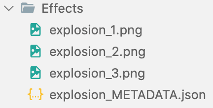


If you are not sure about the number that "time between frames" will represent, [this article](http://www.stopmotionworks.com/stopwatch.htm) explains it:
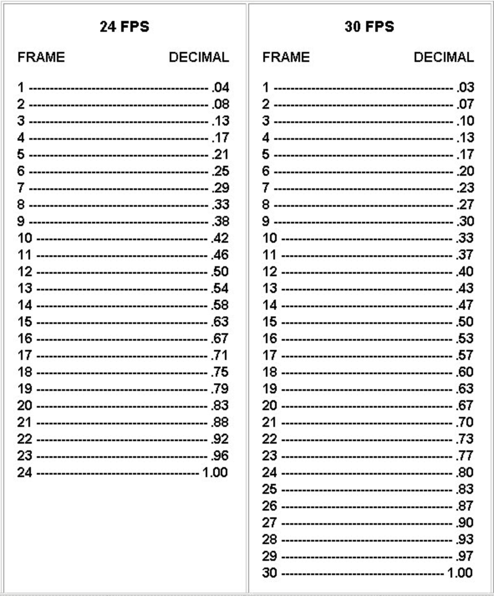


### Adding tags to your assets

Tags allow creators to search your assets. These tags can be things like "side view", "pixel art" and so on.
We recommend you to use Asset Store's existing tags.

Put all your images in a single folder, and inside that folder create a file called `TAGS.md`. In this file, put the tags of the assets, separated by a comma. All tags must be singular, not plural.
Start the file by one of these tags (depending on the type of pack): `top-down`, `side view` or `interface`.

For example:

```
side view, pirate, ship, sea
```


!!! tip

    Folder names will be read as tags. Make sure to use plain English for each folder.

You can put your images in different sub folders. Each sub folder will be used as a tag name. Some folders names like "PNG", "SVG", etc... will be ignored (so don't change the whole structure of your assets, we'll ignore anything that does not make sense).

Note that you can put assets in a folder called `Unimplemented`, `TODO` and `SOURCE FILE` if the packaging isn't completely done, or if you want to keep source files of the pack. These folders will be entirely hidden in the store but are useful for updates or edits on the pack.


### Package an object from scratch, for example particle emitters

!!! note

    These assets from scratch are a bit cumbersome to author right now. Here is an example folder that shows how the particle emitter objects from Wishforge Games are done: [Particles.zip](https://github.com/4ian/GDevelop/files/5757421/Particles.zip)

Create a file with extension `.asset.json`, for example: `My Particle Effect.asset.json`. The format of this asset is:

```
{
  "id": "",
  "name": "",
  "authors": [""],
  "license": "",
  "shortDescription": "",
  "description": "Enter a description. Leave the rest empty, it will be autogenerated",
  "previewImageUrls": [],
  "tags": [],
  "objectAssets": [
    {
      "object": { ...JSON CONTENT OF AN OBJECT...  },
      "resources": [ ],
      "customization": []
    }
  ],
  "gdevelopVersion": "",
  "version": ""
}
```

Leave almost everything empty. Create your object in GDevelop, then copy it in the clipboard. Paste the content in a file, and then copy just the "content.object" key:

For example:

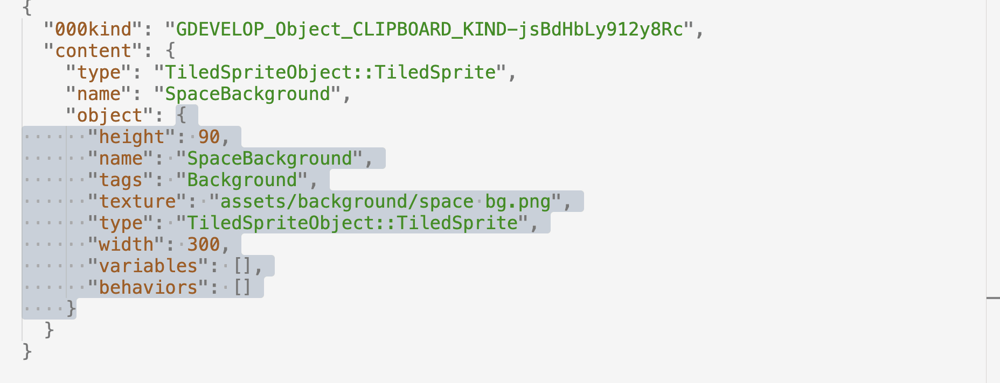

Paste it inside the `.asset.json` file you created, replacing `...JSON CONTENT OF AN OBJECT...`:
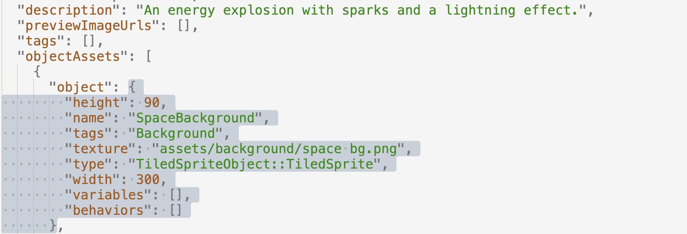

Finally, if your object uses image resources, make sure to add them in the `resources` array:
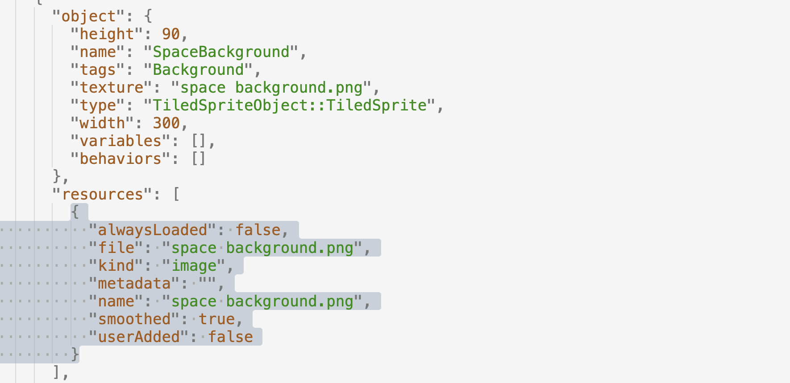

Put all images with the name that you put in the `resources` array next to your `.asset.json` file.

Finally, add:

- a file with the same name but with the extension `.preview.png` that will be shown in the assets store
- an empty filed called `IGNORED_FOR_IMAGE_ASSETS.md` so that the importer will ignore the images and won't try to create objects automatically :)

For example:

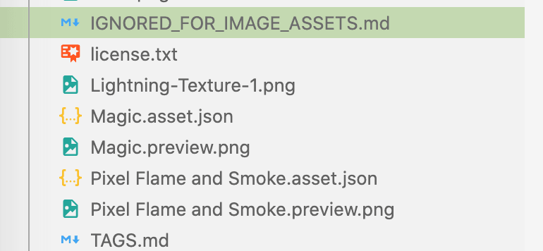

!!! tip

        **How to submit my fonts when they are ready?**

    Zip the folder containing them and send them to the GDevelop team on Github by opening an [issue here](https://github.com/4ian/GDevelop/issues/new?assignees=&labels=%F0%9F%93%A6+Asset+Store+submission&template=--asset-store-submission.md&title=).
