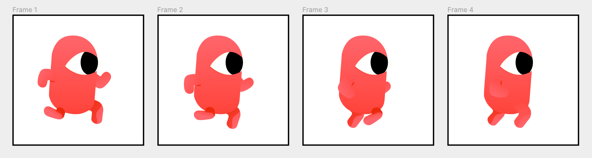
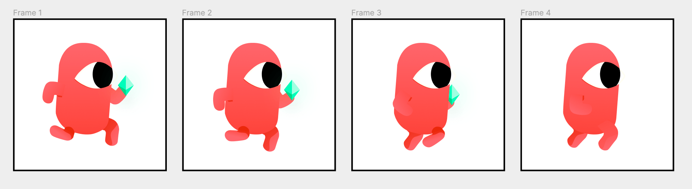
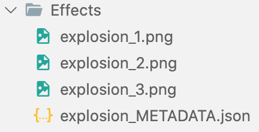
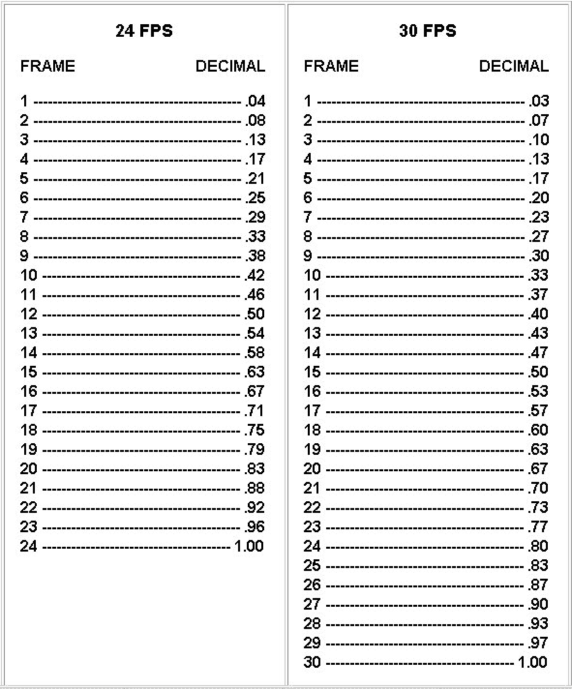
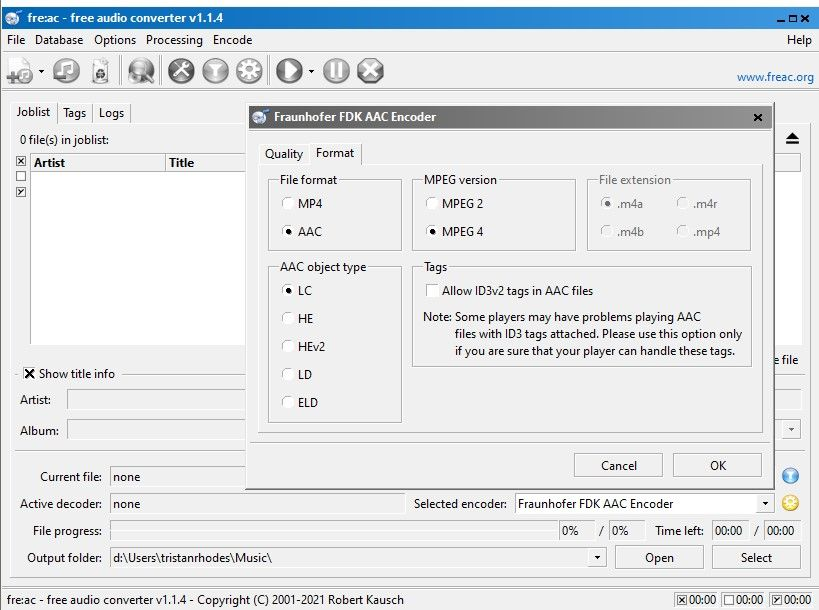
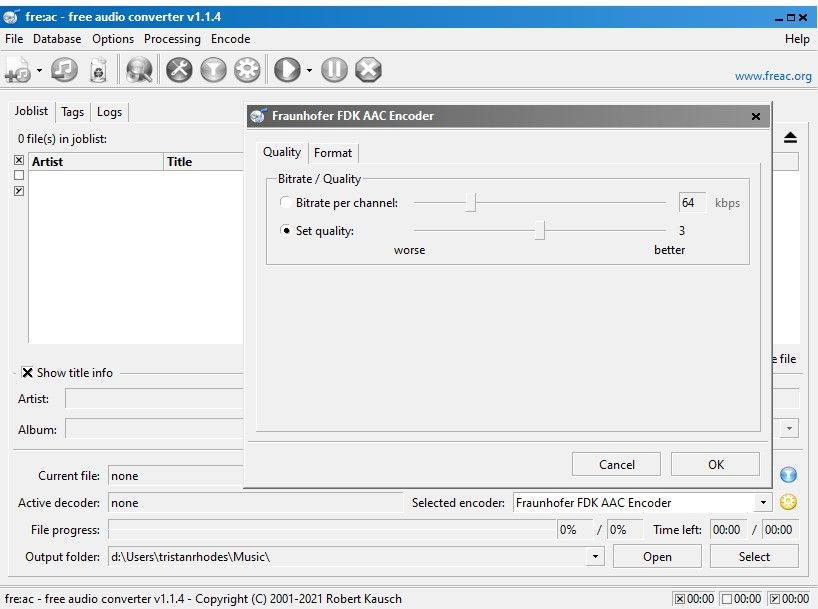

# Overview of a pack

!!! warning

    This page is not yet complete.

If you have too many files, you can manually package an asset pack without the game engine editor.

Here is an example for an imaginary `French food` asset pack:

```
French food
│
├── pack.json                                 << Asset pack metadata
│
├── previewImages                             << Sub folder with public resources
│   ├── IGNORED.md
│   ├── thumbnail.png                         << png only
│   ├── preview1.png                          << png only
│   └── preview2.png                          << png only
│
├── previewSounds                             << Sub folder with public resources
│   ├── IGNORED.md
│   ├── preview1.aac                          << aac, wav, ogg or mp3
│   └── preview2.wav                          << aac, wav, ogg or mp3
│
│
├── Character
│   ├── Enemy 1_Attack Bottom_METADATA.png
│   ├── Enemy 1_Attack Bottom_1.png
│   ├── Enemy 1_Attack Bottom_2.png
│   ├── Enemy 1_Attack Bottom_3.png
│   ├── Enemy 1_Attack Bottom_4.png
│   ├── Enemy 1_Attack Top_METADATA.png
│   ├── Enemy 1_Attack Top_1.png
│   ├── Enemy 1_Attack Top_2.png
│   ├── Enemy 1_Attack Top_3.png
│   ├── Enemy 1_Attack Top_4.png
│   ├── Enemy 2_Attack Bottom_METADATA.png
│   ├── Enemy 2_Attack Bottom_1.png
│   ├── Enemy 2_Attack Bottom_2.png
│   ├── Enemy 2_Attack Bottom_3.png
│   ├── Enemy 2_Attack Bottom_4.png
│   ├── Enemy 2_Attack Top_METADATA.png
│   ├── Enemy 2_Attack Top_1.png
│   ├── Enemy 2_Attack Top_2.png
│   ├── Enemy 2_Attack Top_3.png
│   └── Enemy 2_Attack Top_4.png

│
├── Props
│    ├── 9patch_French Table_all_128.png
│    ├── 9patch_French Table_center.png
│    ├── 9patch_French Table_east.png
│    ├── 9patch_French Table_north.png
│    ├── 9patch_French Table_northeast.png
│    ├── 9patch_French Table_northwest.png
│    ├── 9patch_French Table_south.png
│    ├── 9patch_French Table_southeast.png
│    ├── 9patch_French Table_southwest.png
│    ├── 9patch_French Table_west.png
│    ├── quiche_resting_1.png
│    └── quiche_resting_2.png
│
├── Audio
│   └── cooking.aac
│
├── Font
│   └── bonne maman.ttf
│
└── Splash                            << Sub folder with a partial asset
    ├── IGNORED_FOR_IMAGE_ASSETS.md
    ├── SauceSplashing.asset.json
    ├── SauceSplashing.png
    └── SauceSplashing.preview.png

```

# The title, description, and price

Each pack needs to be defined in a `pack.json` file located at the root of your pack folder. In it, you'll put the pack's name, description, price in Euro or USD in cents, and the categories.

**Note:**

- **Value:** `123` = `1.23€` (Euro)
- **Categories:** full-game-pack, character, props, background, visual-effect, interface, prefab, sounds]

```json
// pack.json
{
  "longDescription": "Write the description of your pack here. You can add a new line like this:\nThis is a new line.",
  "tag": "The name of your pack",
  "sellerId": "LEAVE EMPTY",
  "sellerStripeAccountId": "LEAVE EMPTY",
  "prices": [
    {
      "value": 399,
      "usageType": "commercial",
      "currency": "USD"
    },
    {
      "value": 1099,
      "usageType": "unlimited",
      "currency": "USD"
    }
  ],
  "categories": ["interface"]
}
```

# Make a thumbnail & previews files

A pack with an attractive thumbnail makes it more visible. Additional images can help them decide if a pack suits their needs. Use contrasting colors to make your thumbnail stand out. The thumbnail should accurately represent the contents of the pack. Thumbnails that show assets in context are preferred over simple grids of assets.

All preview images and the thumbnail must be submitted inside a folder named `previewImages`.

**Thumbnail requirements:**

- Size: 16:9 ratio. Example: `1280x720` or `1920x1080`
- File: `.png`
- Name: `thumbnail.png`

**Previews of your assets:** Extra images that display your pack to convince the user to purchase it. If you contribute a Free Asset Pack, preview assets are not mandatory.

- They can be from 1 to 9
- Must be named `preview1.png`, `preview2.png`, ..., `preview9.png`
- Must be 16:9, `1280x720` or `1920x1080`
- File format in `.png` or `.gif`

# License

Put a license.txt file in your folder. Make sure to put your name in this license file too (or the name of the original author).
The importer will be adapted to understand the license file.

!!! danger

    Free asset packs with unclear licenses won't be accepted. In this case, you should get in touch with the author for clarifications and ask if they allow redistribution of their assets. The license must:

    - Allow to Use the assets for free and for any purpose
    - Allow modifications or derived work
    - State if attribution is required or not

# Adding tags to your assets

Tags allow creators to search your assets. These tags can be things like "side view," "pixel art," and so on. We recommend you use the Asset Store's existing tags.

Put all your images in a single folder, and inside that folder create a file called `TAGS.md`. In this file, put the tags of the assets, separated by a comma. All tags must be singular, not plural. Start the file with one of these tags (depending on the type of pack): `top-down`, `side view`, or `interface`.
For example:

`side view, pirate, ship, sea`

**Tip:**

- Folder names will be read as tags. Make sure to use plain English for each folder.
- You can put your images in different subfolders. Each subfolder will be used as a tag name. Some folder names like "PNG," "SVG," etc., will be ignored (so don't change the whole structure of your assets, we'll ignore anything that does not make sense).
- Note that you can put assets in a folder called `Unimplemented`, `TODO`, and `SOURCE FILE` if the packaging isn't completely done, or if you want to keep source files of the pack. These folders will be entirely hidden in the store but are useful for updates or edits on the pack.

# Sprite

You can put them in a folder of your choice. You Still have to make sure to follow the [naming best practices](/gdevelop5/community/contribute-to-the-assets-store#follow-naming-best-practices).

## Static sprite

For unanimated [Sprites](/gdevelop5/objects/sprite), a single image with the name of the object is enough.

`Chair.png`

## Sprites with animations or states

For animated sprites require multiple animated frames, which have to be named properly. While writing your file names, it is important that you follow a specific naming structure:

`BaseName_AnimationState_frame#.png`

For a character called "Red Hero," with 4 frames of a Running animation:



- `RedHero_Run_1.png`
- `RedHero_Run_2.png`
- `RedHero_Run_3.png`
- `RedHero_Run_4.png`

If the same character is carrying a prop, the naming should appear on the Animation State, not on the Character name.



- `RedHero_RunJewel_1.png`
- `RedHero_RunJewel_2.png`
- `RedHero_RunJewel_3.png`
- `RedHero_RunJewel_4.png`

**Note on animation states:**
If the **animated** object only has one animation state, there is no need to specify if the animation is "Walk, Idle, Climb, Death..." on the name. An animation index will do: `Jewel_1.png`, `Jewel_2.png`, `Jewel_3.png`.

### Assets with Specific Time Duration

To specify FPS and looping for an animation, you'll need to add some metadata with the animations files.

Save the `METADATA.json` file of your object with the following structure: `BaseName_METADATA.json`

```json
// basename_METADATA.json
{
  "timeBetweenFrames": 0.2,
  "loop": false
}
```

If you have **multiple animation states** and **each must have a different speed**, create a `.json` file **per animation state**, using this name: `BaseName_AnimationState_METADATA.json`.
For example:

- `Spaceship_Idle_METADATA.json`
- `Spaceship_Flying_METADATA.json`
- `Spaceship_Destroyed_METADATA.json`
- ...

Your file should look something like this:



If you are not sure about the number that "time between frames" will represent, [this article](https://www.google.com/search?q=https://forum.gdevelop.io/t/image-asset-store-how-to-contribute-your-image-assets-to-the-asset-store/40798) explains it.



# Tiled sprite

If you want to create a [Tiled sprite](/gdevelop5/objects/tiled_sprite) (for backgrounds or repeating patterns):
Prefix the **base name** by `tiled_`. For example: `tiled_Grass Background.png`

# Panel sprite

A [Panel sprite](/gdevelop5/objects/tiled_sprite) object can be stretched with the center and the border repeated.

In an image software, slice your image into 9 different images, and name them: `9patch_BaseName_gravity.png` with gravity being: `southwest`, `southeast`, `south`, `northwest`, `northeast`, `north`, `west`, and `east`.
All these files will be used by our server to generate a unique texture used in the 9-Patch object.
For example:

- `9patch_Grass_center.png`
- `9patch_Grass_east.png`
- `9patch_Grass_north.png`
- `9patch_Grass_northeast.png`
- `9patch_Grass_northwest.png`
- `9patch_Grass_south.png`
- `9patch_Grass_southeast.png`
- `9patch_Grass_southwest.png`
- `9patch_Grass_west.png`

# 3D Box

[3D Box](/gdevelop5/objects/3d-box) are not yet supported for manual packaging. It must be integrated and configured in GDevelop then exported as `.gdo` by a right-click on the object.

# 3D Models

Supported 3D file formats are:

- .glb
- .blend
- .gltf
- .obj
- .fbx
- .x3d
- .vrml

**Animation names** should be meaningful such as `run`, `jump`, `idle`, etc.

**Dimensions** of 3d models must be consistent across a pack. For instance, props should fit characters hands.

**The point of origin** is important, it will be used as the position and rotation center of object in GDevelop.

**Textures** are supported only in format types that are contained, such as `.glb`, `.blend`, `.fbx`.

!!! note

    There's no need to add images preview for the models, the asset store will automatically generate them.

# Tile map

[Tile map](/gdevelop5/objects/tilemap) are not yet supported for manual packaging. It must be integrated and configured in GDevelop then exported as `.gdo` by a right-click on the object.

# Fonts

Put the fonts in to a `Font` folders.
Formats supported are:

- .ttf
- .otf

# Package audio

Put your audio files `.aac`, `.wav`, `.mp3` (prefer `.aac`) directly in a `Audio` folder, with the name to be displayed: `Laser effect.aac`, `Background music.aac`.

`TAGS.md` files will work like for images. Subfolders are also used for tags as described for images.

!!! warning

        🚨 Careful about the size! Players are sensitive to the size of a game download (especially on mobile and on the web). **Try to keep music file sizes around 1 to 2 MB.  In rare cases, these can be 4 or 5 MB, but not larger.** Consider downgrading the quality a bit to keep the music files around these sizes.
    Sound effects are usually even smaller. If a sound file is larger than 200 or 300 KB, consider downgrading the quality.

A great tool to convert audio files to AAC format is [fre:ac](https://www.freac.org/). fre:ac is free, open-source, and cross-platform. It can process batches of files, with many options on how they are named and put into folders.

- Choose the encoder called "Fraunhofer FDK AAC Encoder".
- Select "File format > AAC"
- Select "Quality > Set Quality > 3"

This will create high-quality audio files, but using a variable bit rate that won't exceed 96 kbps (assuming stereo input).





# Spine

[Spine](/gdevelop5/objects/spine) are not yet supported for manual packaging. It must be integrated and configured in GDevelop then exported as `.gdo` by a right-click on the object.

# Custom objects

[Custom object (prefab)](/gdevelop5/objects/custom-objects-prefab-template/) with and without variant(s) are not yet supported for manual packaging. It must be integrated and configured in GDevelop then exported as `.gdo` by a right-click on the object.

# 2D & 3D Particules emitter

3D and [2D particle emitter](/gdevelop5/objects/particles_emitter/) with and without variant(s) are not yet supported for manual packaging. It must be integrated and configured in GDevelop then exported as `.gdo` by a right-click on the object.

# Limitations

GDevelop have several limitation for now, as they are:

!!! note

    - Sprite sheets **are not supported yet**! Each animation frame must **be a separate image**.
    - Each animation image must have the same pixel size as the other animation states.
    - GDevelop does not support image the origin point for different animations yet.
    - Audio files are not yet supported within the `.gdo` format. Please place your audio files in an `Audio` folder located in the same directory as your `.gdo` file. Subsequently, compress both the `.gdo` file and the Audio folder into a `.zip` or `.rar` archive for submission via the application form.
