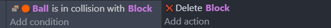
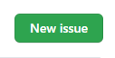
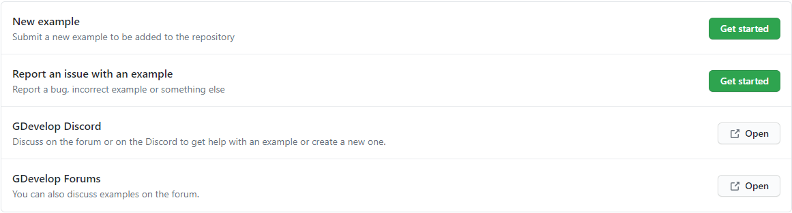
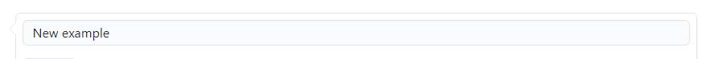
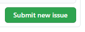

# Guide for submitting examples

Submitting an example is a great way to contribute to GDevelop and help others. If your example is good enough, it will be accepted to the example library and will be available in GDevelop.

## Check if the same example already exists

The first thing you should do is check if an example that does the same thing already exists. So you don't spend your time making something that has already been done.

Search through the examples list in GDevelop (**Create a new project** → **Examples tab**), and make sure the same example doesn't exist.

## Discussing with the community

You can discuss with the GDevelop community on [Discord](https://discord.com/invite/rjdYHvj) or open a new thread on the [GDevelop forum](https://forum.gdevelop.io) on how the example can be improved or if you have any doubts before starting something.

## Choose a scope

### Make a full game template

A game that could almost be published as it is. It should be well organized and easy to tweak or build upon.

!!! note

    Full game templates are good candidates to be sold in the asset store.

### Make a game as a proof of concept

A game that is as simple as possible. The amount of content should be kept to the bare minimum. Visual effects are welcomed but functions must be used to avoid cluttered events.

### Showcase engine or extension features

A project that uses some features in a smart or fun way. They are a good way to show how a feature may help to make a game without actually making one.

### Test an extension

An example that focuses on 1 feature and allows users to see how it works in every situation. It can also help users to check if a community extension works as expected.

!!! note

    The engine is checked with automatic tests, but these examples can be useful for users to check the features themselves and investigate an issue before retorting it.

## License

- **Free**: The free games template are also know as example projects. The free examples are all [MIT licensed](https://en.wikipedia.org/wiki/MIT_License).
- **Paid**: You are agreeing to this final license for the end-user buying your assets: [Asset Store License Agreement](https://gdevelop.io/page/asset-store-license-agreement)

!!! warning

     Ensure that the example and the associate resources can be MIT licensed, or that you hold full rights for your paid game template and the associate resources. If you are uncertain about the licensing of any resource, consult the original creator or contact the GDevelop team for verification.

## Best practices

#### Naming conventions

- Names should describe its use well and clearly. Example: a variable for storing player's health can be named `PlayerHealth`. The object name can be `Player`, but avoid crytic/shorthand names like `PyrObj`.

- Names should not have spaces in them. Example: use `PlayerName` instead of `Player Name`.

- `PascalCase` is recommended, but using other styles is fine.

#### Variables

- Variables should be initialized in the variable editor. It is ok to leave them uninitialized for some situations, but it's generally recommended.

- Unused variables should be deleted

#### Extensions

- If custom extensions are used, add proper comments, description to the events see [Extension best practices](/gdevelop5/extensions/best-practices) for more info

#### Structuring events

- Related events should be added into a group with proper naming.
  - You can use color code to allow differentiating them quickly if you want.
- If the same events are used in multiple places, you can use [external events](/gdevelop5/interface/events-editor/external-events) or a [function](/gdevelop5/events/functions) in an extension.
- Remove empty events.
- Remove disabled events or events that were used for testing.
- Unfold any events so that they are easily visible.
- Move events that are not the main focus of the example into external events or other scenes (for instance, an example that shows a character movement should not be cluttered with events about unrelated UI).

#### Write insightful comments

##### Don't paraphrase

Comments should not paraphrase the events. For instance, "Delete the block when the ball collides it." is a useless comment for the following event:



##### Give the bigger picture

Every event doesn't need to be commented. It's usually a good idea to comment a group of events as a whole to give the bigger picture.

##### Pinpoint oddities

It can happen that you have no other choice but to use big formulas or use engine features in a smart but uncommon way. Comments are really important in these situations.

##### Write a documentation page if necessary

Sometimes words alone are not enough. If you feel diagrams will help, you can [submit a documentation page](/gdevelop5/community/contribute-to-the-wiki) for your example and add a link in a comment.

##### Keep simple colors

You can change the color of the comments according to its use (for example, green for a tip, orange for a warning). Otherwise, just keep the default color.

#### Keep a project clean

- Remove any unnecessary scenes, external events, external layouts
- Remove unused variables
- Remove unused resources from both the [resource manager](/gdevelop5/interface/project-manager/resources) and then from the project folder
- The images should not be too large (2000x2000 is a maximum).
- It is recommended to add all the resources in a folder called `assets`, and add sub-folders according to the use of the assets (GUI, Player, Power-ups) if needed.
- Remove unused resources, images, sounds, fonts, from the project folder
- Remove any unnecessary events from the event sheet

#### Projects folder

- The `.json` file and the project folder's name should be renamed to the example's name, with `-` instead of spaces. For example: an example with `Not a vania` as name should have `not-a-vania` as its folder name and its `.json` filename.
- The project should not be using multiple files for saving (using a single JSON file).
- The project should have a `README.md` file with a text describing the example.

#### Project properties

- The project properties should be properly filled out.
- _Project Name_ The project name should be the example name.
- _Package Name_ The package name should follow `com.example.<projectname>`. In PascalCase, e.g: `com.example.RotateSprite`
- _Version_ The version that is added to the library (after review) should be `1.0.0`, and incremented as changes are added after it's added.
- _Author_ is your username. An account will have to be registered and a proper username will be needed to be able to add the username. Type the username and pick the username from the drop-down menu

##### Game resolution

- Game resolution shouldn't exceed **1920x1080** so that the example can run on all devices without any performance issues .
- If the example uses pixel art with small assets, "nearest neighbor" rendering is recommended.

## Submitting the game

### Paid game template

Open your game in GDevelop, do a Save As in a new folder, then zip the folder containing the game, the resources, and send them to the GDevelop team with **[this form to publish on the GDevelop's store](https://forms.gle/rqQajpDWEF3Em8HS6)**.

### Free game template

Open your game in GDevelop, do a Save As in a new folder, then zip the folder containing the game, the resources, and send them to the GDevelop team with these additional files and informations:

- Get a thumbnail:

  - Must be 16:9, `1280x720` or `1920x1080`.
  - File format in `.png`.
  - Must be named: `thumbnail.png`.

- Get a description:

  - Must be an inline description that represent the game shortly.
  - File format in `.md`.
  - Must be named: `readme.md`.

!!! note

    Both the thumbnail and the Readme.md file should be in the main folder and not in any sub-folders.

Then you can submit your free example directly to the [Example repository](https://github.com/GDevelopApp/GDevelop-examples/issues) as an issue.

- Go to the site,
- Click The Green **New Issue** button:



- A option to select issue template will be shown, click **New Example**:



- You will get a text box where you can write the "issue" which is where you can upload the project file (as a `zip` file) and add a proper description about it.
- Change the title to the example's name.



- Under `## Describe the example` in the textbox, add a proper description about the example, feel free to add any screenshots.
- You will also be given a checklist of what is necessary. If you have done them, add `x` in the in brackets against each checklist.

```
- [ ] My Game has a proper name in the game properties.
- [ ] My Game package name begins with 'com.examples'.
- [ ] My Game has all events unfolded.
- [ ] I've added myself as the author in the game properties.
- [ ] I've included a file called 'README.md' with a description in proper English, explaining what this example is doing.
- [ ] I confirm that this game and all its resources can be integrated to this Github repository, distributed and MIT licensed.
- [ ] I've cleaned unused resources in the project.
```

- Under `## Game folder`, add a zip of your project and drag and drop it into the text box.
- Now click `Submit Issue`.



Congratulations! Now your example has been submitted, but it won't be directly added to the library. A **review** of the example will be done to make sure the example is ready to be added. You might have to refactor some events if the review suggests to.

!!! warning

        There is no guarantee that your example will be accepted, it can be rejected if the example is not for the library. Also remember that while it's hard to get some feedback, reviewers are asking for changes because they believe this will improve your example. Try to rework the example using their feedback! Once you think it's good enough, you can ask for another review or discuss points where you might disagree.
