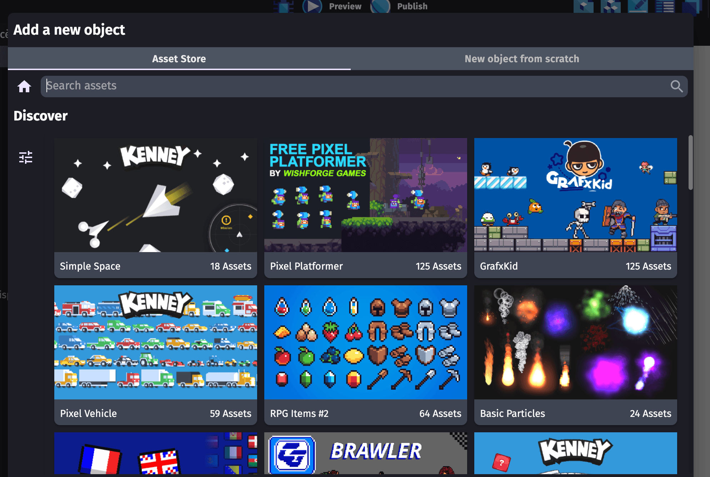
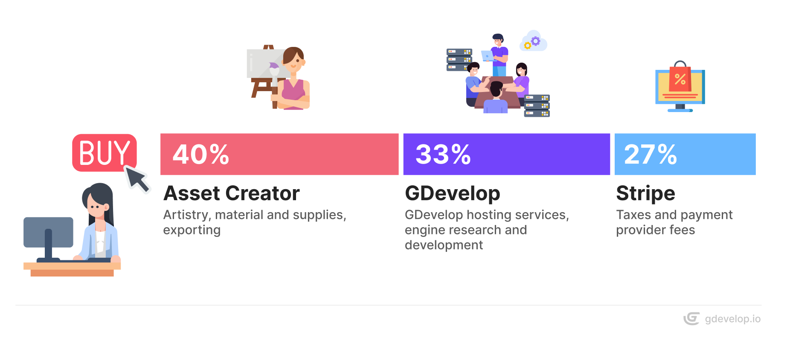

---https://gd.games/2434/nasty-pigs--plinko-
title: Selling assets on GDevelop's Asset Store
---https://gd.games/2434/nasty-pigs--plinko-

# Selling assets on GDevelop's Asset Store

GDevelop has its own built-in asset store, allowing game creators to access game art and game templates directly within the app.
By providing easy-to-use and high-quality assets, we're enabling creators to get a head start on their video game creation journey.

To become a seller you will be required to:

1. Agree to revenue sharing.
2. Choose for your pack: a title, a description, a price (free or paid), and a license.
3. Produce a thumbnail image in 16:9 format.
4. Produce between 1 and 10 images (or audio) representing the content of the pack.
5. Integrate your assets into a GDevelop project or export valid files for the store.
6. Send us your files.

Read on to learn more about revenue sharing, transactions, and other agreements to know before becoming a seller.

## Revenue sharing

When an asset is sold on GDevelop's Asset Store, the purchase is distributed as follows: 40% for the Asset creator, 33% for GDevelop, and 27% for government taxes (VAT) and payment provider fees.

Note that:

- The VAT and payment providers' fees might amount to something larger than 27%. In this case, **you still keep 40%**, and it's us, GDevelop, who will have our margin reduced.
- A cut of 33% might sound a bit higher than some other stores - but other stores express their percentage without mentioning VAT. So the real percentage you are earning is less than what they advertise. For example, if a store says they take 30%, it does not include the VAT and payment process fee, so you will earn way less than 70% (probably something between 25% and 45% of the total price after VAT and additional fees).
- An interesting feature of the GDevelop asset store is that it gives **ready-to-use objects** for creators' games. This means the value someone gets when buying an asset in GDevelop is higher: they receive something we prepared as an object ready to be used (no manual work is involved).

!!! note

    Earnings from GDevelop paying services (including [premium licenses](https://gdevelop.io/pricing)) are reinvested in internet hosting fees, engine development, product research, and feature development.

## The pricing

Products on the store can be:

- **Free**: These assets are accessible to anyone, royalty-free, and open for any type of modification.
- **Paid**: These assets are of higher quality and are carefully selected by the GDevelop team for a more unique game style.

Setting the right price for your work is important. A lower price reduces your revenue share, while a higher price may lead to fewer sales. Check some products on the Asset Store to understand current pricing.

If your price is significantly above or below the average, the GDevelop team may contact you to suggest an adjustment.

!!! note

    Please note that if you would like to change the price of the pack afterward, you will have to get in touch with us.

## The license(s)

We suggest these licenses for your assets:

- **Free**: [CC0](https://creativecommons.org/public-domain/cc0/), [MIT licensed](https://en.wikipedia.org/wiki/MIT_License) or [CC BY 4.0](https://creativecommons.org/licenses/by/4.0/).
- **Paid**: Assets are covered by the [Asset Store License Agreement](https://gdevelop.io/page/asset-store-license-agreement).

!!! warning

    You have to own the rights to your assets. If an asset is flagged for infringing copyright after being accepted and uploaded to the store, we reserve the right to remove the entire pack or the asset and cancel all purchases that have been processed for it.

## Invoice management

GDevelop's Asset Store is built as a marketplace: GDevelop hosts a digital solution that allows users to sell their products (sellers) to users that would like to use them in their projects (buyers).

Here is what happens when a buyer purchases a product on the asset store:

- GDevelop buys the product from the seller.
- GDevelop resells it to the buyer.

From the accounting point of view, the seller should create an invoice addressed to GDevelop.
To avoid obliging sellers to create such invoices, GDevelop will create self-billing invoices that you will be able to retrieve with Stripe.

As a seller, by selling your products on GDevelop's Asset Store, you accept that GDevelop creates self-billing invoices for each purchase of your products.

## Transaction management

Every few months or when you have a significant number of sales, payments are sent to you through Stripe or [Tremendous](https://www.tremendous.com/catalog/).

- **Stripe:** Recommended for professionals and most EU countries. With Stripe, you’ll get access to a dashboard where you can view your transactions and invoices. The GDevelop team will create a Stripe vendor account for you. To activate it, you’ll need to complete your registration by providing your email address, home address, full name, and bank details. Once set up, you’ll be able to track all your transactions through the dashboard. Payouts to your bank account can be scheduled directly from Stripe, with daily transfers available.

- **Tremendous:** You will receive an email with a private link to claim your gift card or Virtual Visa Card.

GDevelop issues invoices. To do this, and to be eligible to sell on the Asset Store, we require the following:

- Your full name.
- Email address.
- An address in your country of residence.
- Bank details (Stripe only)
- You need to be older than 13 years old. (According to [Stripe's terms and conditions](https://support.stripe.com/questions/age-requirement-to-create-a-stripe-account) users under 18 years old will need the permission of a legal guardian to withdraw their earnings.)

See the table below to check if your country is eligible. If your country is not on the list, please reach out to us so we can verify and let you know.

| Provider(s) | Country                                                                                                                                                                                                                                                                                                                                                                                                                                                                                                                                                                                                                                                                                                                                                                                                                                                                                                                                                                                                                                                                                                                                                                                                                                                                                                                                                                                                                                                                                                                                                                                                                                                                                                                                                                                                                                                                                                                                                                                                                                                                                                                                                                                                                                                                                                                                                                                                                                                                                                                                                                                                                                                                                                       |
| ----------- | ------------------------------------------------------------------------------------------------------------------------------------------------------------------------------------------------------------------------------------------------------------------------------------------------------------------------------------------------------------------------------------------------------------------------------------------------------------------------------------------------------------------------------------------------------------------------------------------------------------------------------------------------------------------------------------------------------------------------------------------------------------------------------------------------------------------------------------------------------------------------------------------------------------------------------------------------------------------------------------------------------------------------------------------------------------------------------------------------------------------------------------------------------------------------------------------------------------------------------------------------------------------------------------------------------------------------------------------------------------------------------------------------------------------------------------------------------------------------------------------------------------------------------------------------------------------------------------------------------------------------------------------------------------------------------------------------------------------------------------------------------------------------------------------------------------------------------------------------------------------------------------------------------------------------------------------------------------------------------------------------------------------------------------------------------------------------------------------------------------------------------------------------------------------------------------------------------------------------------------------------------------------------------------------------------------------------------------------------------------------------------------------------------------------------------------------------------------------------------------------------------------------------------------------------------------------------------------------------------------------------------------------------------------------------------------------------------------- |
| Stripe      | Estonia, Finland, Croatia, Cyprus, Australia, Belgium, Bulgaria, Czech Republic, Denmark, France, Germany, Gibraltar, Greece, Hungary, Ireland, Italy, Liechtenstein, Lithuania, Luxembourg, Malta, Norway, Poland, Portugal, Romania, Slovakia, Slovenia, Spain, Sweden, Switzerland, United Kingdom.                                                                                                                                                                                                                                                                                                                                                                                                                                                                                                                                                                                                                                                                                                                                                                                                                                                                                                                                                                                                                                                                                                                                                                                                                                                                                                                                                                                                                                                                                                                                                                                                                                                                                                                                                                                                                                                                                                                                                                                                                                                                                                                                                                                                                                                                                                                                                                                                        |
| Tremendous  | Albania, Algeria, American Samoa, Andorra, Angola, Anguilla, Antarctica, Antigua and Barbuda, Argentina, Armenia, Aruba, Austria, Azerbaijan, Bahamas, Bahrain, Bangladesh, Barbados, Belize, Benin, Bermuda, Bhutan, Bolivia, Bonaire, Bosnia and Herzegovina, Botswana, Bouvet Island, Brazil, British Indian Ocean Territory, British Virgin Islands, Brunei Darussalam, Burkina Faso, Burundi, Cambodia, Cameroon, Canada, Cape Verde, Cayman Islands, Chad, Chile, Christmas Island, Cocos (Keeling) Islands, Colombia, Comoros, Congo, Cook Islands, Costa Rica, Cote d'Ivoire, Curacao, Djibouti, Dominica, Dominican Republic, East Timor, Ecuador, Egypt, El Salvador, Equatorial Guinea, Eritrea, Eswatini, Falkland Islands (Malvinas), Faroe Islands, Fiji, French Guiana, French Polynesia, French Southern Territories, Gabon, Gambia, Georgia, Ghana, Greenland, Grenada, Guadeloupe, Guam, Guatemala, Guernsey, Guinea, Guinea-Bissau, Guyana, Haiti, Heard Island and McDonald Islands, Honduras, Iceland, Isle of Man, Israel, Jamaica, Japan, Jersey, Jordan, Kazakhstan, Kenya, Kiribati, Kuwait, Kyrgyzstan, Laos, Latvia, Lesotho, Liberia, Macao, Madagascar, Malawi, Maldives, Marshall Islands, Martinique, Mauritania, Mauritius, Mayotte, Mexico, Micronesia, Moldova, Monaco, Mongolia, Montenegro, Montserrat, Morocco, Mozambique, Namibia, Nauru, Nepal, Netherlands, New Caledonia, New Zealand, Niger, Nigeria, Niue, Norfolk Island, North Macedonia, Northern Mariana Islands, Oman, Pakistan, Palau, Palestine, Panama, Paraguay, Peru, Pitcairn, Puerto Rico, Qatar, Reunion, Rwanda, Saint Barthelemy, Saint Helena, Saint Kitts and Nevis, Saint Lucia, Saint Martin (French part), Saint Pierre and Miquelon, Saint Vincent and the Grenadines, Samoa, San Marino, Sao Tome and Principe, Saudi Arabia, Senegal, Serbia, Seychelles, Sierra Leone, Singapore, Sint Maarten (Dutch part), Solomon Islands, South Africa, South Georgia and the South Sandwich Islands, South Korea, Sri Lanka, Suriname, Svalbard and Jan Mayen, Taiwan, Tajikistan, Tanzania, Togo, Tokelau, Tonga, Trinidad and Tobago, Tunisia, Turkey, Turkmenistan, Turks and Caicos Islands, Tuvalu, United Arab Emirates, United States, United States Minor Outlying Islands, Uruguay, US Virgin Islands, Uzbekistan, Vatican City, Vietnam, Wallis and Futuna, Western Sahara, Zambia, Estonia, Finland, Croatia, Cyprus, Australia, Belgium, Bulgaria, Czech Republic, Denmark, France, Germany, Gibraltar, Greece, Hungary, Ireland, Italy, Liechtenstein, Lithuania, Luxembourg, Malta, Norway, Poland, Portugal, Romania, Slovakia, Slovenia, Spain, Sweden, Switzerland, United Kingdom. |

## Asset Pack Storage and Safety

All Asset Packs are safely stored on GDevelop's cloud.
This way, we ensure that the files are available for instant purchase and in-app use.

## Submitting on the Asset Store

First and foremost, we want to ensure the Asset Store remains a place of high quality and is safe for everyone to use. Assets must be fully functional within the game engine to be eligible for the Asset Store.

Follow the guide that applies to your submission:

[Submitting an asset pack](/gdevelop5/community/contribute-to-the-assets-store/){ .md-button .md-button--primary }

[Submitting a game template](/gdevelop5/community/guide-for-submitting-an-example/){ .md-button .md-button--primary }
