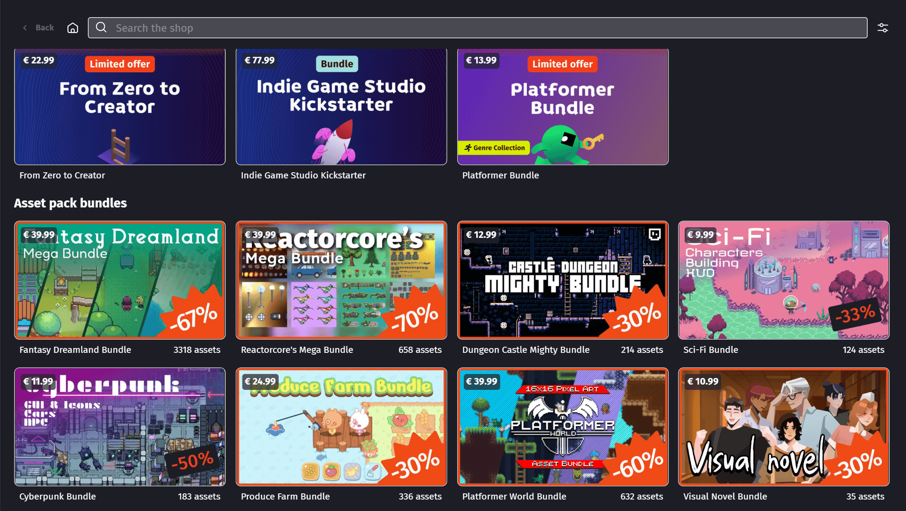
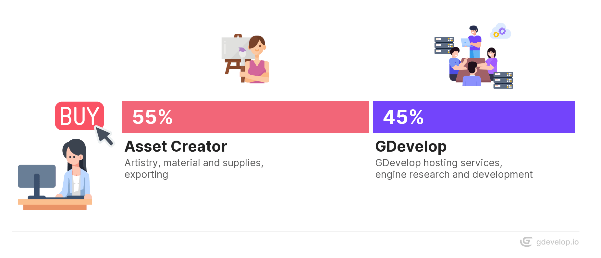

# Selling on GDevelop's Asset Store

The Asset Store is built into GDevelop. Game creators open it from the editor to find game art and ready-to-use game templates, and add them to their project in one click.

You can sell your own work there. This page explains how it works: what you need, how much you earn, and how you get paid.

## What you need to become a seller

1. Accept the revenue sharing described below.
1. Choose a title, a description, a price (free or paid) and a license for your pack.
1. Make a thumbnail image in 16:9 format.
1. Make between 1 and 10 preview images (or audio files) that show what is in the pack.
1. Put your assets into a GDevelop project, or export valid files for the store.
1. Send us your files.

## Revenue sharing

When someone buys one of your products, here is what happens:

1. The taxes (VAT or sales tax) are removed from the price paid by the buyer.
1. What is left is shared: **60% for you, 40% for GDevelop**.

Your share is always a percentage of the price **without taxes**. Tax rates change a lot from one country to another, and they depend on the buyer's country, not yours. Counting your share before taxes is the only way to make it mean the same thing for every sale.

A few rules apply to every sale:

- **Taxes never change your share.** GDevelop collects and declares them. They are removed before the 60/40 split.
- **The payment method doesn't matter.** Card, PayPal, a mobile app store or GDevelop credits: you earn the same amount for a given product.
- **Discounts are shared.** During a promotion, the 60/40 split applies to the discounted price, so both you and GDevelop earn less on that sale. For example, a product sold at 10 EUR before taxes earns you 6 EUR. Sold at half price during a promotion, it earns you 3 EUR.
- **Sales paid with GDevelop credits are real sales.** Creators can pay with credits they bought or earned. You are paid for these sales in real money, with your other sales.

!!! note

    GDevelop's share, like the money from [premium subscriptions](https://gdevelop.io/pricing), pays for hosting, engine development, research and new features.

## The pricing

A product on the store can be:

- **Free**: anyone can use it, without paying royalties, and can change it in any way.
- **Paid**: these products are selected by the GDevelop team for their quality and their unique style.

Choose your price with care. A low price means less money per sale. A high price may mean fewer sales. Look at similar products on the Asset Store to see the usual prices.

If your price is far above or below the others, the GDevelop team may contact you to suggest a change.

!!! note

    To change the price of a pack after it is published, get in touch with us.

## The license(s)

We suggest these licenses:

- **Free** products: [CC0](https://creativecommons.org/public-domain/cc0/), [MIT](https://en.wikipedia.org/wiki/MIT_License) or [CC BY 4.0](https://creativecommons.org/licenses/by/4.0/).
- **Paid** products: they are covered by the [Asset Store License Agreement](https://gdevelop.io/page/asset-store-license-agreement).

!!! warning

    You must own the rights to what you sell. If an asset is reported for copyright infringement after it is published, we may remove the asset or the whole pack, and cancel all its purchases.

## Payouts

You are not paid after each sale. Your earnings add up, and GDevelop sends you one payment every few months, or sooner if you have many pending sales. This payment covers all your sales since the previous one.

For each payout:

- All your sales are added up, whatever the payment method used by the buyers.
- The total is converted into the currency of your country if needed (for example euros in France, US dollars in New Zealand), at the exchange rate of the payout day.
- The amount is paid without VAT.
- A sale that was refunded or cancelled is not counted.

Payments go through one of two providers, depending on your country (see the table below):

- **Stripe**, recommended for professionals and most EU countries. The GDevelop team creates a Stripe vendor account for you. To activate it, you give your email address, home address, full name and bank details. You can then follow all your transactions in the Stripe dashboard, and schedule transfers to your bank account, even daily.
- **Tremendous**: you receive an email with a private link to claim a gift card or a Virtual Visa Card.

Each payout comes with a **payout invoice**, sent by email. Its number starts with `GD-PAYOUT-`. It lists the number of sales covered and the amount paid, so you can keep it for your accounting. See [Invoice management](#invoice-management) below.

To sell on the Asset Store and receive payouts, we need:

- Your full name.
- Your email address.
- An address in the country where you live.
- Your bank details (Stripe only).
- You must be over 13. Under 18, you need the permission of a legal guardian to withdraw your earnings, as required by [Stripe's terms](https://support.stripe.com/questions/age-requirement-to-create-a-stripe-account).

Check the table below to see if your country is supported. If it is not listed, contact us: we will check and let you know.

| Provider(s) | Country                                                                                                                                                                                                                                                                                                                                                                                                                                                                                                                                                                                                                                                                                                                                                                                                                                                                                                                                                                                                                                                                                                                                                                                                                                                                                                                                                                                                                                                                                                                                                                                                                                                                                                                                                                                                                                                                                                                                                                                                                                                                                                                                                                                                                                                                                                                                                                                                                                                                                                                                                                                                                                                                                                       |
| ----------- | ------------------------------------------------------------------------------------------------------------------------------------------------------------------------------------------------------------------------------------------------------------------------------------------------------------------------------------------------------------------------------------------------------------------------------------------------------------------------------------------------------------------------------------------------------------------------------------------------------------------------------------------------------------------------------------------------------------------------------------------------------------------------------------------------------------------------------------------------------------------------------------------------------------------------------------------------------------------------------------------------------------------------------------------------------------------------------------------------------------------------------------------------------------------------------------------------------------------------------------------------------------------------------------------------------------------------------------------------------------------------------------------------------------------------------------------------------------------------------------------------------------------------------------------------------------------------------------------------------------------------------------------------------------------------------------------------------------------------------------------------------------------------------------------------------------------------------------------------------------------------------------------------------------------------------------------------------------------------------------------------------------------------------------------------------------------------------------------------------------------------------------------------------------------------------------------------------------------------------------------------------------------------------------------------------------------------------------------------------------------------------------------------------------------------------------------------------------------------------------------------------------------------------------------------------------------------------------------------------------------------------------------------------------------------------------------------------------- |
| Stripe      | Estonia, Finland, Croatia, Cyprus, Australia, Belgium, Bulgaria, Czech Republic, Denmark, France, Germany, Gibraltar, Greece, Hungary, Ireland, Italy, Liechtenstein, Lithuania, Luxembourg, Malta, Norway, Poland, Portugal, Romania, Slovakia, Slovenia, Spain, Sweden, Switzerland, United Kingdom.                                                                                                                                                                                                                                                                                                                                                                                                                                                                                                                                                                                                                                                                                                                                                                                                                                                                                                                                                                                                                                                                                                                                                                                                                                                                                                                                                                                                                                                                                                                                                                                                                                                                                                                                                                                                                                                                                                                                                                                                                                                                                                                                                                                                                                                                                                                                                                                                        |
| Tremendous  | Albania, Algeria, American Samoa, Andorra, Angola, Anguilla, Antarctica, Antigua and Barbuda, Argentina, Armenia, Aruba, Austria, Azerbaijan, Bahamas, Bahrain, Bangladesh, Barbados, Belize, Benin, Bermuda, Bhutan, Bolivia, Bonaire, Bosnia and Herzegovina, Botswana, Bouvet Island, Brazil, British Indian Ocean Territory, British Virgin Islands, Brunei Darussalam, Burkina Faso, Burundi, Cambodia, Cameroon, Canada, Cape Verde, Cayman Islands, Chad, Chile, Christmas Island, Cocos (Keeling) Islands, Colombia, Comoros, Congo, Cook Islands, Costa Rica, Cote d'Ivoire, Curacao, Djibouti, Dominica, Dominican Republic, East Timor, Ecuador, Egypt, El Salvador, Equatorial Guinea, Eritrea, Eswatini, Falkland Islands (Malvinas), Faroe Islands, Fiji, French Guiana, French Polynesia, French Southern Territories, Gabon, Gambia, Georgia, Ghana, Greenland, Grenada, Guadeloupe, Guam, Guatemala, Guernsey, Guinea, Guinea-Bissau, Guyana, Haiti, Heard Island and McDonald Islands, Honduras, Iceland, Isle of Man, Israel, Jamaica, Japan, Jersey, Jordan, Kazakhstan, Kenya, Kiribati, Kuwait, Kyrgyzstan, Laos, Latvia, Lesotho, Liberia, Macao, Madagascar, Malawi, Maldives, Marshall Islands, Martinique, Mauritania, Mauritius, Mayotte, Mexico, Micronesia, Moldova, Monaco, Mongolia, Montenegro, Montserrat, Morocco, Mozambique, Namibia, Nauru, Nepal, Netherlands, New Caledonia, New Zealand, Niger, Nigeria, Niue, Norfolk Island, North Macedonia, Northern Mariana Islands, Oman, Pakistan, Palau, Palestine, Panama, Paraguay, Peru, Pitcairn, Puerto Rico, Qatar, Reunion, Rwanda, Saint Barthelemy, Saint Helena, Saint Kitts and Nevis, Saint Lucia, Saint Martin (French part), Saint Pierre and Miquelon, Saint Vincent and the Grenadines, Samoa, San Marino, Sao Tome and Principe, Saudi Arabia, Senegal, Serbia, Seychelles, Sierra Leone, Singapore, Sint Maarten (Dutch part), Solomon Islands, South Africa, South Georgia and the South Sandwich Islands, South Korea, Sri Lanka, Suriname, Svalbard and Jan Mayen, Taiwan, Tajikistan, Tanzania, Togo, Tokelau, Tonga, Trinidad and Tobago, Tunisia, Turkey, Turkmenistan, Turks and Caicos Islands, Tuvalu, United Arab Emirates, United States, United States Minor Outlying Islands, Uruguay, US Virgin Islands, Uzbekistan, Vatican City, Vietnam, Wallis and Futuna, Western Sahara, Zambia, Estonia, Finland, Croatia, Cyprus, Australia, Belgium, Bulgaria, Czech Republic, Denmark, France, Germany, Gibraltar, Greece, Hungary, Ireland, Italy, Liechtenstein, Lithuania, Luxembourg, Malta, Norway, Poland, Portugal, Romania, Slovakia, Slovenia, Spain, Sweden, Switzerland, United Kingdom. |

## Invoice management

The Asset Store is a marketplace: GDevelop runs the platform, sellers put their products on it, and buyers use these products in their games.

When a buyer purchases your product:

- GDevelop buys the product from you.
- GDevelop sells it to the buyer, and handles the taxes and the payment provider.

On paper, you should send GDevelop an invoice for the products it bought from you. To save you this work, GDevelop writes these invoices for you: they are called **self-billing invoices**. They are issued in your name, addressed to GDevelop France SAS, one for each payout. You receive them by email with each payout. If you are paid through Stripe, you can also find them in your Stripe dashboard.

By selling on the Asset Store, you agree that GDevelop creates these self-billing invoices for you.

## Asset Pack Storage and Safety

All asset packs are stored on GDevelop's cloud. This keeps them available for instant purchase and use inside the editor.

## Submitting on the Asset Store

We want the Asset Store to stay a safe place with quality products. To be accepted, your assets must work fully in GDevelop.

Follow the guide that matches what you want to sell:

[Submitting an asset pack](/gdevelop5/community/contribute-to-the-assets-store/){ .md-button .md-button--primary }

[Submitting a game template](/gdevelop5/community/guide-for-submitting-an-example/){ .md-button .md-button--primary }
