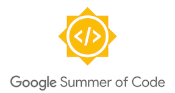

# GDevelop and Google Summer of Code

Google Summer of Code is a global program focused on bringing more contributors into open source software development. Contributors work with an open source organization on a programming project during summer (the length depends on the project).

In 2020, GDevelop was one of the mentoring organizations. We're candidating to be an organization in 2024 too. If you're interested in working with us, read on!

!!! note

    Results of GSoc 2020 projects are accessible on [this Result page](/gdevelop5/community/summer-of-code/results).

## Ideas list

!!! tip

    Those ideas are *not* exhaustive. Feel free to suggest your own idea! Or combine ideas into your own. The descriptions are generic enough so that you can suggest different approaches, goals and stretch goals. Mentor(s) are available for all ideas listed already.

### 3D physics engine

GDevelop includes a 2D physics engine, but has not yet a 3D physics engine. Investigate the best physics engine for our use case and integrate it as a new behavior. Adapt the game engine with anything need to properly support the physics engine. A working implementation, even if not including all the feature of the 3D physics engine, will be sufficient.

* **Skills:** JavaScript, TypeScript
* **Difficulty:** medium
* Project size: 90 hours
* Possible mentors: Alex, Clem, D8H, 4ian
* Expected outcome: working behavior that can be applied to objects, with at least static and dynamic objects + a few basic properties and actions/conditions.

### Allow to edit tilemaps directly in the editor

GDevelop supports tilemaps that are built using Tiled or LDtk - two editors specially made for creating large tilemaps. But for a lot of users, having the ability to edit tilemaps directly in GDevelop would be more intuitive. Beginners could start drawing an entirely new map directly in the scene editor. Advanced users could make quick fixes to their maps inside GDevelop, and continue to use an external editors for larger changes.

This project will aim to bring a very simple Tilemap edition feature to GDevelop. This is a feature that is asked by a lot of users!

* **Skills:** JavaScript, TypeScript
* **Difficulty:** medium
* Project size: 175 hours
* Possible mentors: Alex, Clem, D8H, 4ian
* Expected outcome: working, basic editor for tilemaps in the GDevelop scene editor (display tileset, choose tile, paint)
  
### Refactored collision, object positions handling and object filtering

Investigate the performance of collision handling, distance conditions and raycast (for objects not using a physics engine behavior) and implement optimizations that would allow them to avoid iterating on all objects.
Complete this investigation by generalizing this to all behaviors that could use this.

* **Skills:** JavaScript, good knowledge or interest in algorithms
* **Type:** Exploratory
* **Difficulty:** medium/hard
* Project size: 90 hours
* Possible mentors: Clem, D8H, 4ian
* Expected outcome: Proof of concept or working implementation of optimizations.

### Implement a global undo redo in the interface

In this project, you design and set up a global undo/redo system in the whole app, which could even be used as a basis for a real time collaboration later. This means that any change made in the app could be reverted (or applied again) using two app wide undo/redo shortcuts or buttons. This is a huge improvements for users and would make the app way more efficient to use.

This is also a good opportunity to investigate "Conflict-free replicated data type", as this notion is linked to the changes needed for a global undo/redo system.

* **Skills:** JavaScript, C++, TypeScript
* **Difficulty:**  hard
* Project size: 90 hours
* Possible mentors: Clem, Alex, D8H, 4ian
* Expected outcome: improved undo/redo for at least one editor.

### Refactor the game engine to run in a web worker

This project is about reworking the game engine so that it can run in a web worker. The rendering with PixiJS can be decoupled from logic (it's also partially done in the engine!). Once it's done, the logic could be run in a web-worker, improving the performance of all games. Later games could even be run on a server for multiplayer using this approach - which is a highly requested feature by users.

* **Skills:** JavaScript, TypeScript
* **Difficulty:** hard
* Project size: 175 hours
* Possible mentors: D8H, 4ian
* Expected outcome: game engine running in a web worker or a server.

### Improve interactive tutorials so that the community can create their own

We’ve created a framework to run interactive tutorials directly inside GDevelop (you can try it in the “Getting started”). In this project, tutorials could be listed in GDevelop in the interface, and when one is chosen, it would be played. The community will be able to create new tutorials by submitting tutorials in JSON format.

* **Skills:** JavaScript
* **Difficulty:** easy
* Project size: 90 hours
* Possible mentors: Clem, Alex
* Expected outcome: an interface to list interactive tutorials and a simple, basic interface to edit existing tutorials and try them in the app.

### Improved Debugger and Profiler

GDevelop has a debugger and profiler that can be used when previewing a game. The debugger can list the objects, expose things like variables and allow to edit them. The profiler can measure the time for each part of the game. Both are still quite raw, so we could improve the UI to make it easier to filter objects, add export/import of data, show information in real time, show charts...

* **Skills:** React.js (for the editor), JavaScript (for the engine), WebSockets (communication between editor and games)
* **Difficulty:** Easy
* Project size: 175 hours
* Possible mentors: Clem, D8H
* Expected outcome: a reworked debugger that displays at least real time metrics.

### Refactored and faster code generation

Code generation is a very important point in GDevelop. This project would rework the code generation of events to make it clearer, faster and unlock potential new features like improved object handlings to avoid unnecessary work and get runtime performance boost. This can be seen as a work on a lightweight compiler - which can be fun to then later work on larger ones!

* **Skills:** C++ (mandatory to dig into the existing codebase), JavaScript (for the generated code), good understanding of algorithms and data structures.
* **Difficulty:** medium
* Project size: 90 hours
* Possible mentors: 4ian, D8H
* Expected outcome: a reworked code generation that is faster than currently and documented possible other improvements (if time is too short to implement them).

### Animation support for 9 Panel Sprite and Tiled Sprite objects

These "Panel Sprite" and "Tiled Sprite" objects can't be animated. We'd like to remove this limitation by reworking the game engine so that they can be animated, and rework their editors so that animations can be authored and set up like for sprites.
This will allow for nice effects like animated platforms, background, lava floors...
This will involve refactoring the animation classes in the game engine and refactor animation components in the editor codebase.

* **Skills:** JavaScript (PixiJS knowledge is a bonus) and React.
* **Difficulty:** Medium
* Project size: 175 hours
* Possible mentors: 4ian, D8H
* Expected outcome: a reworked code generation that is faster than currently and documented possible other improvements (if time is too short to implement them).

### Your own idea

Your own ideas and variations on the existing one are very welcome! Remember to take a look at [the roadmap](https://trello.com/b/qf0lM7k8/gdevelop-roadmap) if you want to know more about what users are asking for.

## How to candidate?

You'll need two things!

* First, become a bit familiar with GDevelop. One way to do so is by using the app. You can also try investigating or working an issue (or adding a simple new feature) on the GitHub Issue Tracker. Take a look at the [Good First Issues](https://github.com/4ian/GDevelop/issues?q=is%3Aissue+is%3Aopen+label%3A%22%F0%9F%91%8Cgood+first+issue%22).
  * You'll need to set up your development environment. The *README* will explain everything!
  * Find an issue that looks interesting to you. Might be a [Good First Issue](https://github.com/4ian/GDevelop/issues?q=is%3Aissue+is%3Aopen+label%3A%22%F0%9F%91%8Cgood+first+issue%22) or another one.
  * Do some research, try things, and if you need help ask on the forum or on the GitHub issue itself.
  * If you have something interesting, comment on the issue or open a *Pull Request*! Prepare it with all the required tests and checks, explain what you've done and a reviewer should give you some feedback.

* Searching to solve an issue is a good first step that will actually help you in the second part: making a proposal!
  * Read [this page describing a suggested structure for your proposal](/gdevelop5/community/summer-of-code/contributor-guidance).
  * Prepare your proposal on the Google Summer of Code website 🤓.

!!! tip

    A good proposal will show that you understood at least the big principles and are able to dive more in the problem. Read also [this thread](https://forum.gdevelop.io/t/how-to-make-your-proposal/23400).

## Frequently Asked Questions

### Where can I talk with others about GSoC? What are the communication channels?

Check out the forum [section about GSoC](https://forum.gdevelop.io/c/community/gsoc-2020). You can send us an email but all the information should already be there. You can also talk to the GDevelop community members on the [Discord](https://discord.gg/rjdYHvj) GSoC dedicated channel.

For contributor(s) that will work on GDevelop during GSoC, we'll have regular catch-up by email, using GitHub and sometimes by video call.

### Should I reach out to the forum, by email and on the Discord chat to have my proposal considered?

No. Your proposal will be considered in all cases. It's a good idea to engage with the community on the Discord or the forum if you want to know more how GDevelop works. **Looking at "Good First Issues" and trying to fix/improve stuff on GitHub** is **highly recommended** for you to have a better idea of how GDevelop is coded before making your proposal.

### Should I include my participation on the forum/Discord/GitHub in my proposal?

Yes, it's a good idea, if you participated or contributed already to GDevelop, to include it in your proposal so that we know what you did already - especially useful to give us more confidence in you being able to achieve the project 👍

## More links

- Forum [section about GSoC](https://forum.gdevelop.io/c/community/gsoc-2020)
- [GDevelop GitHub repository](https://github.com/4ian/GDevelop)
- [Good First Issues](https://github.com/4ian/GDevelop/issues?q=is%3Aissue+is%3Aopen+label%3A%22%F0%9F%91%8Cgood+first+issue%22), to start coding with GDevelop.
