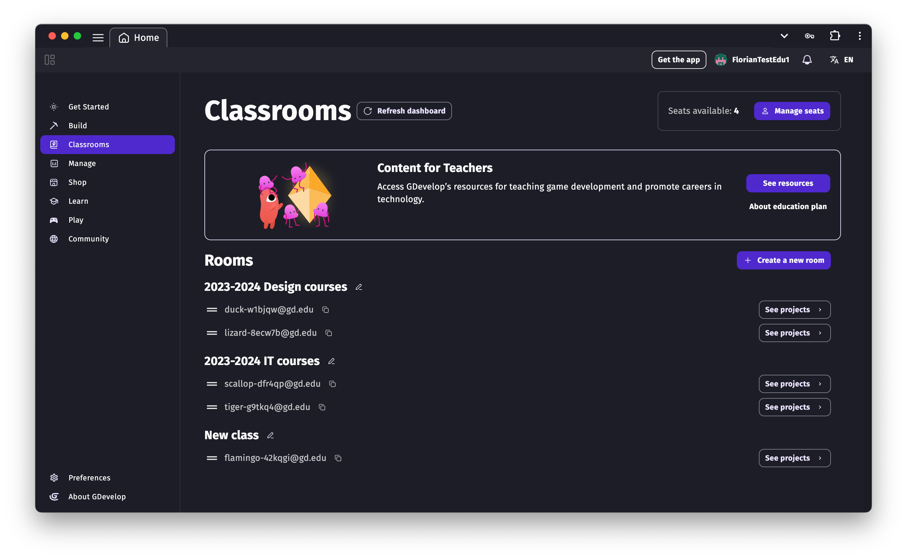
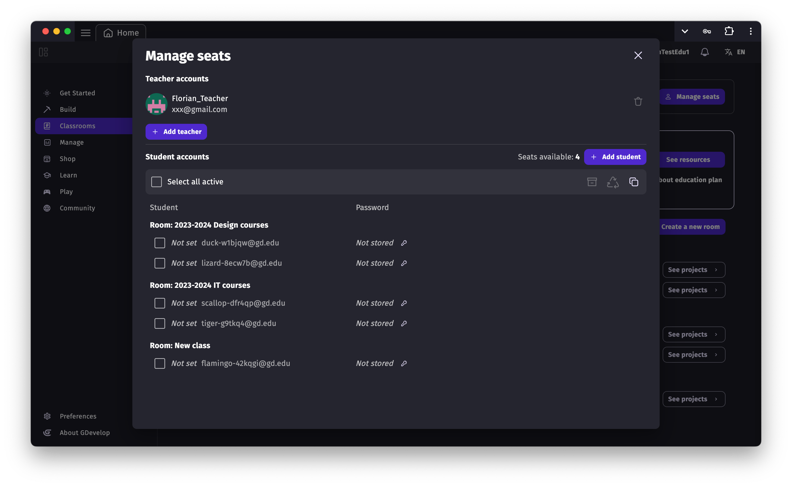
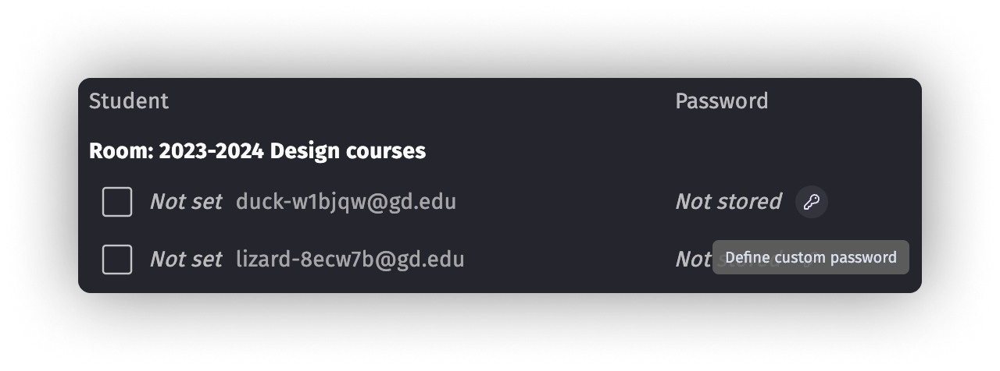
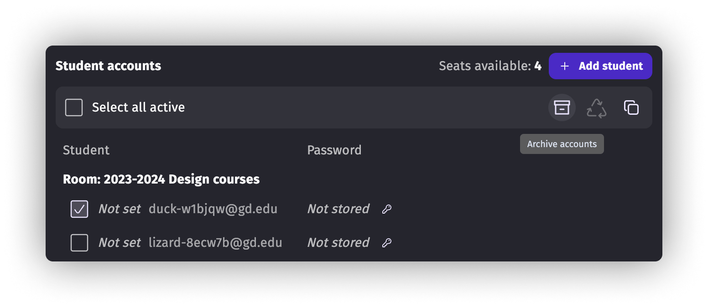

# GDevelop for Education

GDevelop is widely used in educational settings including schools, universities, and bootcamps, with over **10,000 students from the Americas to Europe and Asia** already benefiting from learning with GDevelop. The **GDevelop for Education Plan** is specifically optimized for educational use.

You can read more about [all the benefits that GDevelop and game creation can bring to your classroom, workshop or bootcamp on GDevelop website](https://gdevelop.io/education).

## Teaching resources (curriculum)

The GDevelop for Education plan gives access to **a curriculum designed by the GDevelop team and by teachers**. It includes multiple ready-to-teach lessons that cover game development theory and step-by-step practical lessons to create full games.

Once you've purchased the GDevelop for Education plan, these curriculum and extra educational resources are accessible from the Teach tab, visible for teachers. 

!!! tip

    For a deep dive into how to structure your classes and manage your curriculum, check out our [Teacher's Guide](teacher-guide.md).

## Getting the Education plan

The Education plan is purchased with at least 5 seats. A seat is either occupied by a teacher account, or a student account.
For instance with 10 seats you can have:

- 1 teacher account;
- 9 student accounts.

**All accounts benefits from the same perks as a Gold subscription** (see details [here](https://gdevelop.io/pricing)). This means each student gets:

- **100 cloud projects**
- **Unlimited cloud storage**
- Access to the GDevelop mobile app (Android tablets and smartphones, iPads and iPhones)
- Version history for all cloud projects

## Web App vs Desktop App

GDevelop is available both as a web application ([editor.gdevelop.io](https://editor.gdevelop.io)) and as a downloadable desktop application. **We highly recommend using the web application** for educational settings:

| Feature | Web App (Recommended) | Desktop App |
|---------|----------------------|-------------|
| Installation | None required - open a browser and start | Requires download and installation |
| Updates | Always up-to-date automatically | Manual updates required |
| IT involvement | Minimal - just allow required domains | May need IT for installation |
| Teacher materials | Always have latest curriculum | May miss new resources if not updated |
| Bug fixes | Immediate | Only after manual update |
| Features | Identical to desktop | Identical to web |

!!! warning "Important for IT administrators"

    If using the web app on a school network, ensure your administrator allows these domains: `gdevelop.io`, `gdevelop-app.com`, `gd.games`, as well as all domains on [this list](https://github.com/4ian/GDevelop/blob/master/newIDE/README-network.md).

!!! note

    Some institutions have used the desktop version to limit distractions, but this is no longer necessary. Student accounts automatically have a **distraction-free view** that cannot be deactivated (see below). Both web and desktop versions have identical features with no restrictions on student accounts.

## Teacher accounts: managing students and their work

Besides teaching resources, teacher accounts gain access to the Teach tab on GDevelop's homepage.

In this tab, they can view all the student accounts linked to the plan. The student accounts can be sorted into Rooms for a better organization between teachers:

A teacher has access to the projects made by each student. They can open them in a read-only mode. This is useful for:

- Checking or marking the work done on the projects;
- Preview the game to ensure the game itself works as intended.

## Student accounts: optimized for learning

Student accounts are fully anonymized accounts which can be administrated by teachers. The credentials for those accounts (disposable email address + password) are accessible to teachers from the "Manage Seats" page, available through the Teach tab:

!!! tip

    If you have specific needs related to how students should access their accounts (reuse existing emails, SSO, etc...), please reach out to us.

### Distraction-free view

Student accounts have a **distraction-free view** that students cannot deactivate. This view hides elements that could distract from learning:

- Premium products and commercial assets
- Credits
- Social networks mentions
- Announcements and ads
- GDevelop gaming page (community-shared games)

### Access to examples and starters

Students **can still access** the built-in examples and starter games. These are valuable learning resources that:

- Demonstrate how to create simple or advanced game mechanics
- Increase curiosity and creativity
- Provide inspiration for student projects

!!! info "About ready-made games and starters"

    Students can open, modify, and learn from example games (called "starters") directly in the editor. Teachers and students often appreciate these examples because they demonstrate coding patterns and game mechanics effectively. If you need to verify that a student created original work rather than submitting a modified starter, you can compare their project with the available starters in the app.

### Version history

Student accounts have access to the version history feature for cloud projects: they can go back to any previous save they made. This is useful for recovering from mistakes or exploring different approaches.

## Manage seats

From the "Manage Seats" page, it is possible to administrate your plan and student accounts.

### Set or change a student full name

By default, a student account is fully anonymous (the email and passwords are auto-generated). 
If you have a lot of students, you can set for each account a full name (for example, the first and/or last name of a student).

Click on the "Edit" icon next to the student account username to change it. It will then be displayed next to the username.

### Change account password

Students don't have the possibility to change the password of their accounts.
But teacher accounts can do it. The password is then safely stored in our database so that you can easily retrieve it.

### Add teacher accounts

You can have multiple accounts having the teacher role in your plan.
To do so, click the "Add teacher" button and enter the email address of the other teacher GDevelop account.

Note that teachers must already have signed up with GDevelop before you can add them to your account. We encourage every teacher to sign up with their work/education email.

Teacher accounts have the same rights as the main account but cannot unsubscribe from the education plan.

### Add, archive and restore student accounts

Once you've purchased GDevelop for Education, head to the Teach tab and click on "Manage Seats" to start creating accounts for your students.

Using this field, create multiple student accounts at once:

It is then possible to manage the student accounts by archiving and restoring accounts.
You can also export account credentials in a CSV file (that can be opened using any spreadsheet app).

#### Game and project persistence

**Projects and games are never automatically deleted.** They remain in the student's cloud storage unless the student manually deletes them. This means:

- Student work is preserved throughout the course
- Projects remain accessible for grading and review
- No risk of accidental data loss from timeouts or inactivity

#### Cleaning up accounts between classes

To prepare accounts for a new semester or new students, the recommended approach is to **archive the existing account and create a new one**. This is safer than trying to delete projects because:

- Archived accounts can be unarchived later if needed (e.g., a student returns to class)
- Projects from archived accounts are preserved in case you need to reference them
- New students get a fresh, clean account

Here is the recommended workflow for managing student accounts:

1. **Initial setup**: Add the needed teacher accounts.
2. **Create student accounts**: You can create all accounts at once, up to the number of remaining seats. If you create too many, you can archive unused ones later.
3. **Teach**: Send credentials to your students and use the curriculum and educational resources.
4. **End of class**: Archive student accounts. Projects and games are preserved but accounts are deactivated and students lose access. This frees seats in your plan.
5. **New class**: Create brand new accounts for the next group of students.

!!! tip

    It is possible to reactivate an archived student account (for example, if a student rejoins your class). However, you must wait 15 days after archiving before you can restore an account.

## Cancel your subscription

The main teacher account is the account that holds the subscription.

To cancel it, log in to GDevelop with this account, go to "My profile", click "Manage subscription" and finally click on "Cancel subscription".

Your subscription will be still available until the end of the current period (the month or the year depending which period you chose when subscribing).

---

## Frequently Asked Questions

### Storage and Projects

**How much storage does each student get?**

Each student account has the equivalent of a Gold subscription: **100 cloud projects** and **unlimited storage**. Students can create multiple games and projects within these limits.

**When are student games deleted?**

**Never automatically.** Projects and games remain in cloud storage indefinitely unless a student manually deletes them. To clean up an account for a new student, archive the old account and create a fresh one.

**Can we easily wipe games from all student accounts?**

The recommended approach is to archive accounts you want to clean up and create new ones. This is safe because archived accounts can be restored if needed, and all projects are preserved for reference.

### Account Management

**How are student accounts created?**

Student accounts are automatically generated with anonymous credentials (disposable email + password). Teachers access an interface in the Teach tab where they can:

- Create multiple accounts at once
- Optionally add a student's name next to each account for tracking
- Export credentials as a CSV file
- Change passwords as needed

Teachers do not need to manually enter each student's email—the system generates everything automatically.

### Examples and Ready-Made Games

**Can students access ready-made games and claim them as their own?**

Students can access example games ("starters") directly in the editor. While they could theoretically submit a starter as their own work, teachers can verify originality by comparing student projects with the available starters in the app. The starters are valuable learning resources that demonstrate coding techniques and game mechanics.

### Features and Restrictions

**Are any features restricted on student accounts?**

No. Student accounts have **full access** to all game-making features—identical to the web and desktop versions. The only difference is the distraction-free view that hides commercial content, social features, and community games. All actual game development functionality is available.

**We usually use the desktop version to avoid distractions. Is this still necessary?**

No. Student accounts automatically have a **distraction-free view** that hides community games, commercial products, social features, and ads. This view cannot be disabled by students. We recommend using the web app ([editor.gdevelop.io](https://editor.gdevelop.io)) for easier management and automatic updates.

### Support

**How can I get help or contact the team?**

- For general questions: [education@gdevelop.io](mailto:education@gdevelop.io)
- For purchase orders (POs) or vendor lists: [education@gdevelop.io](mailto:education@gdevelop.io)
- To book a demo: [gdevelop.io/education](https://gdevelop.io/education)

---

## Further Reading

* [Teacher's Guide: Best practices for your classroom](teacher-guide.md)
* [GDevelop Education Pricing](https://gdevelop.io/pricing)
