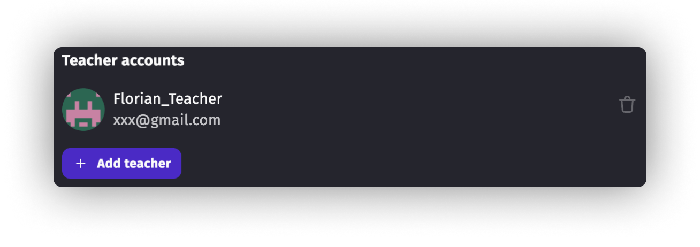
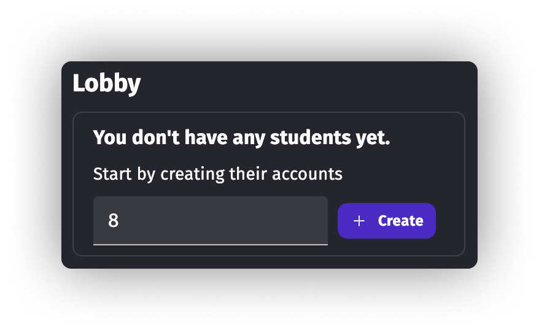

# GDevelop for Education

GDevelop is widely used in educational settings including schools, universities, and bootcamps, with over **10,000 students from the Americas to Europe and Asia** already benefiting from learning with GDevelop. The **GDevelop for Education Plan** is specifically optimized for educational use.

You can read more about [all the benefits that GDevelop and game creation can bring to your classroom, workshop or bootcamp on GDevelop website](https://gdevelop.io/education).

## Teaching resources (curriculum)

The GDevelop for Education plan gives access to **a curriculum designed by the GDevelop team and by teachers**. It includes multiple ready-to-teach lessons that cover game development theory and step-by-step practical lessons to create full games.

Once you've purchased the GDevelop for Education plan, these curriculum and extra educational resources are accessible from the Classroom tab, visible for teachers.

## Getting the Education plan

The Education plan is purchased with at least 5 seats. A seat is either occupied by a teacher account, or a student account.
For instance with 10 seats you can have:

- 1 teacher account;
- 9 student accounts.

**All accounts benefits from the same perks as a Gold subscription** (see details [here](https://gdevelop.io/pricing)). This includes the possibility for students to work on their project using the GDevelop mobile app, available for Android tablets and smartphones, as well as iPads and iPhone.

## Teacher accounts: managing students and their work

Besides teaching resources, teacher accounts gain access to the Classrooms tab on GDevelop's homepage.

In this tab, they can view all the student accounts linked to the plan. The student accounts can be sorted into Rooms for a better organization between teachers:

A teacher has access to the projects made by each student. They can open them in a read-only mode. This is useful for:

- Checking or marking the work done on the projects;
- Preview the game to ensure the game itself works as intended.

## Student accounts: optimized for learning

Student accounts are fully anonymized accounts which can be administrated by teachers. The credentials for those accounts (disposable email address + password) are accessible to teachers from the "Manage Seats" page, available through the Classrooms tab:

!!! tip

    If you have specific needs related to how students should access their accounts (reuse existing emails, SSO, etc...), please reach out to us.

Some concepts in GDevelop's editor have been hidden to student accounts so that they can focus on their work in class:

- Premium products;
- Credits;
- Social networks mentions;
- Announcements and ads;
- GDevelop gaming page.

Student accounts also have access to the version history feature for Cloud projects: they can go back to any previous save they made.

## Manage seats

From the "Manage Seats" page, it is possible to administrate your plan.

### Change account password

Students don't have the possibility to change the password of their accounts.
But teacher accounts can do it. The password is then safely stored in our database so that you can easily retrieve it.

### Add teacher accounts

You can have multiple accounts having the teacher role in your plan.
To do so, click the "Add teacher" button and enter the email address of the other teacher GDevelop account.

Note that the other teacher must already have signed up with GDevelop before you can add them to your account as teachers.

Teacher accounts added this way will have the same rights as the main account except for the subscription management, they cannot unsubscribe from the education plan.

### Add, archive and restore student accounts

Once your plan is all set up, you will have to create the student accounts yourself.

Using this input, create a batch of student accounts.

It is then possible to manage the student accounts by archiving and restoring accounts.
You can also copy-paste the accounts credentials in CSV format.

Here is the recommended way of managing student accounts:

- When your account is set up, add the needed teacher accounts.
- Then create student accounts in a batch (it should correspond to the number of remaining seats).
- Enjoy and teach class!
- When the class is done, archive the student accounts (projects and games won't be removed but accounts will be deactivated and students won't have access to them).
  This action frees seats in your plan.
- Create brand new accounts for the next class.

!!! tip

    When archiving student accounts, you have to wait 15 days before you can restore them.
