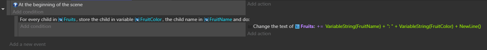
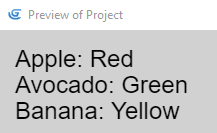

## For each child variable (of a structure or array)

**For each child variable** events give the [child variables](/gdevelop5/all-features/variables/) from structure variables (or arrays) one at a time to their sub-events.

This event stores the value of each child variable (as a string or number) and the name of the child variable (as a string) into scene variables. The names of these scene variables are defined in the event parameters.

## Example

  - Define a structure variable (Fruits) with multiple child variables (Apple, Avocado, Banana)

  - Loop through the child objects and change the text to show the name and value of the child object.

  - The game preview will now show the correct values.

!!! tip

    The [for each object](/gdevelop5/events/foreach) event page explains how to loop on objects one by one.
