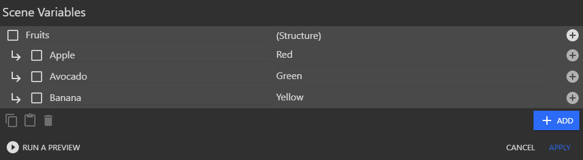
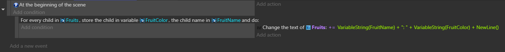
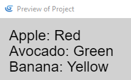

# For Each event

A "For Each" event is a special [event](/gdevelop5/events) that takes an object as a parameter. While the game is running, all of the conditions and actions located inside this event will be repeated for every instance of the object.

!!! tip

    If an object group is used, then the "For Each" event will repeat for every instance of every object in the group.

## When to use it

Most of the time, a "For Each" event is not required because conditions and actions automatically run on all instances of an object. Using a "For Each" when it is not required will cause the computer to do extra work and may lower the performance of a game.

There are specific circumstances that do require using a "For Each" event, including:

- [Collisions](https://wiki.gdevelop.io/gdevelop5/all-features/collisions) that need to be handled individually, even if they happen at the same time (such as keeping score or picking up resources)
- Actions that use an object property or [variable](https://wiki.gdevelop.io/gdevelop5/all-features/variables/object-variables) that is different for each instance
- When using [linked objects](https://wiki.gdevelop.io/gdevelop5/all-features/linked-objects)

In the example below, the goal is to create an explosion at the position of every enemy.  When the player is in a collision with an object called "KillAllEnemyBonus", a "For Each" event is used to create a new object located at the position of each enemy.  If a "For Each" event is not used, a single explosion would be created at the position of the first enemy only.

## For each child variable (of a structure or array)

There is a special version of "For Each" that can be used to loop through the [child variables](/gdevelop5/all-features/variables/) of a structure variable.  The "For Each Child Variable" event enables conditions and actions to be run on all of the child variables under a structure variable (or an array).

This event will store the value of each child variable (as a string or number) and the name of the child variable (as a string) into scene variables.  The names of these scene variables are defined in the event parameters.

## Example

- Define a structure variable (Fruits) with multiple child variables (Apple, Avocado, Banana)

- Loop through the child objects and change the text to show the name and value of the child object.

- The game preview will show the correct values

