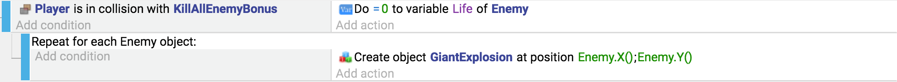

# For each object event

A "For Each" event is a special [event](/gdevelop5/events) that takes an object as a parameter. While the game is running, all of the conditions and actions located inside this event will be repeated for every instance of the object.

!!! tip

    If an object group is used, then the "For Each" event will repeat for every instance of every object in the group.

## Local variables

For Each events support [local variables](/gdevelop5/all-features/variables/local-variables). Local variables declared in a For Each event are scoped to the loop: they are initialized before the loop starts and are only accessible within the loop and its sub-events.

## Ordering instances

By default, instances are processed in the default order (the order GDevelop keeps track of them internally). You can change this by choosing **ordered by** in the event, then entering an expression that is evaluated for each instance. Instances are then sorted by the result of that expression before the loop runs.

For example, you can iterate over enemies from the one with the lowest health to the highest using an expression like `Enemy.HealthBehavior::Health()`, or process the nearest objects first using `Enemy.Distance(Player)`.

You can choose **ascending** (lowest first) or **descending** (highest first) order.

### Limit

When using **ordered by**, you can optionally set a **limit** to process only the first N instances after sorting. This is useful to, for example, target only the 3 nearest enemies rather than all of them.

## Loop counter variable

For Each events can have a **loop counter variable**. When set, this variable starts at 0 and is automatically incremented by 1 for each object instance processed. This is useful to know the index of the current object in the iteration.

To add a loop counter variable, right-click on the For Each event and choose **Add > Loop Counter Variable**.

## How to add this event

Right click (or long press) on an existing [event](/gdevelop5/events) and choose *"Add"* in the menu. Then, select the event you want to add.
Alternatively, click on the *"Plus" icon* in the toolbar or on *"Add..."* at the bottom of the events sheet.

## When to use it

Most of the time, a "For Each" event is not required because conditions and actions automatically run on all instances of an object. Using a "For Each" when it is not required will cause the computer to do extra work and may lower the performance of a game.

!!! warning

    [Trigger once](/gdevelop5/all-features/advanced-conditions/trigger-once) conditions are not checked per instance. Within a "for each" event, [object variables](/gdevelop5/all-features/variables/object-variables/) must be used to follow the state of object instances one by one.

There are specific circumstances that do require using a "For Each" event, including:

- [Collisions](/gdevelop5/all-features/collisions) that need to be handled individually, even if they happen at the same time (such as keeping score or picking up resources)
- Actions that use an object property or [variable](/gdevelop5/all-features/variables/object-variables) that is different for each instance
- When using [linked objects](/gdevelop5/all-features/linked-objects)

In the example below, the goal is to create an explosion at the position of every enemy.  When the player is in a collision with an object called "KillAllEnemyBonus", a "For Each" event is used to create a new object located at the position of each enemy.  If a "For Each" event is not used, a single explosion would be created at the position of the first enemy only.

!!! tip

    The [for each child variable](/gdevelop5/events/foreach-child-variable) event page explains how to loop on variables from structures or arrays.
