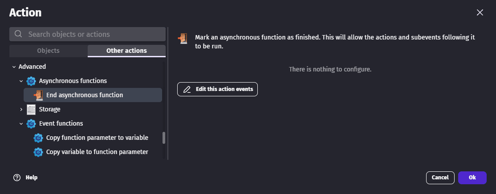

# Asynchronous functions

Some actions like web requests can take a lot of time and you don't want your game to freeze until the server respond. This is why they are asynchronous. It allows:
- to let the game continue
- to have the actions under it to run once the asynchronous action ends.

## Use asynchronous functions in scene events

For instance, in the following example, the loader is hidden back when the response is received. You can notice the icon with the 2 blue arrows. It means this action is asynchronous.

## Write custom asynchronous functions

Custom asynchronous functions use either built-in asynchronous actions or other custom asynchronous functions.

Don't forget to use the action "End asynchronous function" to mark the end of the action. Otherwise, the actions which follow your function in the scene events will never be executed.

The full example which contains an asynchronous function with events or JavaScript can be open is accessible online ([Open the example in GDevelop](https://editor.gdevelop.io/?project=example://parse-json-from-api)).

### Use time-based actions in asynchronous functions

Some actions trigger something for a given duration, for instance [tweens](/gdevelop5/behaviors/tween/) or [sprite](/gdevelop5/objects/sprite/) animations. You may be tempted to use them in an asynchronous function but they are not asynchronous actions. Thanks fully, since you know how much time the animations last, you can use the [wait action](/gdevelop5/all-features/timers-and-time/wait-action/) to wait for them to finish and even schedule them to start at different times.