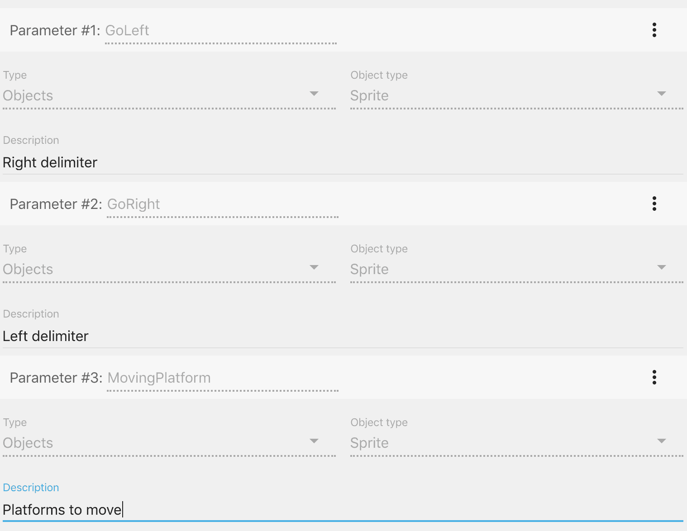

# Extract Events to a Function

When you right click on a selected events (or after selecting more than one event), you can choose the menu item "_Extract Events to a Function_".

GDevelop analyzes the selected events and sub-events, will extract them in a function and will display a window to allow you to customize this [function](/gdevelop5/events/functions). After you've filled the fields, click on Create to have the function created and the selected events replaced by a call to the [function](/gdevelop5/events/functions).

## Setting up the extension and the function name

The first field ask you for the extension where the function must be stored. Remember that functions are grouped into extensions. If you intend to create multiple functions related to a same feature (for example, functions to deal with the inventory, a battle system or to help you manage the enemies in your game), it's better to group them in a same extension with a name related to the feature.

This will allow then to share the extension and reuse it in other games with little to no changes.

You can either select an existing extension or enter the name of a new one - that will be created for you.

Enter then the name of the function. Like the name of an extension, the name of a function is limited to alphanumerical characters (0-9, a-Z) and underscores. No spaces are allowed.

## Setting up the rest of the function and parameters

The rest of the window contains the same widgets to set up your function as the ones displayed when you're editing a function. In particular, you can enter the name displayed to the user and the description.

An important field is the sentence displayed in the events sheet. You can use `_PARAMx_`, with x being a number (for example: `_PARAM1_`) to refer to a parameter. Usually, you want to enter all parameters in this sentence:

You can finally enter the description for the parameters.

!!! note

    Parameters are automatically extracted from the events by GDevelop. GDevelop will understand which objects, groups and behaviors you're using - as well as the object types.

At the end, click on Create on the bottom right of the dialog. The function will be created and the events will be replaced by an action that is using this function!

