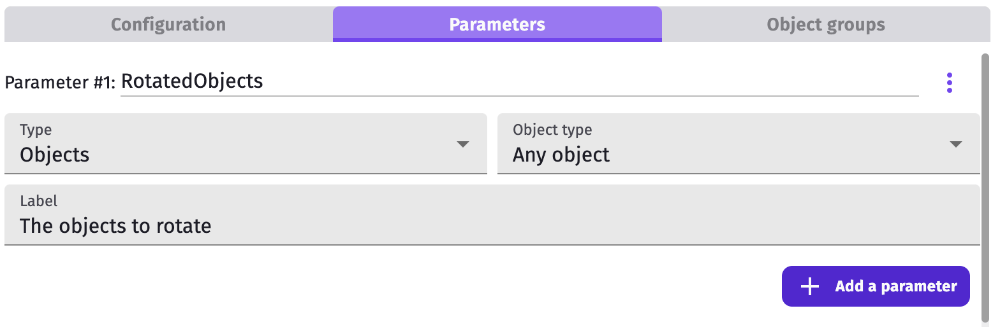
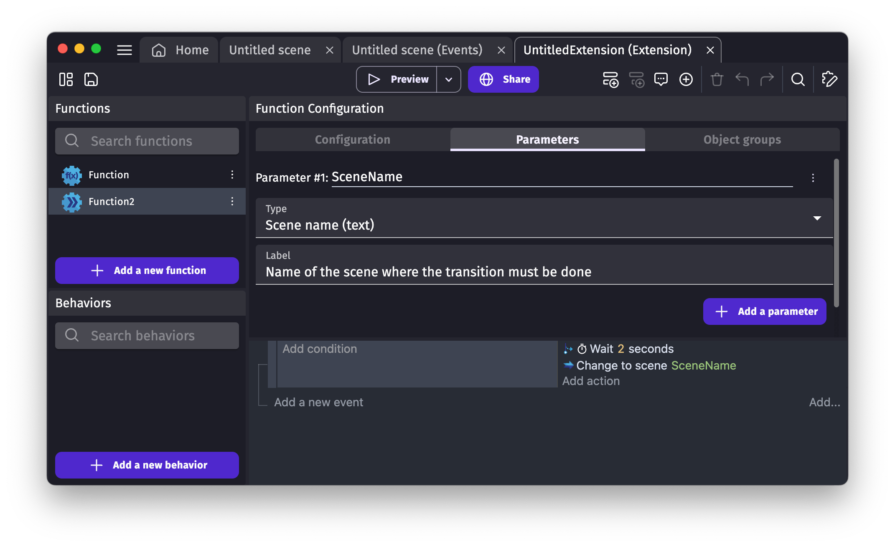
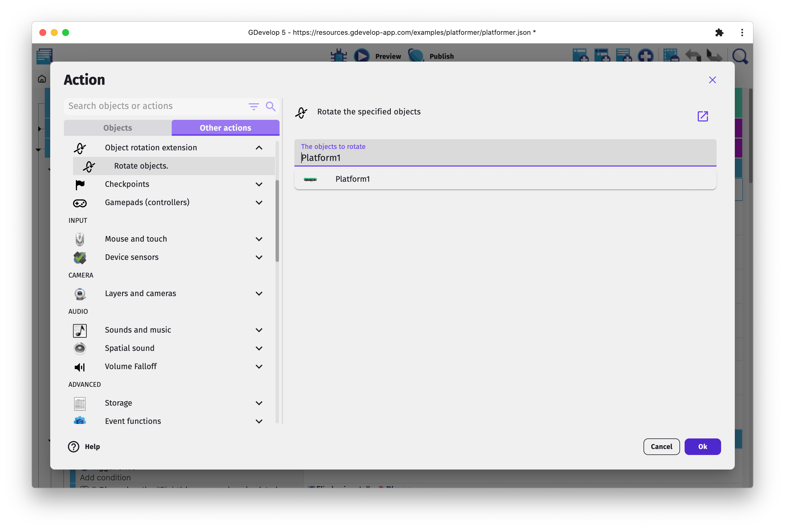

# Functions: create your own actions, conditions or expressions

Similarly to a scene or [external events](/gdevelop5/interface), functions are written with events. They allow to create new conditions, new actions and new expressions that adds up to GDevelop features. They are a good way to organize events, avoid duplication and share features with the community.

!!! tip

    See an example of [replacing external events by functions](/gdevelop5/events/functions/replace-external-events). Events can be automatically [extracted as a function](/gdevelop5/events/functions/extract-events)**.

!!! tip

    See an example of functions being used in [this video by gamefromscratch](https://www.youtube.com/watch?v=BQO9DDXdkjs).

## Creating a new function

Functions are grouped into [extensions](/gdevelop5/extensions). They are the same as [the extensions that can be installed](/gdevelop5/extensions/search). Extensions of a project are listed in the [Project Manager](/gdevelop5/interface/project-manager).

Click on **Create or search for new extensions** at the bottom. Then, select **Create a new extension** to [create a new extension](/gdevelop5/extensions/create).

By default, extensions don't have any function. Add one by clicking on **Add a new function** on the left:

A new function is added, it's time to give it a name. By convention:

- actions start with a verb for instance `Jump`
- conditions start with `Is` for instance `IsJumping`
- expressions don't have any verb for instance `JumpSpeed`

## Editing the configuration and the events of the function

Selecting a function displays its events and a few fields at the top.

* **Function type** - actions and conditions can be used in [events](/gdevelop5/events/) and expressions can be used in formulas.
* **Full name** - The name displayed in the list of actions (or conditions, or expressions).
* **Group name** - A title to group actions in lists.
* **Description** - To explain to extension users what the action does and how to use it.
* **Sentence** - This one is specific to actions and conditions. It's the sentence displayed in the events.

Parameters can be inserted in the sentence by writing `_PARAMx_` between underscores where `x` must be replaced by the parameter number (starting from 1).

### Parameters

Function parameters let extension user give some values that can be used by the function events.

They can be added from the **Parameter** tab. Each of them requires:

  * **Name** - the identifier used in the function events to access to the parameter value.
  * **Type**  - either object, number or text (see the [list of all types](/gdevelop5/events/functions/#references-of-parameters)).
  * **Label** - shown to extension users when filling the parameter values.

!!! note

    Parameters can also be used in Javascript events, learn more about it in the [JavaScript Code events](/gdevelop5/events/js-code#use_javascript_to_get_a_value_from_parameters) page.

### Adding the events to the function and using the parameters

When your function is configured, you can add events to it. These events will be launched when the condition, action or expression is used in the rest of the game.

* You can use all the existing events, actions, conditions and expressions, but you are limited to the **objects that you entered as parameters**. This is to ensure that your function is only acting on them, and has no "side-effects" on the rest of the game - which would be a bad practice and make functions hard to reuse and to generate.

* Note that functions can be reused everywhere, and are not limited to a scene. You **won't have the list of variables of your scenes** in them. You can still manipulate them by using the usual actions and manually writing the variable you want to modify.

* **Links** are not available in functions, because a function is autonomous and is in theory not even tied to a project.

#### Object parameter

Here is an example of a function to rotate some objects:

This is a really simple and not really useful example of a function (you could as well use the action to rotate objects directly without writing a function). But, when you add more complex logic inside, a function's strength can be seen. It's then super easy to reuse this logic from the rest of the game!

!!! note

    If your function is a condition or an expression, [use the actions in "Functions" category to set the expression/condition value](/gdevelop5/events/functions/return) (also called the "return value").

#### Other types of parameters

A parameter can be an object, a text, a number or some other kind of data (the name of a layer, a boolean, etc...). You can use expressions and conditions to access the parameters passed to a function.

For an object, a number or a text parameter, you can directly use them in expressions: just write the name of the parameter. For example, if a parameter is called "ScoreToMultiply" and is a number, you can do: `2 * ScoreToMultiply`.

!!! note

    In previous versions of GDevelop, you needed to use `GetArgumentAsNumber` or `GetArgumentAsString`, passing the name of the argument **between quotes**. This is not needed anymore and you're encouraged not to use these functions. They continue to work but are verbose and error prone.

Here is an example of a text parameter that will get a scene name, which is then used in an action for changing the scene.

## Using the function in your game

When you have configured and created the events for your function, you can use it in the rest of your game.

Simply create a new action (or condition) and find in the list the name of your extension, then choose the function that you've created:

That's it! The function is used like any other condition, action or expression in the [Events Editor](/gdevelop5/interface/events-editor).

!!! tip

    The **Object Groups** feature, while creating functions, helps grouping similar object parameters. This way you can apply an action/condition to a group of object parameters (parameters pointing at objects) at once.

## Advanced usages

This page gave a basic overview of what functions are. They are one of the more powerful features of GDevelop, as you can extend the events by using them, enabling to create very readable and concise events sheets. By using them, you can reduce the amounts of events that you write for your game, avoid copy-pasting them and even reduce bugs by ensuring that functions are always used for common tasks on your objects.

!!! tip

    Functions that focus on an object can be grouped together in [custom behaviors](/gdevelop5/behaviors/events-based-behaviors/). It allows one step further to better organize a project.

### Recursive functions

A function can call itself! In the events of a function, you can use the same action/condition/expression as in the rest of the game. This is called a "recursive" function.

!!! warning

    Be very careful when writing a recursive function. If you don't add conditions, the function could call itself infinitely, blocking your game.

You can [use the actions in "Functions" category to return expression/condition values](/gdevelop5/events/functions/return).

### Sharing functions

Functions can be shared across projects (like actions/conditions that are built in GDevelop). The simplest way to do it is just to copy/paste them. But if you've created a useful set of functions, you may consider [sharing them with the community](/gdevelop5/extensions/share-extension).

!!! tip

    See [an example of replacing external events by a function](/gdevelop5/events/functions/replace-external-events), which is reusable and shareable. You can also **[automatically extract events to a function](/gdevelop5/events/functions/extract-events)**.

## References of parameters

Parameters in function can be various:

| Type                          | Data type    | Description                                               | Scope |
|-------------------------------|--------------|-----------------------------------------------------------|-------|
| [Objects](/gdevelop5/objects) | Objects list | A list of objects                                         | Condition, action |
| [Behavior](/gdevelop5/behaviors) | Behavior  | The behavior from an object                               | Condition, action |
| Expression                    | Number       | Integer or float                                          | Condition, action, expression |
| String                        | Text         | Just a text                                               | Condition, action, expression |
| String from a list of options | Text         | A list of multiple text                                   | Condition, action, expression |
| Keyboard Key                  | Text         | Let extension users choose a key from a list              | Condition, action, expression |
| Mouse button                  | Text         | A list of buttons                                         | Condition, action, expression |
| Color                         | Text         | The color in RGB. Format: `"255;255;255"`                 | Condition, action, expression |
| Layer                         | Text         | The name of a layer                                       | Condition, action, expression |
| Scene name                    | Text         | The name of a scene                                       | Condition, action, expression |
| Yes or No                     | Boolean      | A boolean value                                           | Condition, action |
| True or False                 | Boolean      | A boolean value                                           | Condition, action |
| [Object point](/gdevelop5/objects/sprite/edit-points) | Text         | The name of an point from an object | Condition, action, expression |
| [Object animation](/gdevelop5/objects/sprite/#adding-an-animation) | Text         | The name of an animation from an object | Condition, action, expression |
| [Identifier](/gdevelop5/events/functions#identifier-parameter) | Text         | Allow the auto-complete to suggest previously used values | Condition, action, expression |
| Scene variable              | Scene variable | The value from a scene variable          | Condition, action, expression |
| Created objects             | Objects list | A list of objects just created             | Condition, action |
| Image resource              | Text | The name of the image resource                     | The value of the parameter can only be read from a JavaScript code event. ([Read how](/gdevelop5/events/functions#resource-parameter)) |
| Audio resource              | Text | The name of the audio resource                     | The value of the parameter can only be read from a JavaScript code event. ([Read how](/gdevelop5/events/functions#resource-parameter)) |
| JSON resource               | Text | The name of the JSON resource                      | The value of the parameter can only be read from a JavaScript code event. ([Read how](/gdevelop5/events/functions#resource-parameter)) |
| Font resource               | Text | The name of the Font resource                      | The value of the parameter can only be read from a JavaScript code event. ([Read how](/gdevelop5/events/functions#resource-parameter)) |
| Bitmap font resource        | Text | The name of the Bitmap font resource               | The value of the parameter can only be read from a JavaScript code event. ([Read how](/gdevelop5/events/functions#resource-parameter)) |

### Identifier parameter

This parameter enables auto-completion for previously entered values from other events with the same identifier name and scope.

#### Scopes

- **Object** - To suggest previously used values on the same object.
- **Scene** - To suggest previously used values from the scene events.

#### Identifier name

Every parameter with the same identifier name share their values for the autocompletion.

### Resource parameter

These parameters can be, an image, an audio file, a JSON, a font, and a bitmap font. This parameter will return the name of the resource visible in the resource tab.
The returned value will be only available by getting the value in a JavaScript code events with [this method](/gdevelop5/events/js-code/#use-javascript-to-get-the-value-of-a-parameter-of-a-function).
