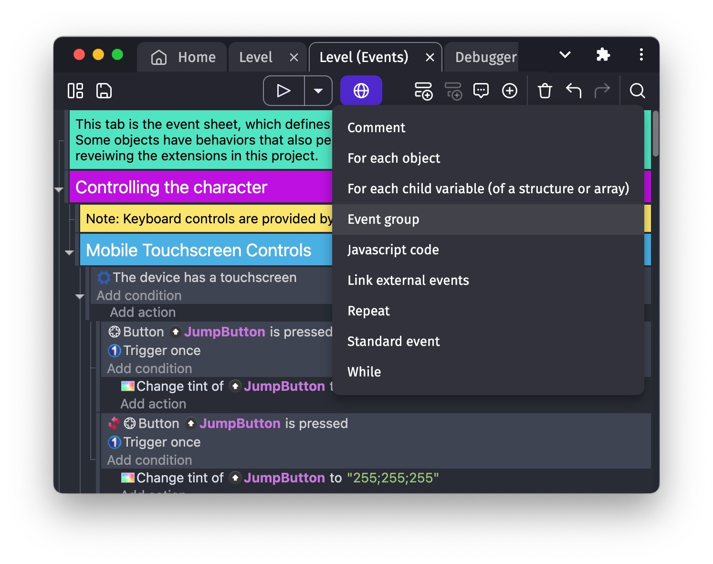

# Group of events

Groups are used to organize and structure your events. They are useful to put together a set of events related to the same concept and make the Events Sheet more readable when it's growing.

You can add an Event Group by selecting this option in the drop-down menu shown when you click the + button in the Events Sheet toolbar:

Name your group by describing what it contains ("Player management", "Map creation", "Green Enemy", "Blue Enemy", "Black Enemy", etc...).

In the events editor, you can click on the small arrow located on the left of the group event to hide the sub-events. Click again on this arrow to unfold the group and show what it contains.

## Group properties

Event groups support several organizational features:

- **Name**: A descriptive title that appears in the events editor
- **Color**: Groups can be assigned colors to visually categorize related events
- **Folding**: Collapsed groups hide their sub-events in the editor (purely visual, doesn't affect execution)
- **Disabling**: Like other events, groups can be disabled to skip their execution along with all contained sub-events

Unlike standard events, groups don't have conditions or actions - they only serve as containers for organizing sub-events.