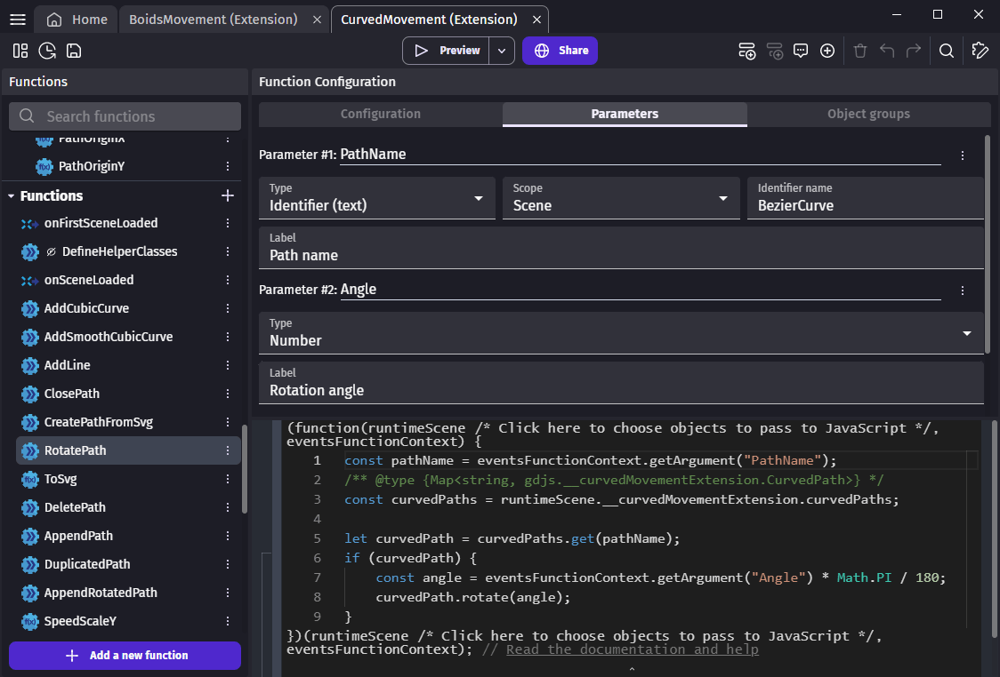

# Use JavaScript in extensions

## Embed JavaScript libraries in extensions

After [creating a new extension](/gdevelop5/extensions/create/), you need to define a new action with a [JS event](/gdevelop5/events/js-code/) to declare the library code.

In order to get the library code, you can copy the content of a bundled library for instance a UMD one. You can usually find bundled libraries in the **node_modules** folder of a JS project after the installation of the library with a packet manager.

Bundled libraries have some extra code at the beginning and the end of the file to bundle the library. This code is not needed. Instead, the classes are added to the `gdjs` namespace like in the following code:

```javascript
// Avoid to declare the library several times.
if (gdjs._myNewExtension) {
  return;
}

// My library function and classes

const myPrivateFunction = () => {
  // Some code here.
}

const myPublicFunction = () => {
  // Some code here.
}

class MyPrivateClass {
  // Some code here.
}

class MyPublicClass {
  // Some code here.
}

// Add all public function and classes to `gdjs` namespace.
gdjs._myNewExtension = {
  myPublicFunction,
  MyPublicClass,
};
```
!!! warning

    Make sure never to use the `runtimeScene` given by the JS event when declaring a library because it is the scene at the declaration which is unlikely to be the same one when the code is called. Instead pass the caller `runtimeScene` as parameter.


This action must be called before the 1st scene is loaded in the **onFirstSceneLoaded** events function. When behaviors use the library, it must also be called at the object creation in **onCreated** because instances in the scene editor are created before **onFirstSceneLoaded** is called.


## Instantiate a state

### Instantiate a state on a scene

When a new scene is loaded, you can initialize the attributes you need in the **onSceneLoaded** event function.

```javascript
runtimeScene._myNewExtension = runtimeScene._myNewExtension || {
    myAttribute: new gdjs._myNewExtension.MyPublicClass(),
};
```

These 2 extensions instantiate a state on scenes:

* The [Noise generator](/gdevelop5/extensions/noise/) instantiate a manager that give generators from their names.
* The [Curved movement](/gdevelop5/extensions/curved-movement/details/) also instantiate a manager for curves.

### Instantiate a state on an object

When a new object instance is created, you can initialize the attributes you need in the **onCreated** event function.

```javascript
behavior._myNewExtension = behavior._myNewExtension || {
    myAttribute: new gdjs._myNewExtension.MyPublicClass(),
};
```

These 2 extensions instantiate a state on behaviors:

* The [Boids movement](/gdevelop5/extensions/boids-movement/) use a state to keep track of Boids speed.
* The [Object stack](/gdevelop5/extensions/object-stack/) use a state to keep track of the object in the stack.

## Wrap JavaScript libraries in events functions

### Get parameter values in JavaScript

Number, string and boolean parameters can be accessed with `getArgument`. Parameter names are case sensitive.

```javascript
const angle = eventsFunctionContext.getArgument("Angle");
```



For object parameter, `getObjects` must be used. It gives an `Array` of `RuntimeObject`.

```javascript
const players = eventsFunctionContext.getObjects("Player");

for (const player of players) {

}
```

### Call a library from an event-function

After getting the events function parameter value, you can pass them to a JavaScript function:

#### Call a "static" function of the library 

```javascript
gdjs._myNewExtension.doSomething(myParameter);
```

#### Call a function on an instance from a scene state

```javascript
runtimeScene._myNewExtension.myAttribute.doSomething(myParameter);
```

These 2 extensions call functions on a state they created on scenes:

* The [Noise generator](/gdevelop5/extensions/noise/)
* The [Curved movement](/gdevelop5/extensions/curved-movement/details/)

#### Call a function on an instance from an object state

```javascript
behavior._myNewExtension.myAttribute.doSomething(myParameter);
```

These 2 extensions call functions on a state they created on behaviors:

* The [Boids movement](/gdevelop5/extensions/boids-movement/)
* The [Object stack](/gdevelop5/extensions/object-stack/)

### Return an expression value in JavaScript

For expressions, you need to return a number or a string by setting `returnValue`.

```javascript
eventsFunctionContext.returnValue = gdjs._myNewExtension.getSomeValue();
```

### Return a condition value in JavaScript

For condition, you need to return a boolean by setting `returnValue`.

```javascript
eventsFunctionContext.returnValue = gdjs._myNewExtension.isSomethingRight();
```

## Wrap JavaScript libraries in events-based behaviors

In case you are writing your first custom behavior, please refer to the [custom behavior](/gdevelop5/behaviors/events-based-behaviors/) page to learn more about them.

### Get an object behavior in Javascript

Behaviors parameter values are actually just a string of the behavior. Each object instance has their own behavior instance so it avoids to pass an array for behavior when they can be mapped from objects with `object.getBehavior(behaviorName)`. 

For actions and conditions of behaviors, the object parameter `Object` only contains one instance because GDevelop does the iteration on object instances. For other object parameters you still need to iterate on all instances.

```javascript
const object = objects[0];
const behaviorName = eventsFunctionContext.getBehaviorName("Behavior");
const behavior = object.getBehavior(behaviorName);
```


### Get behavior property values in Javascript

Behavior properties can be accessed from getters. The property name defined in the property editor is prefixed with `_get`. Property names are case sensitive.

```javascript
const myPropertyValue = behavior._getMyProperty();
```

Setters also exist, but you should not need them. Behaviors may have event functions to change the property values but it's easier to use events for this. If you need to change property values from your JavaScript code, you probably should use JavaScript attributes instead and define expressions to let events access its value.

## Use the power of both events and JavaScript

Although GDevelop engine features can be used in JavaScript (learn more about it in the [JavaScript events](/gdevelop5/events/js-code/) page). It is easier to use events for this.

Both JavasScript and events can be used in the same extension:

* Events allow to easily use GDevelop engine features
* JavaScript should be only used for code independent from GDevelop

JavaScript and events should only communicate through actions, conditions and expressions. JavaScript code should avoid at all cost to use event variables directly because it will likely result to spaghetti code. Variables can still be passed as events function parameter in case the extension need to exchange a structure or an array with the events.

These 2 extensions use a JavaScript library but also use some of GDevelop engine features with events:

* The [3D object shake](/gdevelop5/extensions/shake-object3d/) extension uses a noise library and implement with events a behavior that makes 3D objects shake.
* The [Curved movement](/gdevelop5/extensions/curved-movement/details/) extension evaluates Bézier curves using JavaScript and handles movement logics with events.

## Learn by reading code from the community

Extensions can be implemented with events and JavaScript or a mix of both. Looking at existing extensions can help a lot to understand the API or how the extension system works.

This is a few instances of extensions that use JavaScript:

* The [Noise generator](/gdevelop5/extensions/noise/) extension uses a noise library and exposes its features through expressions, action and conditions.
* The [3D object shake](/gdevelop5/extensions/shake-object3d/) extension uses the same noise library from the above extension but exposes a behavior that makes 3D objects shake.
* The [Curved movement](/gdevelop5/extensions/curved-movement/details/) extension evaluates Bézier curves using JavaScript and handles movement logics with events.
* The [Boids movement](/gdevelop5/extensions/boids-movement/) extension exposes a behavior to users and uses a R-Tree internally to quickly check neighbors.
* The [Object stack](/gdevelop5/extensions/object-stack/) extension exposes conditions that pick object instances according to their position in a stack.
* The [Clipboard](/gdevelop5/extensions/clipboard/) extension uses an asynchronous web API and implements fallbacks to Electron API or Cordova plugins.


