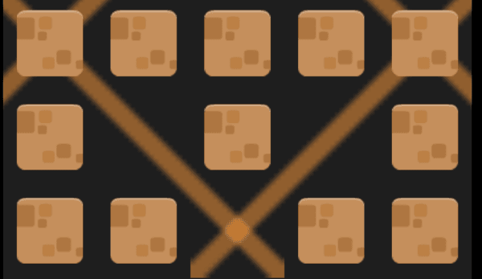
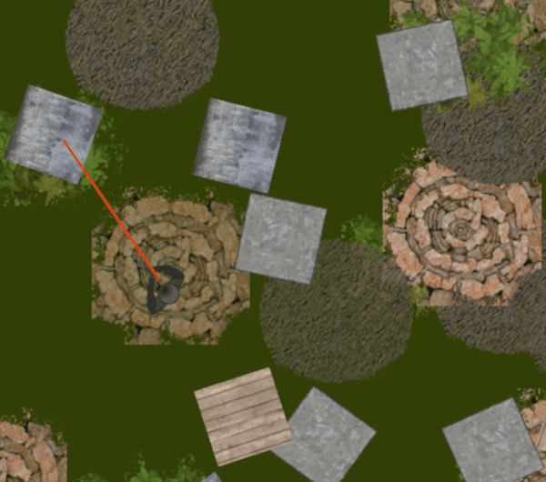

# Repeat events

Repeat events work like standard [events](/gdevelop5/events), but they are repeated multiple times in a row before continuing to the next event in the list. The events that follow are not executed until the number of repetitions has been reached.

Note that this count can be an expression. That means that you can make the number of repetitions vary according to something that the player does. For example, you can create a different number of enemies according to an object's life count, position, etc. You can also create a random number of objects on the scene (see the example below).

## Local variables

Repeat events support [local variables](/gdevelop5/all-features/variables/local-variables). Local variables declared in a Repeat event are scoped to the loop: they are initialized before the loop starts and are only accessible within the loop and its sub-events.

## Loop counter variable

Repeat events can have a **loop counter variable**. When set, this variable starts at 0 and is automatically incremented by 1 on each repetition. This is useful to know which iteration is currently running — for instance, to position objects at different offsets during each repetition.

## How to add this event

Right click (or long press) on an existing [event](/gdevelop5/events) and choose *"Add"* in the menu. Then, select the event you want to add.
Alternatively, click on the *"Plus" icon* in the toolbar or on *"Add..."* at the bottom of the events sheet.

## Examples

!!! tip

        **See it in action!** 🎮
    Open these examples online.

**Diagonals**

[{ width="320" }](https://editor.gdevelop.io/?project=example://find-diagonals)

[Open example in GDevelop](https://editor.gdevelop.io/?project=example://find-diagonals){ .md-button .md-button--primary }

**Laser**

[{ width="320" }](https://editor.gdevelop.io/?project=example://zombie-laser)

[Open example in GDevelop](https://editor.gdevelop.io/?project=example://zombie-laser){ .md-button .md-button--primary }