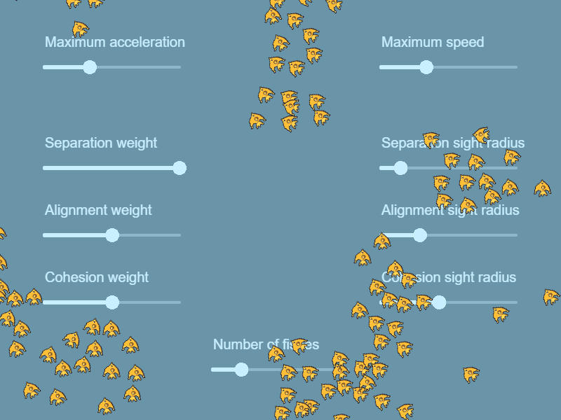

# Boids movement extension

Simulates swarms or flocks movement following the separation, alignment, cohesion principles.

!!! tip

    Learn [how to install new extensions](/gdevelop5/extensions/search) by following a step-by-step guide.

**Fish school example**

[Open in GDevelop](https://editor.gdevelop.io/?project=example://fish-school){ .md-button .md-button--primary }

[{ width="300" }](https://editor.gdevelop.io/?project=example://fish-school)

!!! tip

    Learn more about Boids on the [Wikipedia page](https://en.wikipedia.org/wiki/Boids).
