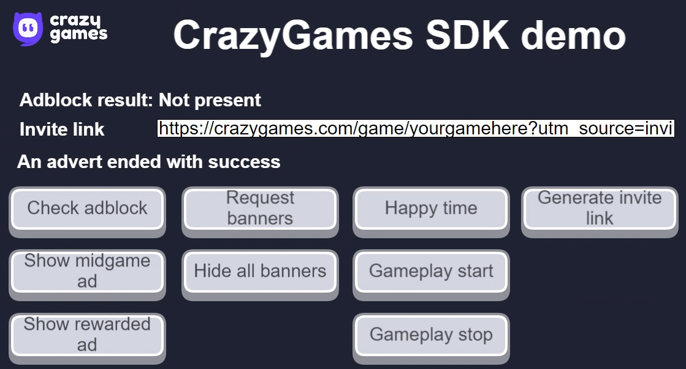
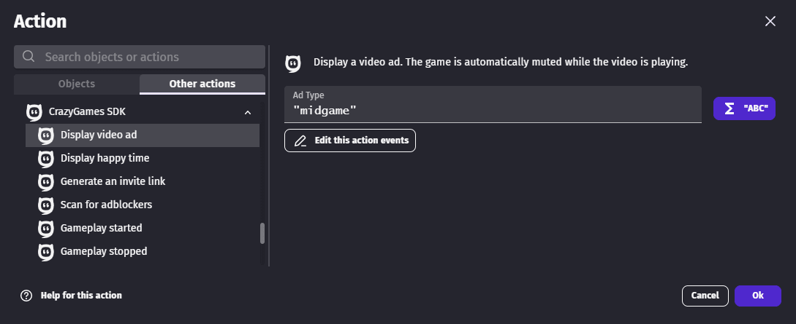
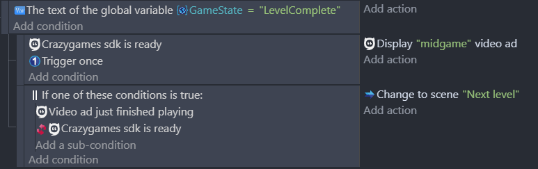
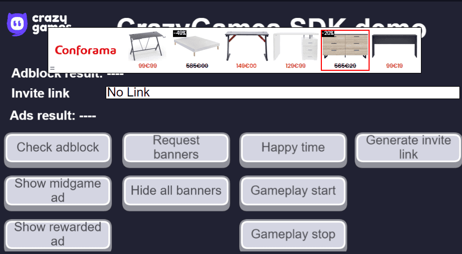
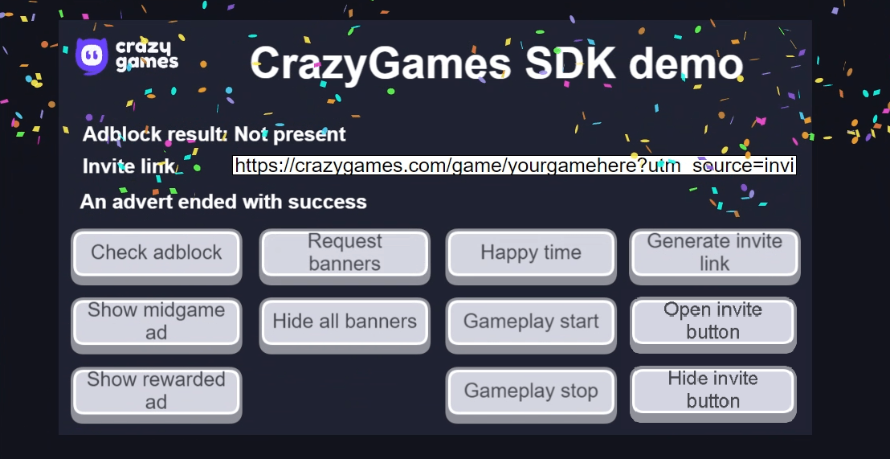
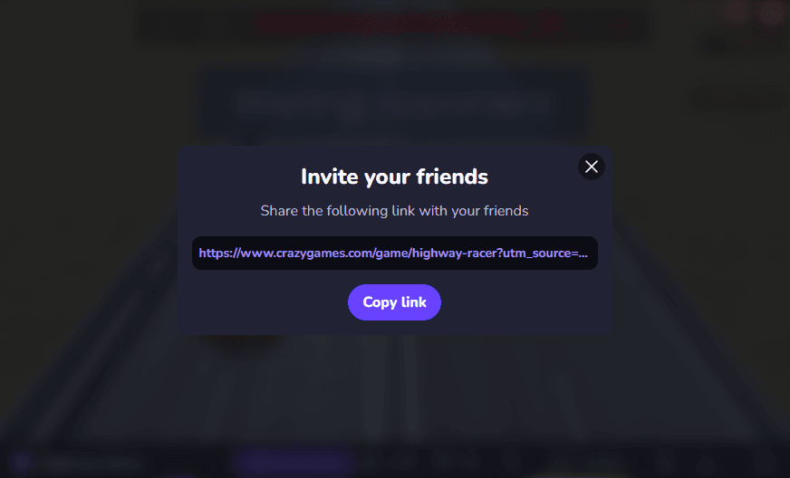

# CrazyGames SDK Extension

This extension allows games to be hosted on the CrazyGames website and display modules in games such as ads, banners, and various functionality related to the game.

## Advanced Configurations

Please refer to the [CrazyGames SDK documentation](https://docs.crazygames.com/sdk/html5/intro/) to learn how to set up compatible environments for games and to get tips about unwanted scrolling on the game page.

## Demo

A project demo showcase the features from the extension in GDevelop.
The project can be exported as HTML5 files, then imported in the QA Tool on CrazyGames website when submitting a new game on their platform.

[Open the demo](https://gdevelop.io/fr-fr/game-example/free/crazygames-sdk-demo){ .md-button .md-button--primary }

## Display Video Ads

A video ad filling the entire game screen can be displayed using the **Display video ad** action. An ad can either be `"midgame"` or `"rewarded"`.

- **Midgame**: Advertisements can happen when a user dies, a level has been completed, etc.

- **Rewarded**: Advertisements can be requested by the user in exchange for a reward (an additional life, a retry when the user dies, a bonus starting item, extra starting health, etc.). Rewarded ads should be shown when users explicitly consent to watch an advertisement.

You can use the **Video ad just finished playing** condition to resume the game after the end of the ad.

## Banners
### Request Banner

Ads banners can be placed with X and Y position and use a part of the game screen according to some static dimensions such as: `728x90, 300x250, 320x50, 468x60, 320x100`.

!!! warning

    A banner can be called only once per 60 seconds. If a banner is called before the delay, an error is returned in the debugger.

### Clearing the Banners

Two possible actions for clearing banners:

- Delete a banner by its name.
- Delete all the banners in game.

## Game

### Happy Time

Celebrate a special moment in the game with some sparkling confetti. Celebrate the defeat of a boss, reaching a new high score, or something big.

### Tracking Users

Some actions or events triggered automatically can be used to track when and how users are playing your games and get the stats directly on CrazyGames game dashboard.

- The **Gameplay Start** action has to be called whenever the player starts playing or resumes playing after a break (menu/loading/achievement screen, game paused, etc.).

- The **Gameplay Stop** action has to be called on every game break (entering a menu, switching levels, pausing the game, etc.). Don't forget to call the Gameplay Start when the gameplay resumes.

### Invite Button

Display on CrazyGames website a popup containing the invite link with a copy button, very useful for multiplayer games to give a friend the possibility to join a session quickly. 

### Invite Link

Return a URL to invite friends to join your game session. This URL can be added to the clipboard or displayed in the game to let the user select it.

# References
!!! tip

    Learn more about all the events from the extension on the [reference page](/gdevelop5/extensions/crazy-games-ad-api/).