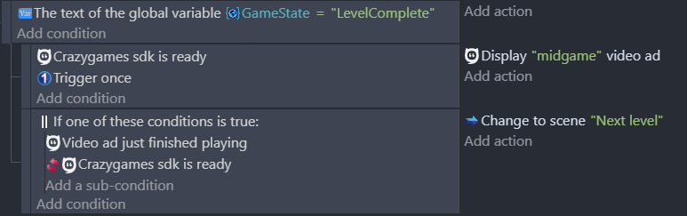

# CrazyGames SDK Extension

This extension allows games to be hosted on the CrazyGames website and display modules in games such as ads, banners, and various functionality related to the game.

## Advanced Configurations

Please refer to the [CrazyGames SDK documentation](https://docs.crazygames.com/sdk/html5/intro/) to learn how to set up compatible environments for games and to get tips about unwanted scrolling on the game's page.

## Video Ads

A video ad filling the entire game screen can be displayed using the **Display video ad** action. An ad can either be `"midgame"` or `"rewarded"`.

- **Midgame**: Advertisements can happen when a user dies, a level has been completed, etc.

- **Rewarded**: Advertisements can be requested by the user in exchange for a reward (an additional life, a retry when the user dies, a bonus starting item, extra starting health, etc.). Rewarded ads should be shown when users explicitly consent to watch an advertisement.


You can use the **Video ad just finished playing** condition to resume the game after the end of the ad.



## Banners
### Request Banner

Ads banners use a part of the game's screen according to some static dimensions such as: `970x90, 320x50, 160x600, 336x280, 728x90, 300x600, 468x60, 970x250, 250x250, 120x600, 300x250, 320x100`.

// TODO Extension update

### Request Responsive Banner

Display ads automatically according to the size of the game. The resulting banners will have one of the following sizes: `970x90, 320x50, 160x600, 336x280, 728x90, 300x600, 468x60, 970x250, 300x250, 250x250, 120x600`. Only banners that fit into your container will be displayed; if your container cannot fit any of these sizes, no ad will be rendered.

### Refreshing Banners and Limitations

A banner can be called only once per 60 seconds. If a banner is called before the delay, an error is returned in the debugger.

### Clearing the Banners

Two possible actions for clearing banners:
- Delete a banner by its name.
- Delete all the banners from the game.

## Game

### Happy Time

Celebrate a special moment in the game with some sparkling confetti. Celebrate the defeat of a boss, reaching a new high score, or something big.

//TODO IMAGE

### Tracking Users

Some actions or events triggered automatically can be used to track when and how users are playing your games and get the stats directly on CrazyGames's game dashboard.

- The **Gameplay Start** action has to be called whenever the player starts playing or resumes playing after a break (menu/loading/achievement screen, game paused, etc.).

- The **Gameplay Stop** action has to be called on every game break (entering a menu, switching levels, pausing the game, etc.). Don't forget to call the Gameplay Start when the gameplay resumes.

//TODO Extension update
- The **Game Loading Start**,
- The **Game Loading Stop**, 

### Invite Button

//TODO Extension update
Display a popup modal containing the invite link with a copy button, very useful for multiplayer games to give a friend the possibility to join a session quickly. 

//TODO IMAGE

### Invite Link

Return a URL to invite friends to join your game session. This URL can be added to the clipboard or displayed in the game to let the user select it.

## User (Not sure about adding this)

# References
!!! tip

Learn more about all the events from the extension on the [reference page](/gdevelop5/extensions/crazy-games-ad-api/).
```