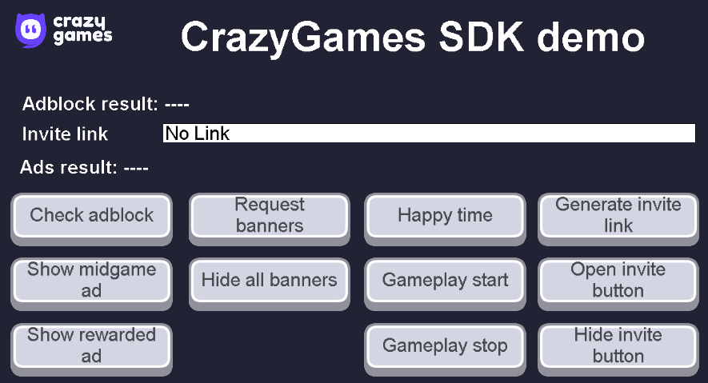
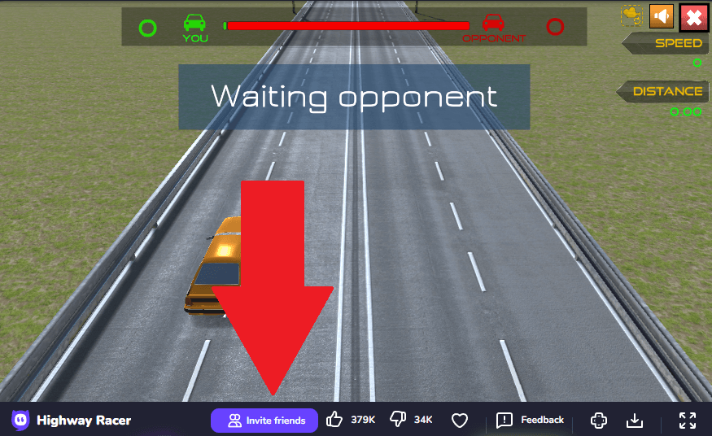

# CrazyGames SDK Extension

This extension allows games to be hosted on the CrazyGames website and display modules in games such as ads, banners, and various functionalities offered by CrazyGames.

## Advanced Configurations

Please refer to the [CrazyGames SDK documentation](https://docs.crazygames.com/sdk/html5/intro/) to learn how to set up compatible environments for games and to get tips about development and testing with their QA Tool.

## Try the CrazyGames SDK demo

A demo project showcases the features from the CrazyGames SDK in GDevelop.
The project can be exported as an HTML5 game, then imported in the QA Tool on [CrazyGames Developer Portal](https://developer.crazygames.com/games) when submitting a new game on their platform.

[Open the demo](https://gdevelop.io/fr-fr/game-example/free/crazygames-sdk-demo){ .md-button .md-button--primary }

## Display Video Ads

A video ad filling the entire game screen can be displayed using the **Display video ad** action. An ad can either be `"midgame"` or `"rewarded"`.

- **Midgame**: Show an advertisement when a user dies, a level has been completed, etc.

- **Rewarded**: An advertisement that can be requested by the user in exchange for a reward (an additional life, a retry when the user dies, a bonus starting item, extra starting health, etc.). Rewarded ads should be shown when users explicitly consent to watch an advertisement.

!!! warning

    When testing your game in CrazyGames' QA Tool, midgame ads won’t work, only rewarded ads will. You must really submit your game in their Developer environment. After this, test again in the QA Tool. The ads should now work. This is the only way to test midgame ads in your game.

You can use the **Video ad just finished playing** condition to resume the game after the end of the ad.

### Adblock detection

CrazyGames games must be playable even if an ad blocker exists. To avoid blocking in your game, you can use the **Ad blocker is detected** condition, or use it to restrict certain parts of your game while warning your players that by deactivating their blocker they will be able to access the rest of the content.

## Banners
### Request a Banner

An ad banner can be placed with X and Y position and use a part of the game screen according to some static dimensions such as: `970x90`, `320x50`, `160x600`, `336x280`, `728x90`, `300x600`, `468x60`, `970x250`, `300x250`, `250x250`, `120x600`.

!!! warning

    A banner can be called only once per 60 seconds. If a banner is called before the delay, an error is returned in the debugger and is also readable with the **Get last error** expression, which return a string.

### Clearing the Banners

There are two possible actions for clearing banners:

- Delete all the banners in game.
- Delete a banner by its name.

## Game

### Game Settings

The game can have setting(s) for:

| Setting | Expression |  |
|-----|-----|-----|
| Is the chat disabled | See the expression in [the references](/gdevelop5/extensions/crazy-games-ad-api/#expressions). ||

### Gameplay start/stop

Some actions or events are triggered automatically and can be used to track when and how users are playing your games. You can get the stats directly on the CrazyGames game dashboard.

- The **Gameplay Start** action has to be called whenever the player starts playing or resumes playing after a break (menu/loading/achievement screen, game paused, etc.).

- The **Gameplay Stop** action has to be called on every game break (entering a menu, switching levels, pausing the game, etc.). Don't forget to call the Gameplay Start when the gameplay resumes.

### Happy Time

Celebrate special moments in the game with sparkling confetti. Celebrate the defeat of a boss, reaching a new high score, or something big.

### Multiplayer Features

Games can be joined directly in multiplayer mode.

Use the expression **Is instantly joining a lobby** to determine if the player should be forwarded directly to a game lobby or multiplayer mode.

If the expression returns true, your game should immediately switch to multiplayer mode.

### Invite Link

Returns a URL to invite friends to join your game session. This URL can be added to the clipboard or displayed in the game to let the user select it.

### Invite Button

Display on CrazyGames website a popup containing the invite link with a copy button. This is very useful in a multiplayer game to give a friend the possibility to join a session quickly. 

## User
The user conditions and actions are only usable on CrazyGames' website. Be sure to check the availability of their information once the user is logged.

### Auth prompt

Use the action **Show CrazyGames login window** to ask the player to log in to the game before getting their information for the multiplayer.

### Check availability

The **Is user account available** is an expression that returns True when the player is playing on CrazyGames.

###  Retrieve user data

Use this action to fetch the user information/data from CrazyGames gaming platform.

!!! note

        When the SDK is loaded an automatic silent authentification is called, and when the action **Retrieve user data** is triggered there is also an automatic check for the authentification to ensure the player is logged, if not logged The Auth Prompt is called.

Once availability is confirmed and the user is logged in, the game can access the player's information:

- The Username
- The URL of the profile picture
- The system information (Country code, OS, browser, device)
- The user token (An encoded string of the user information, [read more](https://docs.crazygames.com/sdk/user/#get-user-token))

 See [the references](/gdevelop5/extensions/crazy-games-ad-api/#expressions) to see how to use the expressions to get these informations.

### Account link prompt

**Show account link prompt** action is made for supporting advanced account use cases, you'll need to handle account linking between the CrazyGames account and the other providers. Check [User linking page](https://docs.crazygames.com/sdk/user-linking/user-linking-html5-v3/) to find out more about user account linking.

## Data

The data allows saving and retrieving user progress. The data will also be synced on all the devices where the user plays the game. 

To save data, use the **Save session data** action.
A parameter name will be requested to store your data and retrieve it via the **Get user session data** expression.

!!! warning

        There is a 1MB data limit. And the save is made 1 second after the action to save is called. That can go up to 30 seconds if CrazyGames system detects abuse. Be careful not to perform this action on all frames.

## In-game Purchase

CrazyGames has partnered with [Xsolla](https://xsolla.com/) to offer you the possibility to integrate in-game purchases only for users that are signed in with them. To do this, you must [get in touch with CrazyGames](mailto:developer-relations@crazygames.com).

Once you are invited, you can then get access to the Xsolla project dashboard and get a token from Xsolla to manage transactions in your game thank to the **Generate Xsolla token** that will get a fresh token for authentification that is valid 1 hour. We recommend that you retrieve the token each time before using it for a transaction.

To perform transactions you must [use the Xsolla SDK as explained here](https://docs.crazygames.com/sdk/in-game-purchases/#registering-orders).

# References
!!! tip

    Learn more about all the events from the extension on the [reference page](/gdevelop5/extensions/crazy-games-ad-api/).
