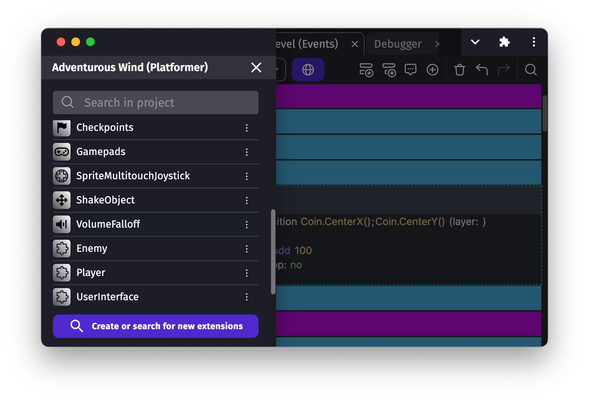
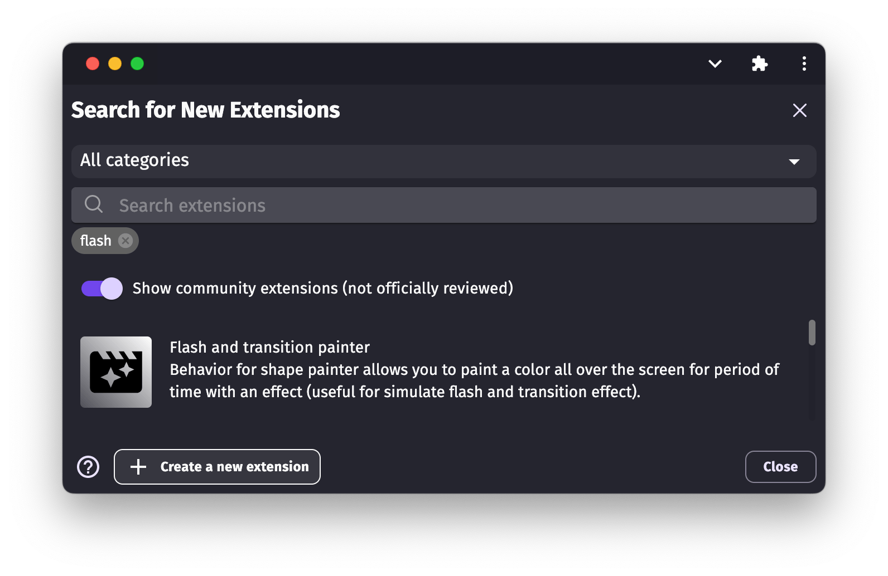

# Create your own extensions (objects, behaviors, conditions, actions or expressions)

Games can be enriched by extensions that can be created directly in a project. They can be made of [Javascript events](/gdevelop5/events/js-code/) or [standard events](/gdevelop5/events/), as in the usual [events sheets](/gdevelop5/interface/events-editor).

!!! note

    Some best practices are in vigor to keep the extensions as clean as possible, [these practices](/gdevelop5/extensions/best-practices) are requirements to submit an extension to the community list in the engine.

Developers can also [contribute to extensions built directly inside GDevelop](https://github.com/4ian/GDevelop/blob/master/newIDE/README-extensions.md).

## Create a new extension

Open the project manager, then click on **Create or search for new extensions**:

A new window opened up, at the bottom click **Create a new extension**:

A new extension is added to the project manager. It's recommended to immediately change the name to something that will hint at what the extension is providing by a right click on the extension and choose **Rename**.

!!! tip

    For example, the name can be "Flash" if you want to create an extension to make an object blink, or "TankEnemies" if you want to create behaviors that will control objects like if they are tanks on a battleground.

Finally, click on the extension to open it. You can now create new objects, behaviors and functions in your extension.

### Create new functions

Functions are either custom actions, conditions or expression that can be used in the events sheet.
Read more about [creating your functions here](/gdevelop5/events/functions).

### Create new behaviors

Custom behaviors are like usual behaviors that you can to an object. They can be used to control objects (moving them, changing their animation, text, size, etc...) according to some logic embedded in the behavior.

Read more about [creating your custom behaviors here](/gdevelop5/behaviors/events-based-behaviors).

### Create new objects ("prefabs")

Custom objects are full featured, autonomous objects which embeds their own logic and are constructed by assembling other objects. For example, UI elements like buttons, switches, toggles, sliders, are constructed as "custom objects", also called "Prefabs" in some game engines.

Read more about [creating custom objects here](/gdevelop5/objects/custom-objects-prefab-template).

## Share your extensions

If you've created an extension providing a useful, reusable behaviors or set of functions, you can [share them with the community](/gdevelop5/extensions/share-extension).
