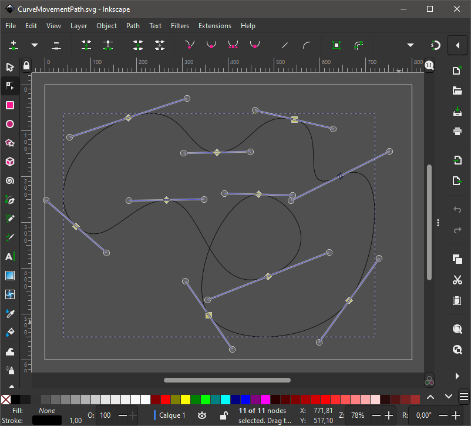
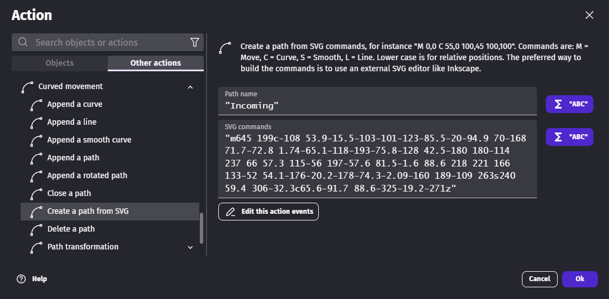

# Curved movement extension

This extension allows to move objects on Bézier curve paths.

!!! tip

    Learn [how to install new extensions](/gdevelop5/extensions/search) by following a step-by-step guide.

!!! warning
    This is an extension made by a community member — but not reviewed
    by the GDevelop extension team. As such, we can't guarantee it
    meets all the quality standards of official extensions. In case of
    doubt, contact the author to know more about what the extension
    does or inspect its content before using it.

**Curved movement example**

A collection of small examples show how to use this extension.

[Open in GDevelop](https://editor.gdevelop.io/?project=example://curved-movement){ .md-button .md-button--primary }

[{ width="300" }](https://editor.gdevelop.io/?project=example://curved-movement)


## Create a path with Inkscape

[Inkscape](https://inkscape.org/) is a free and open-source vector graphics editor. It can be used to create curves that can be used with this extension.

As GDevelop unit for distance is pixels, it's easier to setup Inkscape to use pixels too.


The [Inkscape documentation](https://inkscape-manuals.readthedocs.io/en/latest/pen-tool.html) explains how to use the pen tool to draw curves.



After being saved as an **Optimized SVG**, the curve looks as follows.

```XML
<?xml version="1.0" encoding="UTF-8"?>
<svg width="800" height="600" version="1.1" viewBox="0 0 800 600" xml:space="preserve" xmlns="http://www.w3.org/2000/svg"><path d="m645 199c-108 53.9-15.5-103-101-123s-94.9 70-168 71.7c-72.8 1.74-65.1-118-193-75.8-128 42.5-180 180-114 237 66 57.3 115-56 197-57.6 81.5-1.6 88.6 218 221 166 133-52 54.1-176-20.2-178-74.3-2.09-160 189-109 263s240 59.4 306-32.3c65.6-91.7 88.6-325-19.2-271z" fill="none" stroke="#000" stroke-width="1px"/></svg>
```

The part that starts with `m` and ends `z` can be copied and pasted into the **SVG commands** parameter of the **Create a path from a SVG** action.



## Move an object on a path

### Use a speed shape (Tween)

The **Movement on a curve (duration-based)** [behavior](/gdevelop5/behaviors/) gives control over the speed with:

- a duration
- a speed shape (the **Easing** parameter)

This is useful when:

- the object always travels the whole path
- the travel duration is more important than the speed


### Change the speed dynamically

The **Movement on a curve (speed-based)** [behavior](/gdevelop5/behaviors/) gives control over the speed by:

- changing the speed directly with the **Speed** action
- making the object accelerate with the **Accelerate** action

This is useful when:

- the speed depends on player inputs or game rules
- the speed must stay the same no matter how long is the path

The path that an object must follow can be chosen with the **Follow a path**. This action doesn't actually move the object as the initial speed is `0`.

