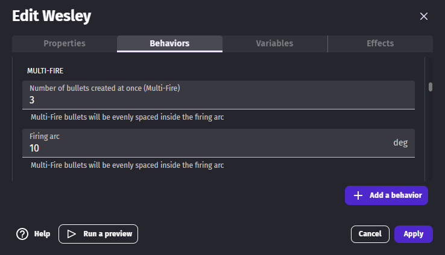

# Fire bullet

This extension allows objects to fire bullets with a cooldown between shots.

## Fire a bullet

The **fire bullet** [behavior](/gdevelop5/behaviors/) must be added to the object that shoots the bullets. One of the 2 **fire bullet** actions can then be used to actually fire bullets.

Bullets are usually created at the end of a cannon. [Custom points](/gdevelop5/objects/sprite/edit-points/) of sprite objects can be used for this.

TODO in the custom points page, add a section to explain how to use points in expressions

### Fire in a given direction

Bullets can be shot in a direction given by an [angle](/gdevelop5/tutorials/basic-game-making-concepts/#angles) with the **Fire bullet toward an angle** action.

**Space Shooter**

[Open in GDevelop](https://editor.gdevelop.io/?project=example://space-shooter){ .md-button .md-button--primary }

[{ width="250" }](https://editor.gdevelop.io/?project=example://space-shooter)

### Fire to the cursor

Bullets can be shot to a position with the **Fire bullet toward an position** action. To shoot in the direction of the [cursor the expressions](/gdevelop5/all-features/mouse-touch/) `CursorX` and `CursorY` can be used as target.

TODO make this example actually use fire bullet

**Conviction of Gun Dude**

[Open in GDevelop](https://editor.gdevelop.io/?project=example://conviction-of-gun-dude-desktop){ .md-button .md-button--primary }

[{ width="250" }](https://editor.gdevelop.io/?project=example://conviction-of-gun-dude-desktop)

## Fire several bullets at once

### Fire parallel bullets

To fire bullets from 2 cannons, the **Fire bullet toward an angle** action can be added twice to the event. Once for each [custom point](/gdevelop5/objects/sprite/edit-points/).

example: TODO merge this new example and add a link

### Fire spreading bullets

Firing bullets that spread on an arc could be done with the method from the previous section but these 2 properties make it a lot easier:

- Number of bullets created at once
- Firing arc

With these property values, the **fire** action fires 3 bullets evenly spread on a 10° cone.

**Fire bullet example**

[Open in GDevelop](https://editor.gdevelop.io/?project=example://fire-bullet){ .md-button .md-button--primary }

[{ width="250" }](https://editor.gdevelop.io/?project=example://fire-bullet)

### Fire like a shotgun

Some randomness can be defined with these 2 property:

- Angle variance
- Bullet speed variance

