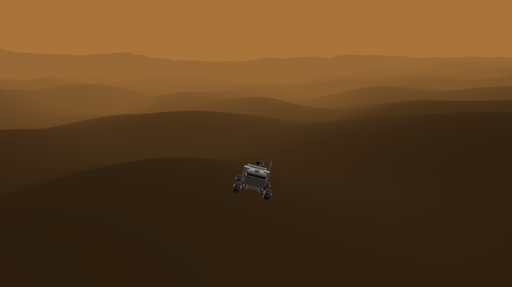

# Height map extension

This extension allows to build a terrain with hills where objects with the 3D physics behavior can stand.


## Create a height map from a 3d model

3D modelers like [Blender](https://www.blender.org/) can be used to render a model height into a grayscale image. The model should only contain the terrain. Decorations like trees or buildings must be removed for this process.


## Generate a realistic terrain

[WGEN](https://github.com/jice-nospam/wgen) is a free and open-source height map generator. It can produce grayscale images that can be used with this extension.


## Generate an endless terrain

Basic terrains can also be generated directly inside GDevelop using the [noise extension](/gdevelop5/extensions/noise).

[Open example in GDevelop](https://editor.gdevelop.io/?project=example://3d-endless-terrain){ .md-button .md-button--primary }

[{ width="320" }](https://editor.gdevelop.io/?project=example://3d-endless-terrain)


## Avoid stairs-like height maps

The extension can only read images as 8 bits per channel. This can lead to terrain moving up like stairs. To avoid this issue, a 16 bits grayscale image can be converted into a 8 bits RGB image that uses red and green channels.

```Python
import numpy as np, cv2

src = cv2.imread("greyscale-height-map.png",cv2.IMREAD_UNCHANGED)
h,w = src.shape
dst = np.zeros((h,w,3), np.uint8)

dst[:,:,1] = (src & 0xff00) >> 8
dst[:,:,2] = src & 0x00ff

cv2.imwrite("red-and-green-height-map.png",dst)
```

This is a slightly modified version of the [original script](https://gist.github.com/companje/85e94ea96629ddaf1219f137b225fd69) written in [Python](https://www.python.org/).


## Reference

All actions, conditions and expressions are listed in the [Height map reference page](..).
