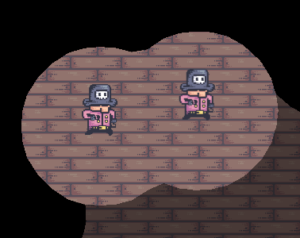
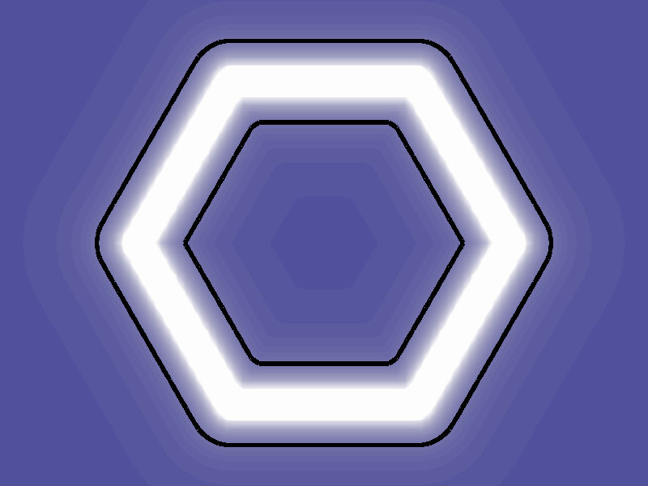
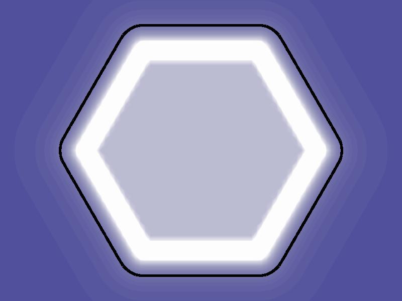
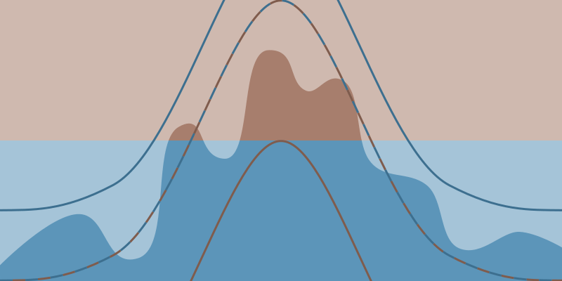

# Marching Squares Extension

This extension allows to build a scalar field and draw contour lines of it.

6 examples illustrate how this can be used in games:

  * a liquid effect demo ([open the project online](https://editor.gdevelop.io/?project=example://marching-squares-liquids))
  * a fog of wars demo ([open the project online](https://editor.gdevelop.io/?project=example://marching-squares-fog-of-war))
  * a platformer with destructible platforms ([open the project online](https://editor.gdevelop.io/?project=example://marching-squares-platforms-painter))
  * a QIX-like game that paint territories ([open the project online](https://editor.gdevelop.io/?project=example://marching-squares-qix))
  * a top-down relief with physics ([open the project online](https://editor.gdevelop.io/?project=example://marching-squares-terraforming))
  * an island generator ([open the project online](https://editor.gdevelop.io/?project=example://marching-squares-island-generator))

## Understand scalar fields

A scalar field associate a value for every point of a space. For instance, scalar field values can represent the height on a map (a 2d space).

## Understand contour lines

Points with a same value form a contour line. This can be used to draw shapes that change dynamically.

## Use contour lines

### Draw liquids effects

Liquids or blob effects can be made using contour lines. In the liquids example, each drop is a physics object with gravity and they collides with each other. One spike is added on the field for every drop. The action is called "Add disk" because its contour line makes a circle.

The spikes are merged using the "Addition" operation. This is important because when 2 spikes are next to each other, their values add up and can go over value chosen for the contour line. This is what does the feeling of attraction between 2 drops.

|  |  |
|---|---|

### Draw a fog of war

Contrary to the previous section, a fog of war needs the disks to be merged without a blob effect. This can be done by choosing the "Maximum" operation for the "Add disk" action.

|  |  |
|---|---|

Fog of wars often keep a trail of the scouted area. But, at every frame, the field of sight is cleared to be updated with the new location of the objects which means that previous scouted area is forgotten. The "merge" action can be used to keep the trail in another field.

### Make destructible environments

Destructible or dynamic environments can be achieved with the same logic as in the previous sections. Matter can be created with the "add disk" action and destroyed with the "Mask disk" operation.

The "Mask disk" operation hasn't been introduced before so let's take a look at its effect next to a "Add disk". The contour line is the shape of a moon quarter: a disk eaten by another disk. More complex shapes like in the previous screenshot can be built by combining more disk actions.

### Paint territories

Previous sections show how to build shapes using "disk" actions that work a bit like a brush from drawing applications. In these applications, paint bucket tools can fill an area with color. In the same way, parts of the field can be filled to a given level with the "flood" action. It can also be seen as flooding a valley for a dam.

|  |  |
|---|---|
| Before the flood | After the flood |

## Use scalar fields

### Build a terrain

In the examples of the previous section, the scalar field was only used to build shapes from a contour line. When building a terrain, the field values represent the height, so all the field values are needed to give a graphical representation.

The "disk" actions give very high values near the center. This doesn't allow a fine control over the terrain height. This is where the "hill" action comes in place. It allows to choose a height at a center. It could actually be used to draw shapes too but it needs more complicated computing than the "disk" actions. The following illustration shows one hill with a lower height at the left and a higher one at the right.

### React to the slope of a terrain

When the field values represent a terrain height, the "NormalX", "NormalY" and "NormalZ" expressions can be used to apply forces to objects and give the impression that they are falling down from a slope.

### Constraint a terrain generation

Noise can be useful to generate terrains but, without any constraint, the result might be hard to use.

For instance, a terrain can be forced into an island. To do so, 2 constraints can be used:

  * a lower bound to ensure that the terrain is over the sea level where the island should be
  * an upper bound to ensure that the island is surrounded by sea

One scalar field can be used for the lower bound and another the upper bounds. They will define a range of value for every point of the surface and the noise will be stretched in between. They can be built with hills like in the following illustration to give the general shape of the island.

|  |  |
|---|---|
| Island shape | Island with noise |
