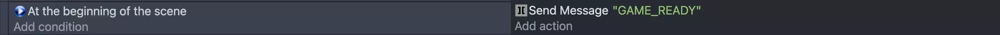
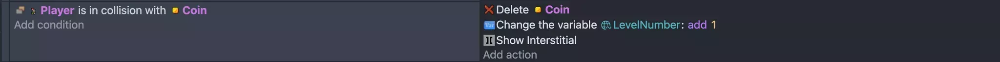
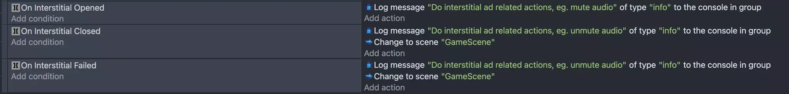
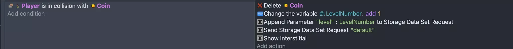
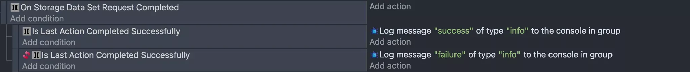
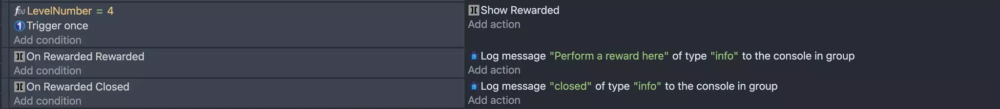

# Step-by-Step Guide to Monetizing HTML5 Games in GDevelop with PlaygamaBridge

Welcome to our guide on integrating PlaygamaBridge with your GDevelop game! In this tutorial, we’ll be using a [GDevelop game](https://www.youtube.com/watch?v=P1MYDHdWDNw) as a working example to demonstrate how you can enhance your game's reach and monetization capabilities.

This game consists of two core scenes:

1. **Level selection scene**: Where the player chooses the level they have access to.
2. **Game logic scene**: Where the main gameplay takes place.

The levels are managed through external layouts. Before proceeding, watch the accompanying video to get a clear understanding of how the game functions. Once you're familiar with it, return here to continue with the integration steps.

Here’s the plan for our integration:

1. **Create an initialization scene**: We’ll add a new scene that retrieves the maximum accessible level when the game starts.
2. **Switch to the level scene**: Once initialization is complete and the player starts the game, we’ll transition to the level scene and send a specific message to the **PlaygamaBridge** extension.
3. **Show interstitial ads**: When the player switches between levels, we’ll display interstitial ads to enhance monetization.
4. **Save and retrieve data**: We'll implement features to save the player's accessible level and retrieve it at the beginning of the game. This ensures that progress is preserved and players can seamlessly continue from where they left off.
5. **Implement rewarded ads**: We’ll add rewarded ads to provide incentives, granting rewards to the player based on their interaction with the ad.

With these steps, we’ll enhance both the gameplay experience and monetization potential. Let’s dive in!

# Installation

There are two ways to install the **PlaygamaBridge** extension, giving you flexibility based on your preference:

1. **Directly from GDevelop IDE**: Since **PlaygamaBridge** is a reviewed and approved extension, you can easily find and install it within the GDevelop interface.
2. **From the Release page**: Alternatively, you can download the extension from the official Release page for manual installation.

Once the extension is installed, you’ll gain access to a full suite of **Conditions**, **Actions**, and **Expressions**, ready to be used in your game. These powerful tools will allow you to integrate monetization, data handling, and platform features seamlessly into your game development workflow.

### **1. GDevelop IDE**

Go to `Project Manager` → `Create or search for new extensions` → Type `Playgama` in `Search extensions` field and install the extension.

or: 
### **2. Release page**

Download the specific version of `PlaygamaBridge.json` from the [GitHub release page](https://github.com/playgama/bridge-gdevelop/releases).

Go to `Project Manager` → `Create or search for new extensions` → `Import extension` and select the downloaded file.

# **Create an initialization scene**

When integrating PlaygamaBridge, there are essential steps you must follow. One critical requirement is to wait for the bridge to be fully initialized and ready to interact with the platform-specific API. Once initialization is complete, you can safely proceed with game logic, such as retrieving the player's profile or accessing stored data.

To ensure smooth data handling, we’ll manage this process in a separate scene, which we have added and named the `Loader` ****scene, allowing for easy data retrieval at later stages of the game.

Let’s see how it is done

You can also copy and paste this content into your clipboard and paste it into GDevelop to add this instruction line in a very quick way.

We’ll come back to this scene later. For now, let’s do some other preparation

# **Switch to the level scene**

Once the initialization is complete and the game is ready to be displayed, we send the `GAME_READY` message. This step is crucial, as many platforms require it, although the implementation can vary across platforms. Thankfully, PlaygamaBridge simplifies this process, making it seamless. Just remember to trigger the `GAME_READY` message once everything is fully prepared to start the game.

# **Show interstitial ads**

Here comes the most exciting part! Right before transitioning to the next level, we’ll display an interstitial ad. The process is incredibly simple and can be achieved with just a few steps, as shown below:

Now, we have the ability to subscribe to interstitial state changes, allowing us to react and perform custom game logic based on these events. This lets you manage the game's flow dynamically, such as pausing, resuming, or updating elements depending on the ad's status.

# **Save and retrieve data**

To allow players to continue their progress across multiple devices, we implement data saving. Specifically, we’ll save and retrieve a variable `LevelNumber` that represents the maximum accessible level in our case.

Here’s how it works:

- When the player completes a level (in our simplified example, by collecting a coin), we increment the `LevelNumber` variable.
- We then save this updated value to storage. To ensure the data is accessible across sessions and devices, we’ll use the `platform_internal` option with the `default` storage setting. This option automatically detects whether platform cloud storage is available. If cloud storage isn't supported, it falls back to `local_storage`.

Since the storage data structure isn't predefined, adding a new parameter requires an extra step. We need to use the `Append Parameter to Storage Data Set Request` method before performing the actual save operation. 

Optionally, you can perform additional actions once the saving process is completed. To achieve this, use the `On Storage Data Set Request Completed` condition. Additionally, if you need to verify whether the save operation was successful, you can use the `Is Last Action Completed Successfully` condition. Based on the result of this check, you can trigger appropriate actions to handle both success and failure scenarios effectively.

Retrieving data is a crucial step, and in our case, it should be done once at the beginning of the game, even before sending the `GAME_READY` message. This is important because the `GAME_READY` message signals that everything is fully prepared for the player to start interacting with the game.

The ideal place to perform this data retrieval is in the `Loader` scene, the scene we added earlier for initialization. By retrieving the maximum accessible level and other necessary data here, we ensure that all essential information is loaded and ready for the game to proceed smoothly.

In the example above, we followed a similar approach to setting the data, but this time we used the `Append Parameter to Storage Data Get Request` method along with the `On Storage Data Get Request Completed` condition. We also checked for the existence of the `level` key in the response to ensure it can be assigned to our global variable, `LevelNumber`.

Once all of this is completed, we’re ready to switch to the `LevelSelect` scene, allowing the player to choose their starting level.

# Adding Rewarded Ads

We've reached the final step: integrating rewarded ads. To keep things simple, we'll trigger the ad display when the player completes the 4th level. However, the timing is entirely up to you, depending on your game's design and flow.

One crucial aspect to remember is that **rewarding the player** is a key requirement for using rewarded ads. This could be in the form of coins, extra attempts, or other in-game currency or benefits. Failure to provide a reward may lead to your game being rejected by certain platforms.

For the purpose of this tutorial, I'll simply add a log to simulate the reward process. However, in your actual game, ensure that the player receives their reward appropriately to comply with platform requirements and enhance player satisfaction.

# Summary

Congratulations! We've successfully implemented the core mechanisms that enable your game to be monetized across multiple platforms. From initializing the `PlaygamaBridge` to managing data storage, displaying interstitial and rewarded ads, and switching scenes seamlessly, your game is now equipped to reach a broader audience and generate revenue effectively.

For further reference, you can explore the [repository](https://github.com/Playgama/bridge-gdevelop-example) with the full example of the game used in this guide.

Stay creative, stay ambitious, and keep pushing the boundaries of HTML5 game development! Whether you're refining MVPs or crafting new game concepts, `PlaygamaBridge` has your back. Stay tuned for more updates and keep on building amazing experiences!

!!! tip

    Learn more about this extension in the [reference page](/gdevelop5/extensions/playgama-bridge/)