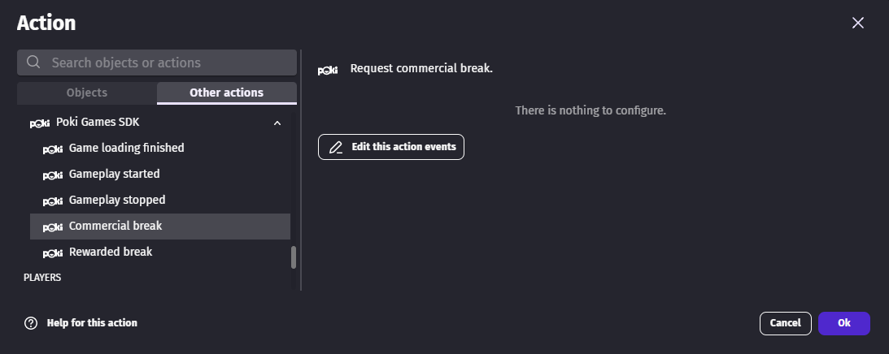
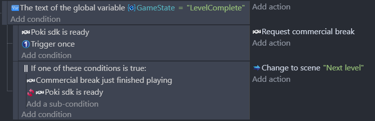

# Poki Games SDK extension

This extension allows games to be hosted on Poki website and display ads.

!!! tip

    Please refer to [Poki's guide](https://sdk.poki.com/sdk-documentation.html) to know when to call the different actions.

## Display an ad

Ads can be displayed using either the **Commercial break** or **Rewarded break** actions. Please refer to [Poki's implementation details](https://sdk.poki.com/html5.html#4-implement-commercialbreak) to understand when to use one or the other.

You can use the **Commercial break just finished playing** condition to resume the game after the end of the ad.

For rewarded ads, use both **Rewarded break just finished playing** and **Should reward player** to grant rewards only when the ad was completed. Check both conditions in the same event branch.

## Shareable URLs and URL parameters

Use **Create shareable URL** to generate a Poki-compatible URL from a structure variable.

- Create a structure variable (for example `ShareParams`) with child variables like `id` and `type`.
- Call **Create shareable URL** with this variable.
- Read the result with the expression `PokiGamesSDKHtml::LastShareableURL()`.

To read incoming URL parameters, use `PokiGamesSDKHtml::URLParam("id")`. This helper also supports Poki's `gd`-prefixed URL parameters.

You can find the official Poki behavior here: [Shareable URLs and URL manipulation](https://sdk.poki.com/html5.html#6-shareable-urls-url-manipulation).

## Poki Pill on mobile

Use **Move Poki Pill** to reposition the Poki Pill if it overlaps your UI.

- `TopPercent` should be between `0` and `50`.
- `TopPx` is an additional pixel offset.
- The Poki default position is equivalent to `TopPercent = 0` and `TopPx = 20`.

Reference: [Poki Pill repositioning](https://sdk.poki.com/html5.html#7-poki-pill-repositioning).

## Other useful actions

- **Open external link**: open external URLs via Poki SDK.
- **Measure event**: send analytics events with `category`, `what`, and `action` values (for example `level`, `1`, `start`).

See the full Poki SDK docs here: [SDK documentation](https://sdk.poki.com/sdk-documentation.html).

!!! tip

    Learn more about this extension in the [reference page](/gdevelop5/extensions/poki-games-sdkhtml/)
