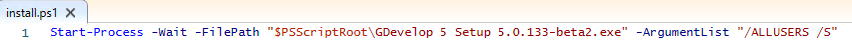

# Install GDevelop on a lot of machines in your company or university

GDevelop is available for all major operating systems, including the latest versions of Windows, macOS, and Linux. To download GDevelop, visit [gdevelop.io/download](https://gdevelop.io/download/).

If you're trying to install GDevelop on a large number of machines, you probably want to script the installation.
Here are a few tips from the community.

!!! note

    If you're a regular, single user of GDevelop, read the [Getting Started page instead](/gdevelop5/getting_started) to begin using GDevelop.

## On Windows

The installer is based on *NSIS*, so you can find online resources to use it from a script. For example, it can be [run silently](https://nsis.sourceforge.io/Docs/Chapter4.html#silent).

For usage in a company or university, we recommend installing it "system-wide" (i.e: for all users). Each user will have their own preferences.

You can create a Powershell script:


Something like this (adapt the executable path):

```
Start-Process -Wait -FilePath "$PSScriptRoot\GDevelop 5 Setup 5.X.XXX.exe" -ArgumentList "/ALLUSERS /S"
```

## On macOS

GDevelop can be run after copying it in the /Applications folder.

## Linux

You should be able to install GDevelop using the provided AppImage or the Flatpak available on Flathub.

!!! note

    Your contribution to this page is welcome to add more details according to your experience (links to scripts, etc...).

## Domains to be allowed for GDevelop app & services to function correctly.

GDevelop requires an internet connection to access services such as: exporting a game, games examples, tutorials, cloud saves etc. See below for a list of domains that need to be whitelisted for the services to work fully. Make sure these are accessible especially if you're on a school, university or company computers/network.

```
*.gdevelop.io
*.gdevelop-app.com
*.googleapis.com
*.amazonaws.com
*.cloudflarestorage.com
```

If you can, also whitelist these domains to ensure games exported from GDevelop can be played:

```
*.cloudfront.net
app.posthog.com
*.github.com
*.gd.games
gravatar.com
```
