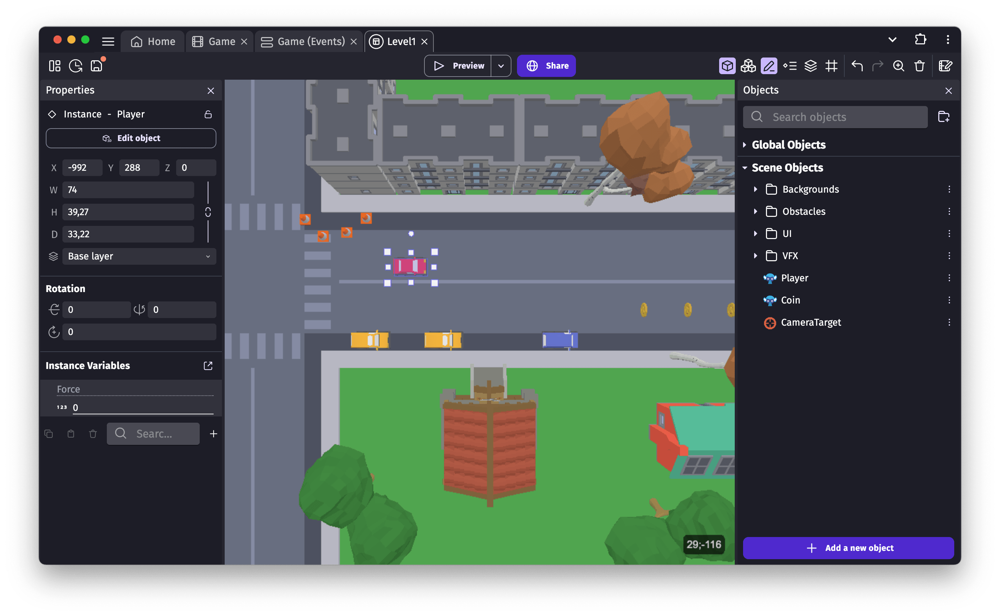

# GDevelop 5

GDevelop is a full-featured, no-code, open-source game creation app. You can build **2D, 3D and multiplayer games**, as well as interactive presentations and experiences, for mobile (iOS, Android), desktop and the web. GDevelop is fast and easy to use: the game logic is built up using an intuitive and powerful event-based system and reusable behaviors.

GDevelop is perfect to build your first game projects in a few days — **even if you've never created a game before**.
If you're an experienced developer, animator or game designer, you'll be familiar with the concepts in a few minutes and you will be able to quickly create ambitious prototypes or full games.

## Next steps

* [Start GDevelop](https://gdevelop.io/download). Read the [Getting Started](/gdevelop5/getting_started) guide if needed.
* If you've never made a game before, read the [Basic game-making concepts](/gdevelop5/tutorials/basic-game-making-concepts) guide and follow items in the "Get Started" page of GDevelop, including the guided tutorials.
* If you're ready to start making a game, watch the [Official Intro Tutorial Video Series](https://www.youtube.com/watch?v=595-swNh0Mw&list=PL3YlZTdKiS89Kj7IQVPoNElJCWrjZaCC8&index=1).
