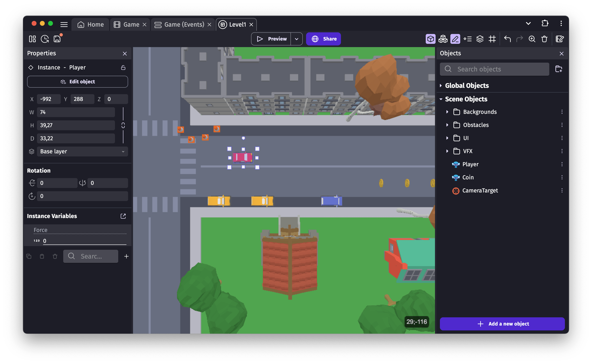

# GDevelop 5

Welcome to GDevelop, the full-featured, no-code, open-source game creation tool. Build **2D, 3D, and multiplayer games**, as well as interactive presentations and experiences, for mobile (iOS and Android), desktop, and web platforms.

GDevelop is designed to be **fast** and intuitive: build games using an easy-to-understand yet powerful event-based system, reusable behaviors, and an AI that guides or builds alongside you.

!!! tip

    GDevelop is perfect for creating your first game projects in just a few days — **even if you've never created a game before**.
    If you're an experienced developer, animator, or game designer, you'll become familiar with the concepts in minutes and can quickly create ambitious prototypes or complete games.

## First steps

* Download and start: [Get GDevelop here](https://gdevelop.io/download). If you need help installing, read the [Getting Started](/gdevelop5/getting_started) guide
* Learn the basics: If you've never made a game before, check out the [Basic game-making concepts](/gdevelop5/tutorials/basic-game-making-concepts) guide and follow the interactive tutorials on GDevelop's onboarding page.
* Ready to Create:  Watch the [Official Intro Tutorial Video Series]([...](https://www.youtube.com/watch?v=595-swNh0Mw&list=PL3YlZTdKiS89Kj7IQVPoNElJCWrjZaCC8&index=1)) to build your first project step-by-step.
