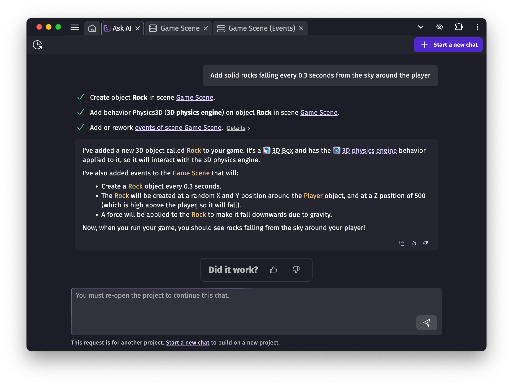

# Build with AI: the AI agent

The **AI agent** is an AI designed specifically to build games and do game creation tasks with GDevelop.

## How to use it

To open the AI, click the "Ask AI" button in the top-right corner of the GDevelop interface. Select **"Build for me"**, then type your request and send it — that’s it. You can then watch take it actions in your game to build what you asked.

## What the AI agent can build for you

The AI agent has knowledge of all GDevelop features and official, reviewed extensions. It also has a view of your whole game, and can if necessary inspect your game events or scenes.

The AI agent is good for:

- Doing simple changes ("Make an object bigger"),
- Creating new features ("Make an enemy that attacks the player"),
- Experimenting ("Make the key move away from the player when they try to reach it")
- Learning new concepts - by watching what the AI does for you.

The AI will reply in a few seconds after your request. It will then progressively take actions in your game. This can be:

- Creating a scene,
- Adding a new object,
- Adding a behavior to an object,
- Creating or modifying events to build the logic of your game,
- Placing game objects on the scene,
- And more.

The AI will try to fulfill the request as much as it can. It will show on the screen a summary of everything it is doing. Some steps can also have extra details you can inspect. Sometimes, a task can fail (for example: generating game logic may fail if the request is hard to fulfill), in which case the AI agent will try alternative ways to continue.

!!! note

    As with every AI tool, what the AI is doing is not perfect. From time to time, it can confuse some concepts, misunderstanding your game or what you're trying to do.
    Always double check what the AI does: you can keep continuing as long as it looks useful or stop and rework yourself what was created.

You can continue the conversation by asking follow-up requests. If you want to switch topics or ask something unrelated, click **"Start a new chat"** — this helps the AI better focus on your new request.

## Tips to use properly the AI agent

Before using the AI agent, **make sure to save your project**. This way, you can easily undo any changes the AI makes. In the future, cloud projects will support automatic restore points.
Here are a few best practices for working with the AI agent:

- Be **specific in your prompt**. Think of it like explaining your idea to someone who’s about to build it for you. Avoid vague instructions: clear language helps the AI understand your goals.
- Use **one chat per task**. When you’ve finished a task, start a new conversation. This keeps things focused and avoids confusing the AI with unrelated details.
- **Keep an eye on what the AI is doing**. If things start going off-track, you can click Pause to stop the process.
- **Expect variation**. Results may differ from one attempt to another—feel free to retry or rephrase your request for better outcomes.

## Cost of an AI request

Each account starts with a few **free AI requests**. If you have a GDevelop Silver, Gold or Pro subscription, you’ll receive more every day — 4 with Silver, 20 with Gold and 100 with Pro.

Once you've used all free requests, a request to the AI agent you send costs **4 to 20 credits**. The actual price depends on how much work and thinking the AI agent has to do. A simple request for a small change will be 4 credits, while a work involved request that needs for example to generate multiple events can be 16 or 20 credits.

!!! tip

     This means that with [a package of 500 credits](/gdevelop5/interface/profile/credits), you can make from 30 to 100 requests. Remember you can get **free credits by following GDevelop accounts** on socials — check your profile!

If you hover/tap the text indicating the price of the request, below the field where you write your request, you will see the credits paid for the last request you sent.

## Help us improve the AI

You can rate the AI’s answers with a 👍 or 👎. These ratings help the GDevelop team improve the assistant: we've reviewing every day the reports (especially if you include some details explaining what went wrong) and are constantly improving the AI.

!!! note

    Sometimes, high demand can temporarily slow things down or prevent a proper response. If that happens, don’t worry — you won’t be charged credits or lose your free requests.
