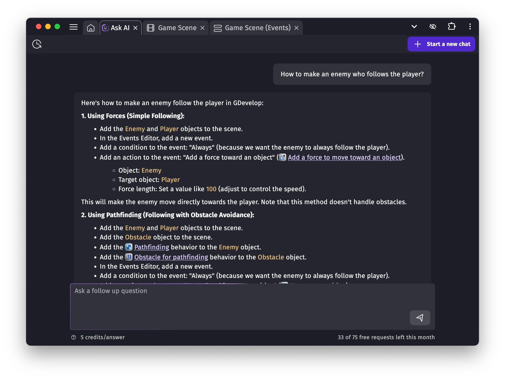

# Chat with AI: Get Help Building Your Game with AI

The **AI chat** is a chat assistant designed specifically to answer questions about GDevelop and game creation.

## How to use it

To open the AI, click the "Ask AI" button in the top-right corner of the GDevelop interface. Select **"Ask a question"**, then type your question and send it — that’s it.

The AI will reply in a few seconds. Answers often include **links to helpful resources, extensions, behaviors**, and relevant GDevelop concepts like actions or conditions.

!!! note

    As with every AI tool, the AI answers are not perfect. From time to time, it can confuse some concepts, misunderstanding your game or what you're trying to do.
    Always double check the answers and use the AI answers as suggestions to build your game. It's a good idea to follow the **[GDevelop Essentials Course](https://gdevelop.io/academy)** to quickly learn the basics of GDevelop and make your first games.

You can continue the conversation by asking follow-up questions. If you want to switch topics or ask something unrelated, click **"Start a new chat"** — this helps the AI better focus on your new request.

## What the AI chat can help you with

The AI understands all built-in GDevelop features and official, reviewed extensions (it doesn’t include community extensions unless they’ve been approved by the GDevelop team). It also has access to *an overview* of your project, which includes:

- Your game scene names
- Global objects and objects in each scene (but not their exact configuration),
- Object behaviors (but not their exact configuration),
- Global, scene and object variables (but not their content).

It **does not** currently have access to your scene events. It also has no access or details given about your username, profile, cloud projects, leaderboards, analytics or any personal detail from your user account.

The AI chat is perfect for getting a better understanding of a game develpment notion, discover extensions or features that you can use or learn how to build something.

## Cost of an answer from the AI

Each account starts with a few **free AI answers**. If you have a GDevelop Gold or Pro subscription, you’ll receive more every month — 25 with Gold and 75 with Pro.

!!! tip

    Once you've used all free answers, a message you send to the AI costs 5 credits. This means that with [a package of 500 credits](/gdevelop5/interface/profile/credits), you can make up to 100 requests. Remember you can get **free credits by following GDevelop accounts** on socials — check your profile!

    This is done to help pay for the expenses related to AI processing, and their maintenance.

## Help us improve the AI

You can rate the AI’s answers with a 👍 or 👎. These ratings help the GDevelop team improve the assistant.

!!! note

    Sometimes, high demand can temporarily slow things down or prevent a proper response. If that happens, don’t worry — you won’t be charged credits or lose your free requests.
