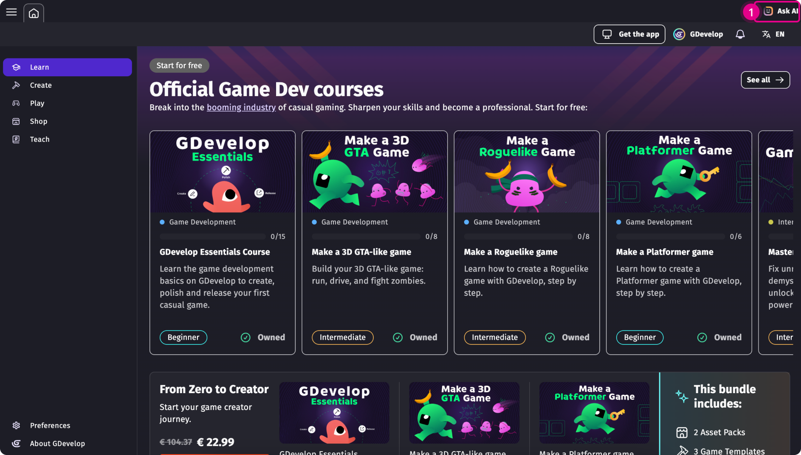

# Ask AI: Build your game with AI
Unlike general-purpose AI tools like ChatGPT, Claude, or Google Gemini, GDevelop AI is **tailored for game creation**. It knows how GDevelop works, it has access to your game's objects configuration, events and context.
It can help you:

- Understand features and how to use them
- Build specific mechanics or systems
- Help fix small implementation errors
- Explore, brainstorm and bring new ideas to life

!!! tip

    Think of it as an always available mentor and creative collaborator that speaks GDevelop fluently.

Click on **Ask AI** on the top-right corner (1) of GDevelop to open the AI chat.

## How it works

The AI understands all built-in GDevelop features, and official reviewed extensions. However, its knowledge does not include community extensions unless they’ve been approved by the GDevelop team. 
Context is everything to assure good AI results. To improve its suggestions, the AI can read the content of your project: object's configuration, behaviors, variables and event sheet.

The AI has two modes:

- **[Ask a question (AI chat)](./chat)**: silimar to Chat GPT or Gemini conversations. The AI will answer questions on game development, GDevelop usage, and idea brainstorming. This mode is recommended to learn the tool and define the implementation plan before using the Build mode.
- **[Build for me (AI agent)](./agent)**: similar to Cursor or V0. The AI will build your implementation requests inside your game. This can range from simple changes (example: "Make X object 20% bigger") to more complex requests ("Create an enemy that starts shooting arrows when the player comes 20px near it").

For mor information on credit consumption and good practices:
[Learn more about the GDevelop AI agent](./agent){ .md-button .md-button--primary .full-width }

[Learn more about the GDevelop AI chat](./chat){ .md-button .full-width }

## Cost of AI requests
An AI request could use 3 to 30 credits depending on the scope.
The number of credits used depends on the work and processing ("thinking") the AI has to do:

- an "Ask" request can be 2 to 5 credits,
- a simple "Build" request to do a small change could use 10 credits while implementations with multiple events could be 16 to 20 credits.

!!! tip

    Start by using the "Ask" mode to wirte your prompts and define the scope of your desired implementation. Once the AI has a feasible plan switch to "Build mode". This will prevent you from spending unnecessary credits.

## Aquiring credits for AI requests
All accounts starts with a few free AI credits. Once you've used all your free AI credits, you can:

- wait for them to replenish (every Sunday at 23:50 UTC),
- follow GDevelop accounts on socials and claim the credits through your profile,
- give <a href="/interface/games-dashboard/player-feedback/"> quality feedback</a> to GDevelop creators,
- use the AI chat to switch to your available <a href="gdevelop5/interface/profile/credits/"> GDevelop credits</a>,
- buy additional GDevelop credits through the app to get more AI requests,
- upgrade to GDevelop premium subscriptions.

!!! note
    A package of 500 credits usually represents 60 to 100 requests to the AI. 

**Premium Subscriptions** like GDevelop Silver, Gold or Pro receive more free AI requests every week: 200 with Silver, 1000 with Gold and 3000 with Pro.

## AI privacy

GDevelop AI is built on general purpose Large Language Models (LLMs) that can be adapted, fine tuned or have internally multiple agents working on a request.

**GDevelop AI is not trained on your accout's files nor individual projects**.
Local and cloud project are only accessible to the AI when the chat is in use. All cloud projects are stored separately from the GDevelop AI infrastructure which prevents it from access them without your request.

**In all cases there is no usage of private data for improving the AI.**

## How to improve the AI

You can rate the AI’s answers with a 👍 or 👎. Positive ratings will signal the AI to follow that rationale. Negative feedback will nudge the GDevelop team that the answer wasn't correct.

In the case of negative feedback, adding context to why the answer wasn't correct will help the engineers stir the AI to the right direction.

!!! note

    High AI demand can temporarily slow processing down or prevent the AI to give a proper response. In that case — don’t worry — you won’t be charged any credits.
