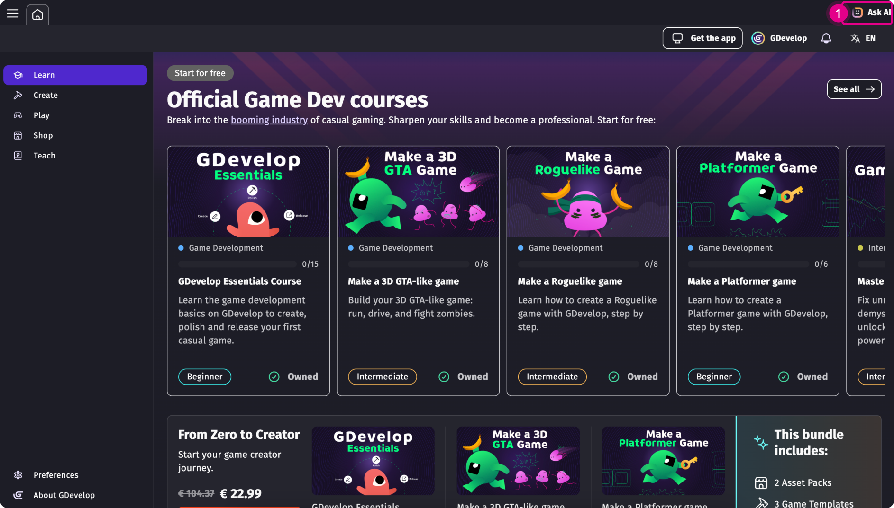
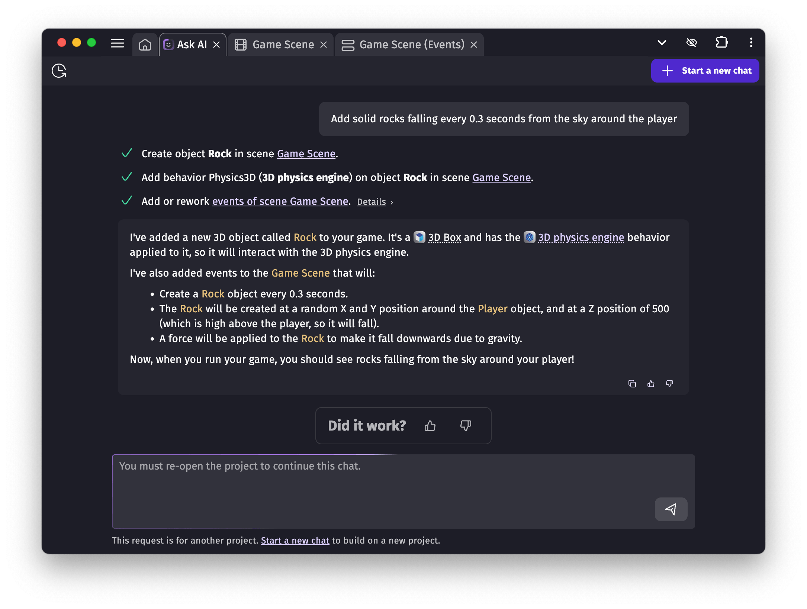

# Build and learn with GDevelop AI

GDevelop AI is a **creation agent for making games**: describe what you want in plain language, and it will answer your questions, brainstorm ideas, and build mechanics directly in your project. Unlike general-purpose tools like ChatGPT, Claude or Google Gemini, it's specialised for GDevelop — it knows how the engine works and can read your game's objects, behaviors, variables and events to understand what you're working on.

It can help you:

- Understand features and how to use them,
- Build specific mechanics or whole systems,
- Fix small implementation mistakes,
- Explore, brainstorm and bring new ideas to life.

!!! tip

    Think of it as an always-available mentor and creative collaborator that speaks GDevelop fluently.

Click on **Ask AI** in the top-right corner of GDevelop to open it.

You simply describe what you want in plain language, and the AI decides whether to answer, explain, or make changes in your project.

The AI knows all built-in GDevelop features and the official, reviewed extensions. It does **not** know about community extensions unless they've been approved by the GDevelop team.

## What the AI can build for you

When it builds, the AI can take many concrete actions in your game, such as:

- Creating and deleting scenes,
- Adding, editing and removing objects and placing them in a scene,
- Adding behaviors to objects,
- Organizing objects into groups,
- Reading, creating and deleting object, scene and global variables,
- Inspecting and adjusting object and scene effects,
- Creating or modifying events to build your game's logic,
- Creating global or scene-wide elements,
- Finding and installing suitable official extensions or assets.

!!! note

    It's well suited for:

    - Simple changes — *"Make object_X 25% bigger"*,
    - Game mechanics — *"Make an enemy that shoots the player once it's within 20px"*,
    - Experiments — *"Make the key move away from the player when they try to reach it"*,
    - Learning — by reading the events the AI writes, you can see how a mechanic is actually built.

## How the AI works on your request

The AI replies within a few seconds, then gets to work. Rather than doing everything in one block, it **breaks your request into smaller pieces of work** and tackles them one after another. You'll see these as short steps in the conversation, for example *"Exploring the game"*, *"Inspecting the game structure"*, *"Editing the game"*, or *"Searching the asset store"*.

For more involved requests, the AI first lays out a **plan**: a numbered list of the steps it intends to follow. Each step shows its status (pending, in progress, or done), and you can expand a step to see the detailed actions it performed. This makes it easy to follow along and notice if something heads in an unexpected direction.

If a step turns out to be difficult (for example, building complex, heavily interconnected logic), it may not fully succeed. When that happens, the AI moves forward and tries an alternative approach to keep going.

!!! note

    Like all AI tools, the answers aren't always perfect. Now and then the AI can confuse a concept, misunderstand your game, or miss what you intended. **Always double-check what it does.** Keep its work when it's useful, and adjust or undo the parts that aren't.

## Choosing how hard the AI thinks (reasoning level)

You can pick a **reasoning level** for the AI, next to the message box. A higher level means the AI thinks more deeply before acting — which can give better results on tricky requests, but takes a bit longer and uses more credits.

- **Medium** — available to everyone, a good balance for most requests.
- **High** — available with a **Gold** or **Pro** subscription, for more complex builds.
- **Maximum** — available with a **Pro** subscription, for the most demanding requests.

Start with Medium for everyday tasks, and raise the level only when a request is large or the AI is struggling to get something right.

## "Auto edit": chatting safely or letting the AI build

Next to the message box you'll find an **Auto edit** switch:

- **Auto edit on** (the default): the AI applies changes to your project directly as it works. This is the best setting when you want it to build something for you.
- **Auto edit off**: the AI can still read your project, answer and suggest, but it will **ask for your confirmation before each change**. This is perfect for brainstorming, planning, or asking questions when you don't want to risk any modification to your game.

When Auto edit is off and the AI wants to make a change, it shows a short prompt with the change it intends to make. You can choose **Yes, just this change**, **Yes, and enable auto-edit** (to stop being asked for the rest of the conversation), or **No**.

!!! tip

    Turn Auto edit **off** while you're still figuring out *what* you want. Once you and the AI agree on a plan, turn it **on** and let it build. This avoids unwanted changes and saves credits.

## Restoring your project to an earlier point

For **cloud projects**, GDevelop automatically saves a restore point **before** each of your messages and AI requests. If a build went in a direction you don't like, you can roll back: in the conversation, find the saved point (shown as **Project saved**) and use the **restore** button to bring your project back to that state.

!!! warning

    Restoring overwrites the current project state with the saved one, so use it when you genuinely want to discard the changes made since that point. GDevelop will ask you to confirm before restoring.

If you're working on a **local project** (saved on your computer) rather than a cloud project, this automatic restore isn't available — so it's a good idea to **save your project or keep a working copy** before asking the AI to make big changes.

## Pausing and starting fresh

- **Stop**: if the AI starts going off-track, click **Stop** to pause it. It will wait for your next message instead of continuing.
- **New chat**: when you've finished a task, start a new conversation. This keeps each chat focused on one topic and helps the AI avoid confusing it with unrelated details.

## Cost of AI requests

Each request uses some of your **AI usage**, depending on how much work and "thinking" it involves: a quick question costs very little, while building several events at once costs more. The reasoning level also matters — higher levels use more.

**Monitoring your usage**

Your remaining AI usage is shown as a **percentage** near the message box (for example, *"You still have 80% left on this week's AI usage"*). Your allowance **resets every week, on Sunday evening** (23:50 UTC). Hover or tap the info icon to see exactly when it resets.

!!! tip

    Keeping **Auto edit off** while you plan, and only switching it on to build an agreed-upon plan, is the best way to make your weekly usage go further.

**Getting more AI usage**

If you've used up your allowance, you can:

- Wait for it to reset (every Sunday at 23:50 UTC),
- [Upgrade](https://editor.gdevelop.io/?initial-dialog=subscription) to a GDevelop premium subscription — Silver, Gold and Pro each include more weekly AI usage,
- [Buy](https://editor.gdevelop.io/?initial-dialog=credits-purchase) additional [GDevelop credits](/gdevelop5/interface/profile/credits/),
- Give [quality feedback](/gdevelop5/interface/games-dashboard/player-feedback/) to other GDevelop creators,
- Follow GDevelop on social media and claim credits through your profile.

!!! note

    High AI demand can occasionally slow things down or prevent a proper response. If that happens — don't worry — you won't be charged for it.

## Good practices

- **Be specific:** describe *what* you want and *how* it should behave, as if explaining your idea to a developer who has never seen your game. Give concrete values, and say what you *do* and *do not* want changed.
- **Plan before you build:** with Auto edit off, discuss the mechanic and let the AI propose an approach. Once it clearly understands your goal, switch Auto edit on to build it.
- **One chat per task:** start a new conversation for each new feature to keep things focused.
- **Keep an eye on the work:** watch the steps and the plan. If something looks wrong, stop the AI and rephrase.
- **Expect variation:** results can differ between attempts. Rephrasing often helps — and noting down prompts that worked well will sharpen your own process.

## AI privacy

GDevelop AI is built on general-purpose Large Language Models (LLMs), which can be adapted, fine-tuned, or coordinate several specialized steps internally to handle a request.

**GDevelop AI is not trained on your account's files or your individual projects.** Local and cloud projects are only accessible to the AI while you're actively using it in a conversation. Cloud projects are stored separately from the GDevelop AI infrastructure, which prevents access to them without your request.

The AI also has **no access** to personal details such as your username, profile information, leaderboards, or analytics. It cannot browse the internet.

**In all cases, your private data is never used to improve the AI.**

## How to improve the AI

Because no community projects are used to train it, the main way to improve the AI is to **rate its answers** with a 👍 or 👎. Positive ratings reinforce a good approach; negative feedback flags to the GDevelop team that an answer wasn't right.

When leaving negative feedback, adding a short note on *why* the answer was wrong helps the team steer the AI in the right direction.

