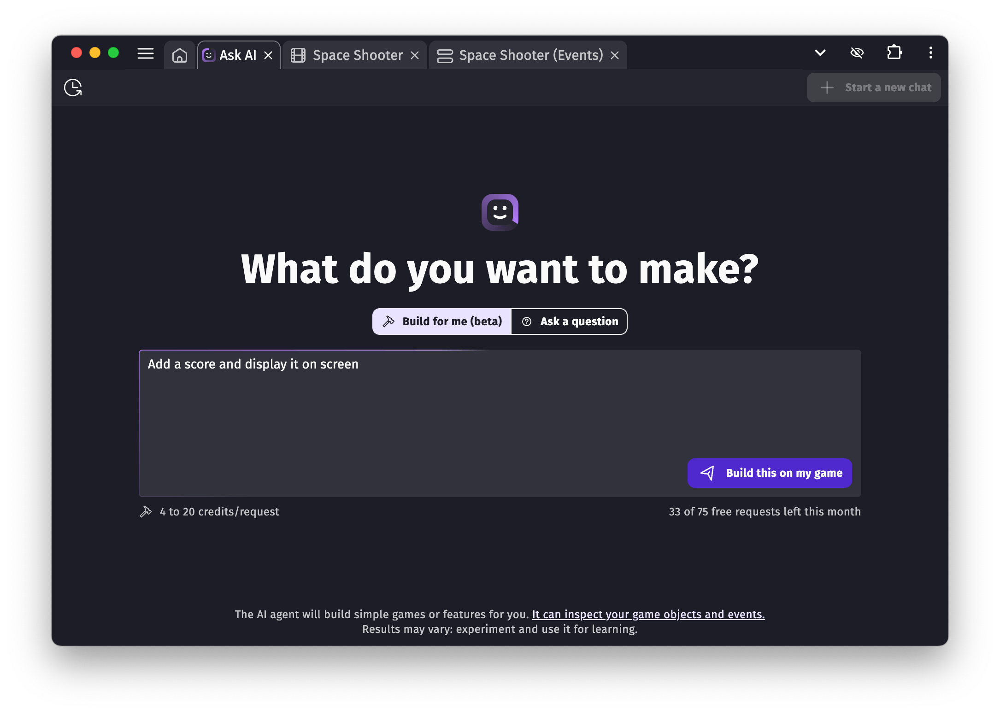

# Ask AI: Build your game with AI

Click on **Ask AI** on the top-right corner of GDevelop to open the GDevelop AI editor.

Unlike general-purpose AI tools like ChatGPT, Claude, or Google Gemini, GDevelop AI is **tailored for game creation**. It knows how GDevelop works and can help you:

- Understand features and how to use them
- Build specific mechanics or systems
- Explore, brainstorm and bring new ideas to life

!!! tip

    Think of it as a mentor and creative collaborator that speaks GDevelop fluently.

## How does it work: AI agent and AI chat

The AI understands all built-in GDevelop features and official, reviewed extensions (it doesn’t include community extensions unless they’ve been approved by the GDevelop team). It can also read the content of your game project when you ask it to build something for you.

The AI has two operating modes:

- **[Build for me (AI agent)](./agent)**: the AI will build your request inside your game. This can range from simple changes ("Make this object bigger") to more complex requests ("Create an enemy that starts attacking when the player comes near").
- **[Ask a question (AI chat)](./chat)**: the AI will answer any question you ask it about game development and usage of GDevelop.

[Learn more about the GDevelop AI agent](./agent){ .md-button .md-button--primary .full-width }

[Learn more about the GDevelop AI chat](./chat){ .md-button .full-width }

## About privacy

GDevelop AI is **not trained on your game projects** - be it local or cloud projects. Cloud projects are stored separately from the GDevelop AI infrastructure and the AI has no access to them.

GDevelop AI is built on general purpose Large Language Models that we can be adapted, fine tuned or have internally multiple agents working on a request. In all cases there is no usage of private data for improving the AI.

## Help us improve the AI

You can rate the AI’s answers with a 👍 or 👎. These ratings help the GDevelop team improve the assistant.

!!! note

    Sometimes, high demand can temporarily slow things down or prevent a proper response. If that happens, don’t worry — you won’t be charged credits or lose your free requests.
