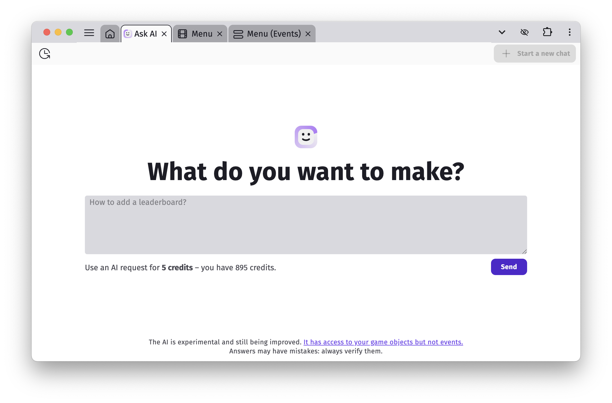

# Ask AI: Get Help Building Your Game with AI

**Ask AI** is an experimental chat assistant designed specifically to help you create your game in GDevelop.

Unlike general-purpose AI tools like ChatGPT, Claude, or Google Gemini, this AI is **tailored for GDevelop**. It knows how GDevelop works and can help you:

- Understand features and how to use them
- Build specific mechanics or systems
- Explore and brainstorm new ideas

Think of it as a mentor that speaks GDevelop fluently.

## How does it work

The AI understands all built-in GDevelop features and official, reviewed extensions (it doesn’t include community extensions unless they’ve been approved by the GDevelop team). It also has access to parts of your project, including:

- Your game scene names
- Global objects and objects in each scene (but not their exact configuration),
- Object behaviors (but not their exact configuration),
- Variables (global, scene and object variables).

It **does not** currently have access to your scene events.

## How to use it

To open Ask AI, click the "Ask AI" button in the top-right corner of the GDevelop interface.
Type your question and click Send — that’s it.

!!! note

    Each message you send to the AI costs 5 credits. This means that with [a package of 500 credits](/gdevelop5/interface/profile/credits), you can make up to 100 requests.
    If you have a GDevelop Gold or Pro subscription, you also get free AI requests every month.

The AI will reply in a few seconds. Answers often include links to helpful resources, extensions, behaviors, and relevant GDevelop concepts like actions or conditions.

!!! warning

    As with every AI tool, the AI answers are not perfect. From time to time, it can confuse some concepts, misunderstanding your game or what you're trying to do.
    Always double check the answers and use the AI answers as suggestions to build your game. It's a good idea to follow the **[Complete GDevelop Master Course](https://gdevelop.io/academy)** to quickly learn the basics of GDevelop and make your first games.

You can continue the conversation by asking follow-up questions. If you want to switch topics or ask something unrelated, click Start a new chat — this helps the AI better focus on your new request.

## Help us improve the AI

You can rate the AI’s answers with a 👍 or 👎. These ratings help the GDevelop team improve the assistant.

Sometimes, high demand can temporarily slow things down or prevent a proper response. If that happens, don’t worry — you won’t be charged credits or lose your free requests.
