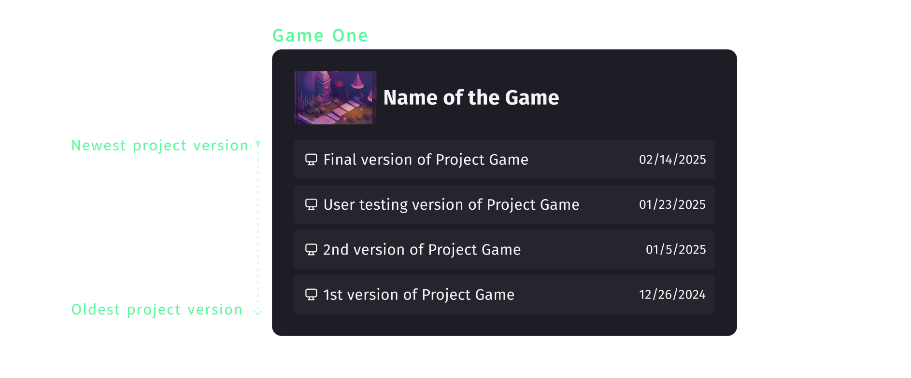

# Create section

The Create Dashboard is the central hub for game development projects on GDevelop.
It provides an all-in-one space to analyze, access and manage games and projects.

Through the Create Dashboard creators can follow numerous steps of game development:

## 1. Game Earnings

Keeps track of the money earned by the games published on gd.games. Creators have two options to cash out their game earnings:

 * Cash Out Directly: accumulate $60 USD of earnings to be able to cash them out. A bank account will be required to do this operation.
 * Exchange for GDevelop Credits: no minimum amount is required. These credits can be used within GDevelop to purchase assets, templates, marketing packages, and more.

To learn more about enabling game earnings, head to [Hosting on GDevelop's Platform](/gdevelop5/monetization/#hosting-on-gdevelops-platform-gdgames).

## 2. Wallet: 
Holds all the gd coins in the GDevelop account. Ways to increase the credits in the wallet are:

* Exchanging game earnings as credits through the "credit out" option.
* Giving [written feedback](/gdevelop5/interface/games-dashboard/player-feedback/#giving-feedback) on games published on gd.games.
* Compleating challenges like following GDevelop on social media.
* Purchasing a [GDevelop premium subscription](https://gdevelop.io/pricing) including a certain number of credits per month. 

Learn more about [GDevelop credits](/gdevelop5/interface/profile/credits/#gdevelop-credits).

## 3. Game list
The Game List section allows you to access, edit, manage, filter, and create your games efficiently. GDevelop automatically organizes project versions under their respective games, simplifying version control and project iteration.

Each project attached to a game can be individually modified or shared with collaborators (see [project collaboration](https://wiki.gdevelop.io/gdevelop5/collaboration/)).

#### Game cards
Each Game Card provides key details and indicators:

1. **Last Modification Details:** Displays who last modified the game and when. Learn more about [project collaboration](https://wiki.gdevelop.io/gdevelop5/collaboration/).
2. **Number of projects (desktop or cloud) attached:** Shows the number of linked desktop or cloud projects. Click the icon to view all projects.
3. **gd.games published status (on/off):** Manages game’s visibility on gd.games. [Manage Game visibility](https://wiki.gdevelop.io/gdevelop5/interface/games-dashboard/#manage-games-dashboard).
4. **Ad revenue share status (on/off):** Enable or disable ad revenue sharing. [Learn more abot hosting on GDevelop's Platform](https://wiki.gdevelop.io/gdevelop5/monetization/#hosting-on-gdevelops-platform-gdgames).
5. **Player feedback (on/off):** Control whether player feedback is collected. [Learn more about player Feedback](https://wiki.gdevelop.io/gdevelop5/interface/games-dashboard/player-feedback/).
6. **Manage:** Access the [Game's Dashboard](/gdevelop5/interface/games-dashboard/]) which includes Analytics, Player Services, and the full list of Game Projects.
7. **Open:** Launches the latest saved version of the project.

For published games, additional options are available:

8. **Game URL:** Displays the URL of your game on gd.games. Privacy depends on the game visibility settings.
9. **Social media sharing:** Quickly share your game URL on social media platforms.

!!! tip

    If a game isn't properly displaying a project, make sure that the project of the game still exists in your local files or in the cloud. Then, open the project so GDevelop recognizes it and links it to the game to which it belongs.

