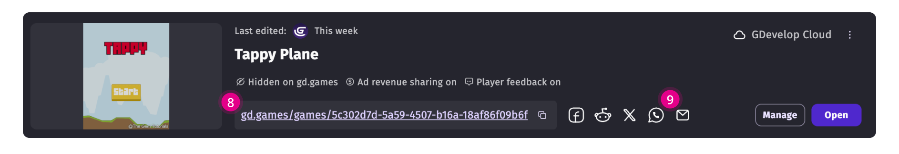

# Create Dahsboard

!!! note

    **Who can use this feature:** All users with a GDevelop account.

The Create Dashboard is the central hub for game development projects on GDevelop.
It provides an all-in-one space to analyze, access and manage your games and game files.

Through the Create Dashboard creators can follow numerous steps of game development:

1. Game Earnings: keeps track of the money earned by the games published on gd.games (see [Hosting on GDevelop's Platform](https://wiki.gdevelop.io/gdevelop5/monetization/#hosting-on-gdevelops-platform-gdgames)).
2. Wallet: holds all available gd coins across the app (see [credits](https://wiki.gdevelop.io/gdevelop5/interface/profile/credits/#gdevelop-credits)).
3. Game list: displays all the games made by or shared with the game developer.

## Game list
You can access, edit, manage, filter and create your games through the "Game list" section.
GDevelop automatically groups the project versions inside the game to which they belong to. This makes project management easier for versioning and iteration. 
Each project attached to a game can be shared (see [project collaboration](https://wiki.gdevelop.io/gdevelop5/collaboration/)) and modified individually.

**Game cards** display game related information like:
1. **Who last modified the game and when:** In case of having project [project collaboration](https://wiki.gdevelop.io/gdevelop5/collaboration/) on, creators will see who did the latest changes to the game.
2. **Number of projects (desktop or cloud) attached to that game:** Clicking on the icon with the number will display all the projects attached to the game.
3. **gd.games published status (on/off):** To hide games from gd.games go to "[Manage Game](https://wiki.gdevelop.io/gdevelop5/interface/games-dashboard/#manage-games-dashboard)".
4. **Ad revenue share status (on/off):** To turn revenue share off, go to "[Hosting on GDevelop's Platform](https://wiki.gdevelop.io/gdevelop5/monetization/#hosting-on-gdevelops-platform-gdgames)".
5. **Player feedback (on/off):** To stop collecting player feedback refer to "[Player Feedback](https://wiki.gdevelop.io/gdevelop5/interface/games-dashboard/player-feedback/)".
6. **Manage:** Opens Game Analytics, Player Services, and Game Project's list.
7. **Open:** Opens the latest saved Project version of the game.

If the game is published on gd.games:

8. **URL link with its location:** Displays your URL on gd.games. Its privacy depends on the "game visibility status" in the Game Details.
9. **Social media buttons to share the game:** Shares your game's URL in your selected platform.

!!! tip

    If a game isn't properly dislaying a project, make sure that the project of the game still exists in your local files or in the cloud. Then, open the project so GDevelop recognizes it and links it to the game to which it belongs.

