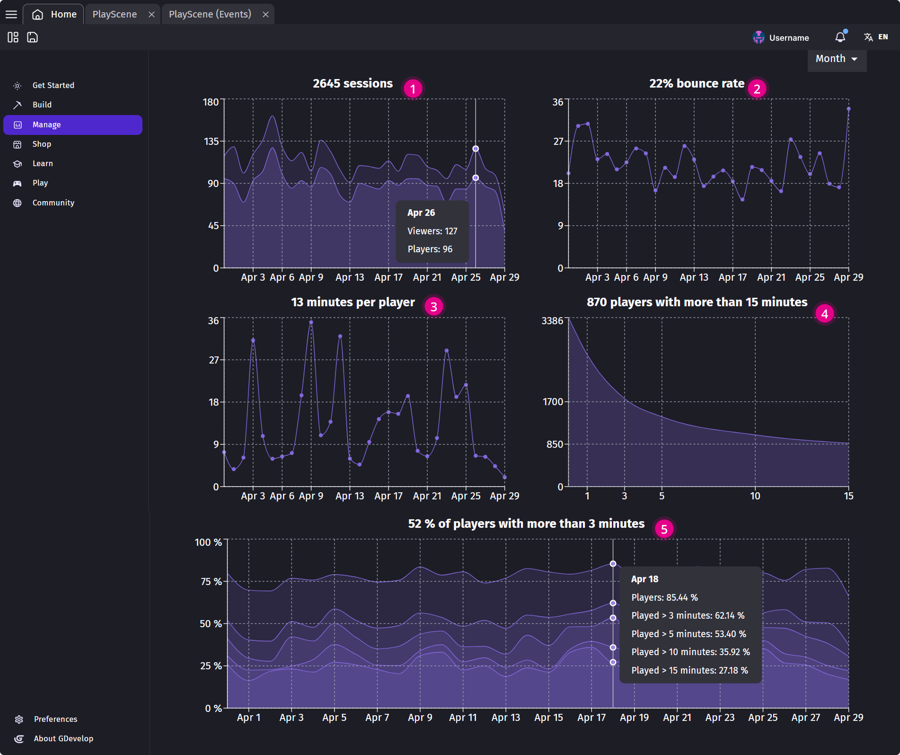

# Game Analytics

!!! note

    **Who can use this feature:** All users with a GDevelop account who have published their game on [gd.games](https://gd.games). Some limitations may apply depending on the license type.

Player analytics are essential during video game development. They provide data on how long players stay engaged with the game and how quickly they lose interest. By understanding these patterns, developers can tailor game features to better suit player preferences, enhancing enjoyment and engagement. Alongside player feedback, this information guides improvements, helping ensure the game's success by making it more appealing and enjoyable for its audience.

## Accessing game metrics
When you've opened the "Manage" section, find the game you'd like to evaluate and click "Manage game". Under the thumbnail image you'll see the "Analytics" card displaying the numer of sessions in your game.

## Interpreting game analytics

The Game Analytics section provides the following metrics and indicators:

* **Number of sessions:** Number of times the game was launched.
* **Bounce rate:** Percentage of players who leave a webpage without interacting further.
* **Play time:** The total duration players spend engaging with the video game.
* **Number of players with more than X minutes:** Players who engage with a game for at least X minutes. This information is crucial for understanding player retention and game performance.

* **Average minutes per player:** Time spent by each player engaged with a game. The graphs show how this average stayed true across time.
* **Number of players with more than 15 minutes:** Displays a distribution on player retention going form 1 to 15 minutes.
* **Percentage of players with more than X minutes:** Displays the most representative sample (in percentage) on a specific time length. The graph also displays players with more than 3, 5, 10 and 15 minutes.

!!! note

    These data are collected anonymously when a game is launched. It's important to respect the privacy of the players, and no personal information is ever collected or stored. This means that while aggregated data can be useful to understand your audience, you can't know about a particular player, because the information is not stored and players are not tracked individually.

If you don't have a GDevelop subscription, you'll only get access to the number of sessions - which should still give you an overview of your game success.
As GDevelop is providing the analytics, the infrastructure cost and the bandwidth to collect the session metrics, we ask you to support GDevelop by getting a subscription.
This will help the development of the game engine for the future and help to strengthen the community!

While the presentation of the metrics is for now very simple, it will be improved later to offer a better picture of the sessions played on your game.

## About collecting metrics
While GDevelop strive to collect only usage metrics that are anonymized, and limits these to the purpose of analyzing the performance of your game, you may collect other metrics by your own means. In any cases, it's important that you have a clear privacy policy (which will be asked by most app stores anyway) explaining how you use these data and respect the privacy of your users.

!!! tip

    * If you **want to display an explanation** before enabling metrics collection, use the action to disable the metrics collection at the beginning of your game, then use the action to enable them again once the player consent to the metrics collection.
    * If you **don't want to collect any metrics at all**, use the action to disable the metrics collection at the beginning of your game. By doing this, no data will be sent at all. Of course, this means that you won't be able to follow the number of sessions played on your game.
