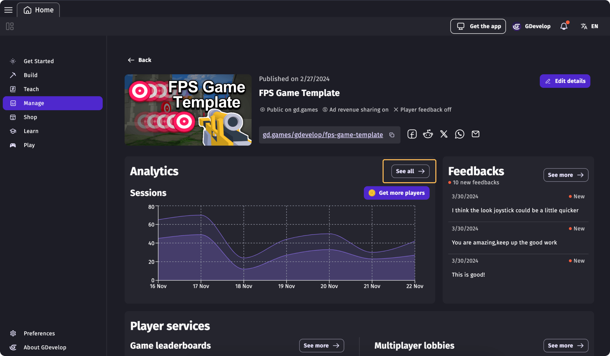

# Game Analytics

Player analytics are essential during video game development. They provide data on how long players stay engaged with the game and how quickly they lose interest. By understanding these patterns, developers can tailor game features to better suit player preferences, enhancing enjoyment and engagement. Alongside player feedback, this information guides improvements, helping ensure the game's success by making it more appealing and enjoyable for its audience.

## Accessing game metric

Find the game you'd like to access on GDevelop home and click "Manage". Under the thumbnail image you'll see the "Analytics" card displaying the numer of sessions in your game. Click "See all" to access the full report.

## Interpreting game analytics

The Game Analytics section provides the following metrics and indicators:

* **1) Number of sessions:** Number of people who launched the game. Viewers are considered players when they stayed at least 60 seconds including loading screens.
* **2) Bounce rate:** Percentage of people who leave before 60 seconds including loading screens.
* **3) Average minutes per player:** Time spent by each player engaged with a game. The graphs show how this average stayed true across time.
* **4) Number of players with more than X minutes:** Average of players still active after 15 minutes. This graph shows how long players stay in the game after X minutes. It helps to see if the players quit quickly or keep playing for a while.
* **5) Percentage of players with more than X minutes:** Shows how long players stay in the game over time. The percentages are showing people playing for more than 3, 5, 10, and 15 minutes based on the best day. A higher value means better player retention on the day. This helps you understand when players are most engaged — and when they drop off quickly.

!!! note

    These data are collected anonymously when a game is launched. It's important to respect the privacy of the players, and no personal information is ever collected or stored. This means that while aggregated data can be useful to understand your audience, you can't know about a particular player, because the information is not stored and players are not tracked individually.

If you don't have a GDevelop subscription, you'll only get access to the number of sessions - which should still give you an overview of your game success.
As GDevelop is providing the analytics, the infrastructure cost and the bandwidth to collect the session metrics, we ask you to support GDevelop by getting a subscription.
This will help the development of the game engine for the future and help to strengthen the community!

## About collecting metrics

While GDevelop strive to collect only usage metrics that are anonymized, and limits these to the purpose of analyzing the performance of your game, you may collect other metrics by your own means. In any cases, it's important that you have a clear privacy policy (which will be asked by most app stores anyway) explaining how you use these data and respect the privacy of your users.

!!! tip

    * If you **want to display an explanation** before enabling metrics collection, use the action to disable the metrics collection at the beginning of your game, then use the action to enable them again once the player consent to the metrics collection.
    * If you **don't want to collect any metrics at all**, use the action to disable the metrics collection at the beginning of your game. By doing this, no data will be sent at all. Of course, this means that you won't be able to follow the number of sessions played on your game.
