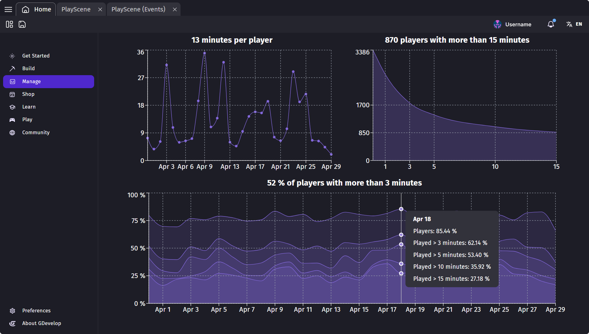
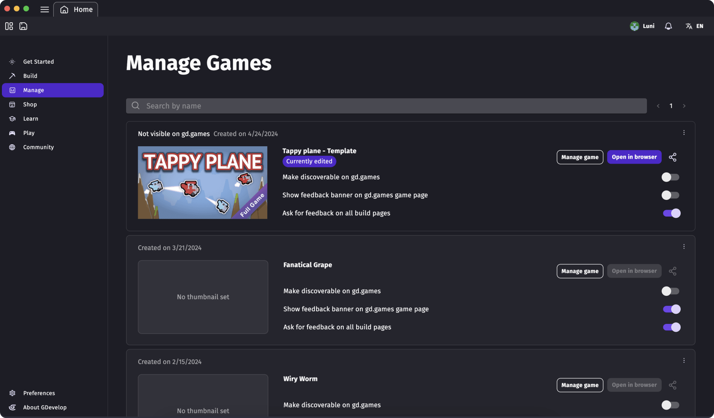
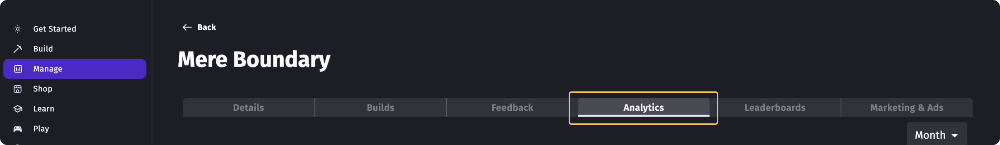

# Game Analytics

!!! note

    **This feature is available to:** All users with a GDevelop account who had [published their game to gd.games](/gdevelop5/publishing).

Player analytics are essential during video game development. They provide data on how long players stay engaged with the game and how quickly they lose interest. By understanding these patterns, developers can tailor game features to better suit player preferences, enhancing enjoyment and engagement. Alongside [player feedback](/gdevelop5/interface/games-dashboard/player-feedback/), this information guides improvements, helping ensure the game's success by making it more appealing and enjoyable for its audience.

GDevelop's Game Analytics offers various metrics **without** intrusive trackers, third-party applications, or compromising players' privacy.

!!! tip

    Depending on the terms and conditions under which your game is distributed, you may want to inform and give a way to your players to not send any data. This can be done using an action to enable or disable the metrics.

## Registering a game

To access the game's metrics, the project has to be [published on gd.games](/gdevelop5/publishing/web/). Before publishing your game, make sure to be logged to the [GDevelop account](/gdevelop5/interface/profile) that you wish to publish.

Once the game has been shared, the Manage section will be habilitated and accessible through the App.

To access game analytics, click the "Manage game" button to access more functionalities.

## View the metrics of your game

When you've opened a game dashboard, navigate to the Analytics tab.

Data can be displayed monthly or yearly with the help of the drop-down selector on the upper right.

## Interpreting data

With the help of Analytics you'll be able to access the following data:

* **Number of sessions:** Refers to the total count of individual times players engage with a game. It tracks how often they return, providing insights into the game's ability to maintain player interest over time. A gd.games "session" expires after 3 minutes of player inactivity.
* **Bounce rate:** Measures the percentage of players who leave a video game after a short session -typically their first-. It indicates how quickly players lose interest, helping developers understand initial user engagement and game appeal.
* **Minutes per player:** Average play duration -in minutes- per player. Quantifies the total duration a player spends in a game during individual sessions or over a specific period. It helps gauge how engaging and captivating the game is to its audience.
* **Players with more than 15 minutes:** Refers to the count of players who engage with a game for longer than 15 minutes per session, indicating a deeper interest and potentially higher satisfaction with the game's content and mechanics.
* **Percentage of players with more than X minutes:** Measures the proportion of all players who play a game for longer than X minutes. This metric helps developers understand how many players are deeply engaged with the game, indicating its ability to maintain interest for extended periods.

!!! note

    These data are collected anonymously when a game is launched. It's important to respect the privacy of the players, so GDevelop does not collect nor store any personal information. This means that while *aggregated* data can be useful to understand your audience, you can't know about a particular player, because the information is not stored and players are not tracked individually.

GDevelop is providing the analytics, the infrastructure cost, and bandwidth to collect the session metrics.
Some of the listed insights might be limited according to your GDevelop Subscription plan. [Click here](https://gdevelop.io/pricing) to learn more on Analytics availablity according to Subscriptions.

## About collecting metrics

While GDevelop strives to collect only usage metrics that are anonymized and limits these to the purpose of Game Research to analize the performance of your game, you may collect other metrics by your own means. In any case, you must have a clear privacy policy (which will be asked by most app stores) explaining how you use these data to respect the privacy of your users.

!!! tip

    If you want to **display an explanation** before enabling metrics collection, use the action to disable the metrics collection at the beginning of your game, *then use the action to enable them again* once the player consent to the metrics collection.

!!! tip

    If you don't want to **collect any metrics at all**, use the action to disable the metrics collection at the beginning of your game. By doing this, no data will be sent at all. Be aware that you won't be able to follow the number of sessions played on your game.
