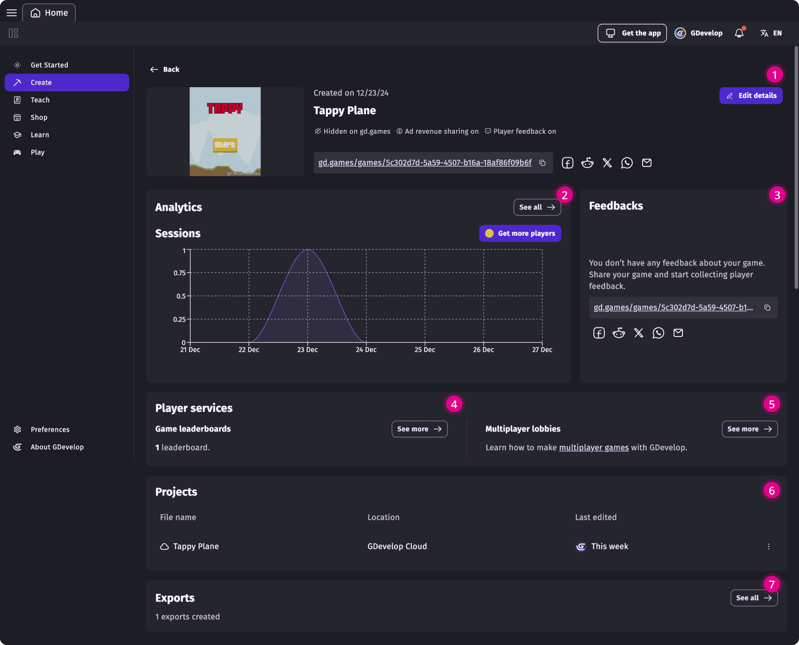

# Game dashboard

!!! note

    **Who can use this feature:** All users with a GDevelop account who had published their game to [gd.games](https://gd.games)

Tracking game performance post-launch is crucial. It helps identify improvements, understand player behavior, and enhance the gaming experience for long-term success. Once the project has been publised, it's important to set up a system to collect player feedback, encourage player competition, market the game and measure player's engagement and retention.

GDevelop's Game dashboard section is equipped with features such as leaderboards, player feedback, game lobbies, and marketing publication packages. The engine provides a comprehensive suite of tools for developers to enhance player engagement and drive the success of their games.

 1. Game Details (game information)
 2. Game analytics
 3. Player feedback
 4. Game leaderboards
 5. Game multiplayer Lobbies
 6. Game projects
 7. Game builds

All these services are available for all users with a GDevelop account and are easy to configure. They work **without** intrusive trackers, third-party applications, or compromising players' privacy.

!!! tip

    Depending on the terms and conditions under which your game is distributed, you may be required to inform your players about data collection. Metrics can be disabled by using an action in the [Events editor](https://wiki.gdevelop.io/gdevelop5/interface/events-editor/) to enable or disable metrics.

## Enabling published game functionalities

To access the game's metrics, the project has to be published on [gd.games](https://gd.games). Before publishing the project, make sure to be logged to the [GDevelop account](/gdevelop5/interface/profile) from which you wish to publish.

Numerous platforms are available for export. Learn how to do it according to your desired platforms with the help of [this guide](https://wiki.gdevelop.io/gdevelop5/publishing/).

Once the game is online, it will be automatically visible and available through the app's "Manage" section.

!!! note

    Game insights are collected anonymously when a game is launched. It's important to respect the privacy of the players, so GDevelop does not collect nor store any personal information. This means that while aggregated data can be useful to understand your audience, you can't know about a particular player, because the information is not stored and players are not tracked individually.

## 1. Game details

Through the game details view, a creator can configure their game's visibility on GDevelop's free publishing website [gd.games](https://wiki.gdevelop.io/gdevelop5/publishing/web/#creating-a-private-web-link):

* **Publish game on gd.games (on/off):** controls game publication on GDevelop's free game publication platform gd.games. Turning it off automatically disables the following customisation options.
* **Visibility**:
  
    * **Visible in search and profile:** Players will be available to find the game through the gd.games website
    * **Hidden:** Only players with the URL will be able to find the game on gd.games.
    * **Enable ads and revenue sharing on the game page (on/off):** [Monetize your game](https://wiki.gdevelop.io/gdevelop5/monetization/#publishing-on-platforms-with-integrated-ads) without setting up any web ads network.
    * **Collect feedback from players (on/off):** The game will display a banner to collect [player feedback](https://wiki.gdevelop.io/gdevelop5/interface/games-dashboard/player-feedback/) through gd.games website

To learn how to publish to the gd.games platform and configure the privacy of the links follow [these instructions](https://wiki.gdevelop.io/gdevelop5/publishing/web/).

## 2. Game analytics
Analytics play a crucial role in video game development. They offer insights into how long players remain engaged and when they begin to lose interest. By analyzing these trends, developers can adjust game features to align with player preferences, ultimately improving both enjoyment and retention. [Learn more about game analytics](/gdevelop5/interface/games-dashboard/game-analytics/)

### About collecting metrics

While GDevelop strives to collect only usage metrics that are anonymized and limits these to the purpose of Game Research to analize the performance of your game, you may collect other metrics by your own means. In any case, you must have a clear privacy policy (which will be asked by most app stores) explaining how you use these data to respect the privacy of your users.

!!! tip

    - If you want to **display an explanation** before enabling metrics collection, use the action to disable the metrics collection at the beginning of your game, then use the action to enable them again once the player consent to the metrics collection.
    
    - If you **don't want to collect any metrics at all**, use the action to disable the metrics collection at the beginning of your game. By doing this, no data will be sent at all. Be aware that you won't be able to follow the number of sessions played on your game.

## 3. Player feedback
GDevelop’s built-in player feedback system allows developers to collect written feedback from online players to refine the game design, improving player engagement. [Learn more about player feedback](/gdevelop5/interface/games-dashboard/player-feedback/)

## 4. Game leaderboards
Leaderboards create a competitive environment by displaying player's top scores. This can improve game engagement by motivating people to reach the top of the charts. [Learn more about Leaderboards](https://wiki.gdevelop.io/gdevelop5/interface/games-dashboard/leaderboard-administration/)

## 5. Game multiplayer lobbies
Multiplayer lobbies improve game mechanics by enabling real-time interaction between players, creating a game mechanic based on collaboration or even competition.[Learn more about multiplayer lobbies](https://wiki.gdevelop.io/gdevelop5/all-features/multiplayer/#configuring-the-lobby)

## 6. Game projects
Lists all projects linked to the game. They are a great way to work on project versioning without risking any undesirable outcomes or breaking changes. To create a new version of the same project file: open the project to be duplicated and "Save As". Choose the project location (desktop of the cloud) and choose "Keep the new project linked to this game".

## 7. Game builds
Access your gd.games, Windows, macOS and Linux game build exports in this section. [Learn more about game builds](/gdevelop5/publishing/windows-macos-linux-with-electron/)]