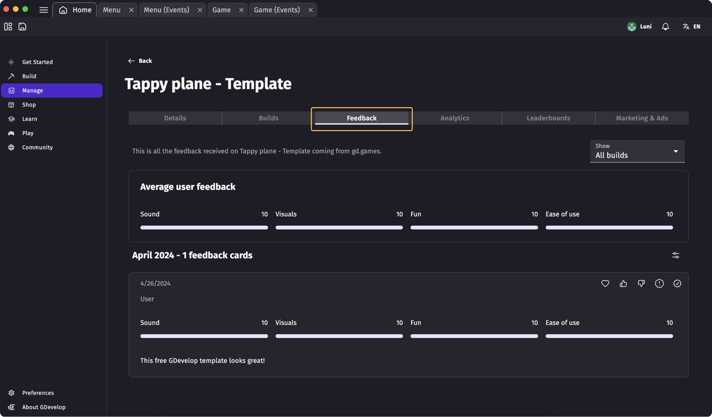
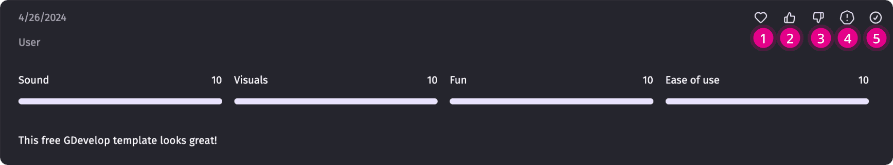
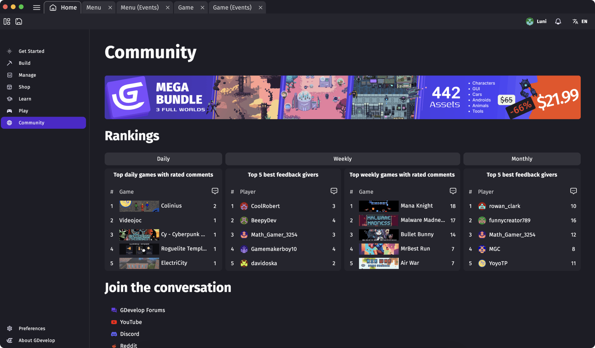

# Player Feedback

!!! note

    **This feature is available to:** All users with a GDevelop account. Please note that the number of player feedbacks might be limited to each subscription level. For more information on subscription limits, [click here](https://gdevelop.io/pricing)

Player feedback is a crucial step in the process of game development.

It helps developers understand player interactions, preferences, and areas needing improvement in order to encrease game adoption by their final target market for game success.

GDevelop's intergrated player feedback allows developers to enhance game design to increase player satisfaction, leading to a more engaging experience and a loyal player base.

## Feedback availabity by channel
Player Feedack is available to every user with a GDevelop account from free to paying subscriptions and *only* through gd.games.
Games published on sites like Itch, Newgrounds, Poki, and personal website; or exported to Android or iOS cannot collect player feedback.

Games published on gd.games have the possibility to be:
* Public and visible to the gd.games community (recomended for public player feedback)
* Unlisted on gd.games only available to people with the URL
* Uploaded to the gd.games server, but not available through the public site (recommended for private player feedback)

## Habilitating Player Feedback
Player feedback can be turned on or off acording to the game's development stage.

To be able to collect player feedback the game has to be available online. You can verify that the Game has been published to gd.games through the [Manage section](https://wiki.gdevelop.io/gdevelop5/interface/games-dashboard/):

On the game listing screen you can configure:

* **Make discoverable on gd.games:** players will be avaliable to find the game through the gd.games site
* **Show feedback banner on gd.page:** the game will display a banner to collect player feedback through the site gd.games
* **Ask for feedback on all builds:** All published versions of the game listed under the "Builds" tab will dislay the feedback banner to collect player feedback

To learn how to publish to the gd.games platform and configure the privacy of the links [follow these instructions](https://wiki.gdevelop.io/gdevelop5/publishing/web/)

## Receiving feedback
Recieved player feedback is stored and visible under the "Feedback" tab of the desired published Game.
Click on the [Manage section](https://wiki.gdevelop.io/gdevelop5/interface/games-dashboard/) > the game that you wish to manage to see the "Feedback tab".

## Rating Feedback
Rating player feedback helps the community identify the best beta testers of gd.games so they can get rewarded accordingly.

Rate the feedback by clicking on the correspondent icon:
1. Great feedback
2. Good feedback
3. Bad feedback
4. Report feedback (spam)
5. Resolve / Close feedback 

Keep in mind that the creators that rate the most amount of player feedback, will be listed under the Community's Top 5 "Games with rated comments".

### FAQ
1. **If I get a bad review from a player, can it affect my game's visibility?** -> No, bad reviews do not affect the visibiliy of your game. Player feedback is private and it was concieved for games who are still under development and require player feedback. It is in no standard to score 
2. **What happens after you report a spam review?** -> If a user gets flagged after a certain number of times, their profile will be blocked and they'll no longe be able to give feedback

## Giving Feedback
Game creators can also give feedback through gd.games in exchange of GDevelop credits, and have the possiblity to be ranked on the Top 5 "Best feedback givers".

To learn about 5 ways to Give good written feedback to increase your changes to make it to the top ten, [click here](https://gdevelop.io/blog/5-ways-give-good-player-feedback)

