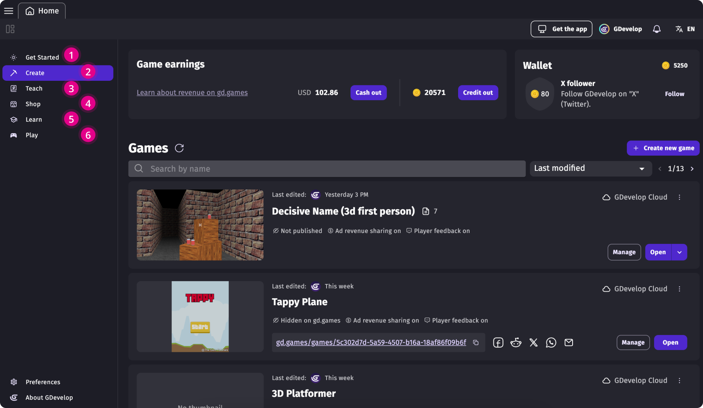
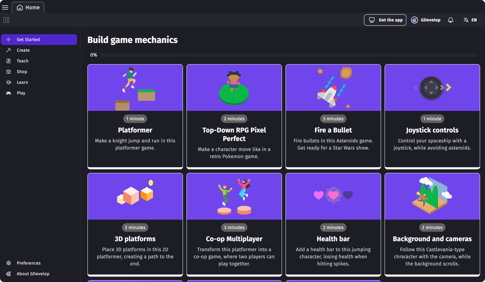
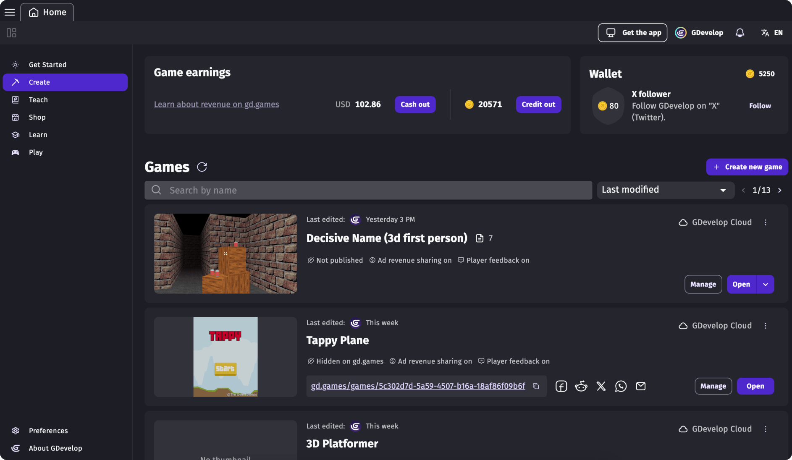
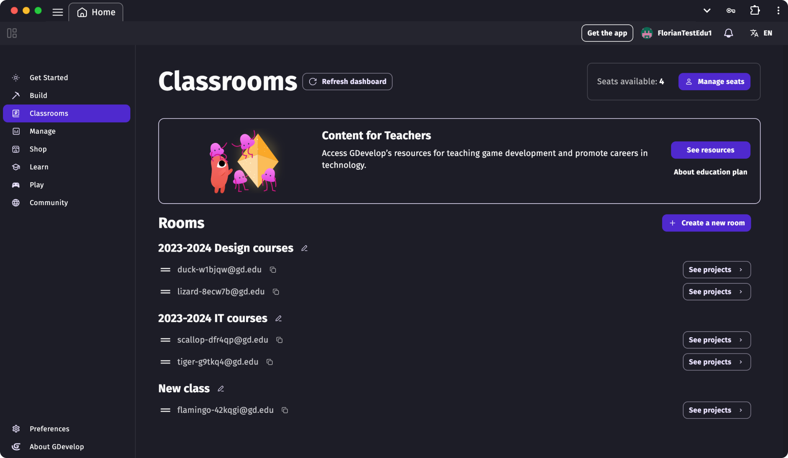
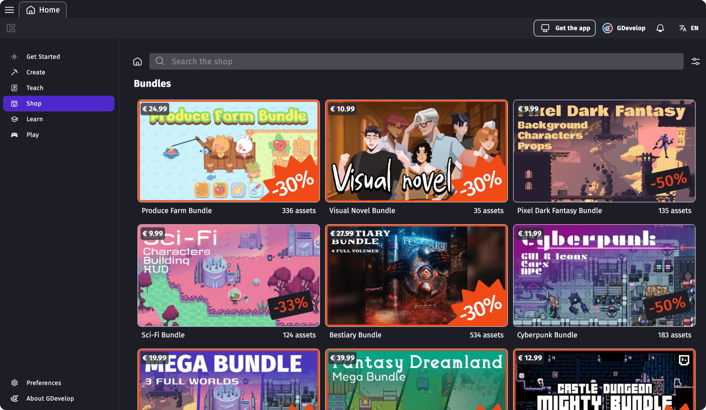
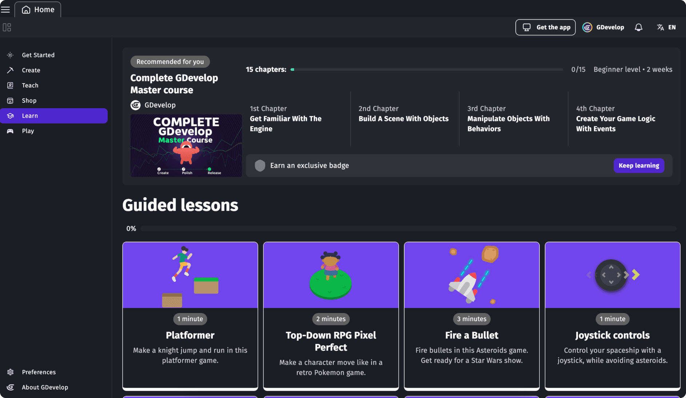
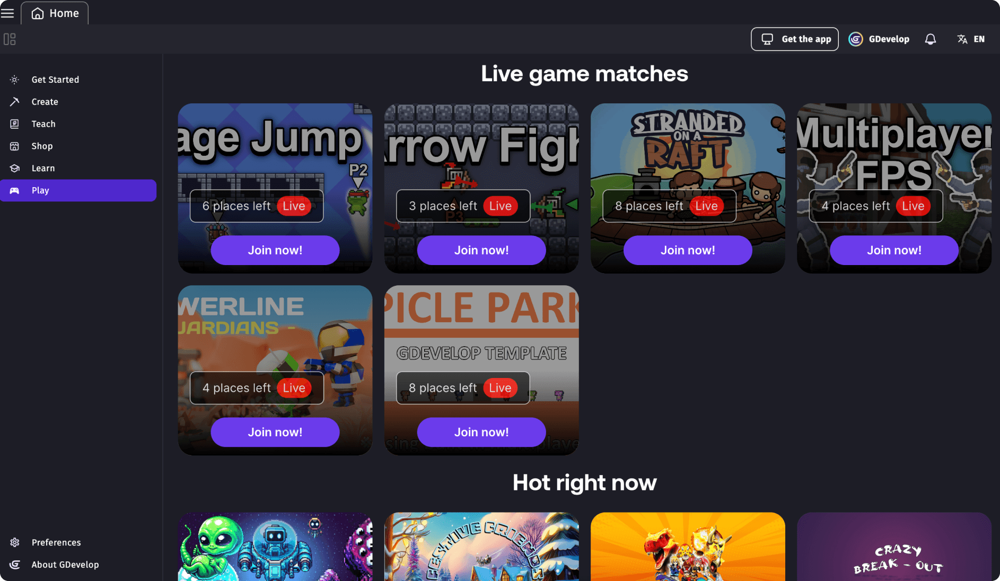
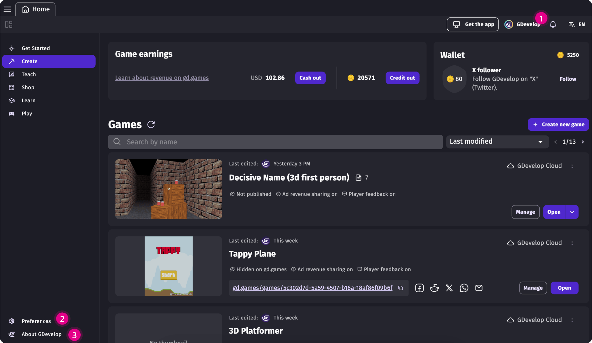
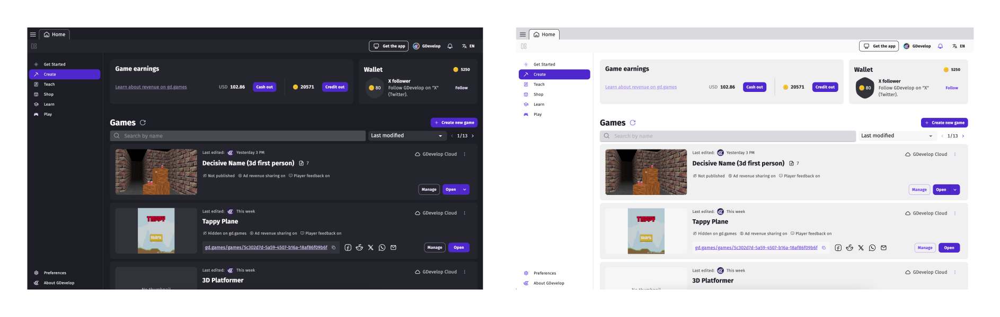

# GDevelop's UI interface

GDevelop's main game creation interface is divided into two main tabs: **Home Page** (1) and **Project** (2).

Watch an overview of GDevelop's layout:

  <iframe src="https://www.youtube.com/embed/bR2BjT7JG0k" frameborder="0" allowfullscreen></iframe>

## Home Page tab

The **Home Page** appears when you first launch GDevelop. It provides dedicated sections for different aspects of game development:

 * Get Started
 * Create
 * Teach
 * Shop
 * Learn
 * Play

### 1. Get Started
The **Get Started** section offers resources and updates tailored for new users. To disable this section on startup, check "Don't show this screen on next startup" at the bottom of the page.

### 2. Create
The **Create section** serves as a central hub for managing your game projects, providing tools to access, analyze, and organize files. Learn more about the [Create](/gdevelop5/interface/create-dashboard/) section.

### 3. Teach
The Teach section is designed for educational use, offering tools for teachers and schools, including anonymous student accounts and teacher management interfaces. Available exclusively with an [Education Subscription](https://gdevelop.io/pricing/education).

### 4. Shop
GDevelop's Market Place offers pre-made assets, including:
 * Character animations
 * Backgrounds and props
 * Particles and visual effect
 * User Interface Parts
 * Smart pre-coded ready to use objects
 * Ready-made game templates
 * Sounds and music

Creators can contribute and sell their assets. [Learn more about selling assets](gdevelop5/community/sell-asset-pack-store/)

### 5. Learn
The **Learn section** includes courses, tutorials, videos, and documentation to help users better understand GDevelop.

### 6. Play
The Play section showcases community-made games published on gd.games, including multiplayer titles. Feedback on games can earn [credits](/gdevelop5/interface/profile/credits/) redeemable in the Shop.

## Project tab

The Project tab provides tools for game creation, including:

 * Project manager
 * Scene editor
 * Events editor
 * Preview
 * Debugger

### 1. Project manager
Located in the upper-left corner, the **[Project manager](/gdevelop5/interface/project-manager/#project-manager)** activates when a project is open. It offers access to:

 * [Global variables](/gdevelop5/all-features/variables/global-variables/#global-variables)
 * [Resources](/gdevelop5/tutorials/resources/#resources)
 * [Scenes](/gdevelop5/interface/scene-editor/)
 * [Extensions](/gdevelop5/extensions/tiers/#extension-tiers)
 * [External events](/gdevelop5/interface/events-editor/external-events/#external-events)
 * [External layouts](/gdevelop5/interface/scene-editor/external-layouts/#external-layouts)

Use the project manager's drawer to add new elements to your project.

!!! note

    GDevelop doesn't close a project automatically. Even if all the project tabs are closed, GDevelop still considers the project to be open and active.

**Saving and quitting a project**

To close a project, click the three-dot menu on the project's card and select "Close Project". Ensure all changes are saved beforehand.

### 2. Scene editor

The **Scene editor** is where you design and build game levels and menus by placing and configuring objects. The first scene in the list is loaded when the game starts.

Learn more about the scene editor and it's parts [here](/gdevelop5/interface/scene-editor).

### 3. Events editor
The Events Editor allows you to define your game's logic using GDevelop's visual no-code system.

Learn more about [its usage on this page](/gdevelop5/interface/events-editor) or check [the help about events](/gdevelop5/events).

### 4. Preview
You can preview your project at any time using the **[Preview](/gdevelop5/interface/preview/#previewing-your-game)** button in the toolbar. Additional options are available in the drop-down menu next to the button.

### 5. Debugger
The **[debugger](/gdevelop5/interface/debugger/profile-your-game/)** helps identify performance bottlenecks and optimize resource usage.

## Other sections of the app

Additional sections include:

 1. **GDevelop account / Profile:** Manage subscriptions and account settings. [Learn more](/gdevelop5/interface/profile/#cancelling-your-subscription)
 2. **App Preferences:** Customize language, theme, and keyboard shortcuts. [Learn more](/gdevelop5/preferences/#preferences)
 3. About GDevelop: View update history and check for [available updates](/gdevelop5/interface/updates).

!!! note

     At startup, GDevelop will check for new updates. If a new update is available, the update will automatically be downloaded (unless deactivated in preferences).

#### GDevelop's official app themes

GDevelop offers two official themes: **GDevelop Default Dark** and **GDevelop Default Light**. UI components are available in [Storybook](http://gdevelop-storybook.s3-website-us-east-1.amazonaws.com/analytics-charts/latest/?path=/story/welcome--to-storybook) for reference for open-source contributors.

