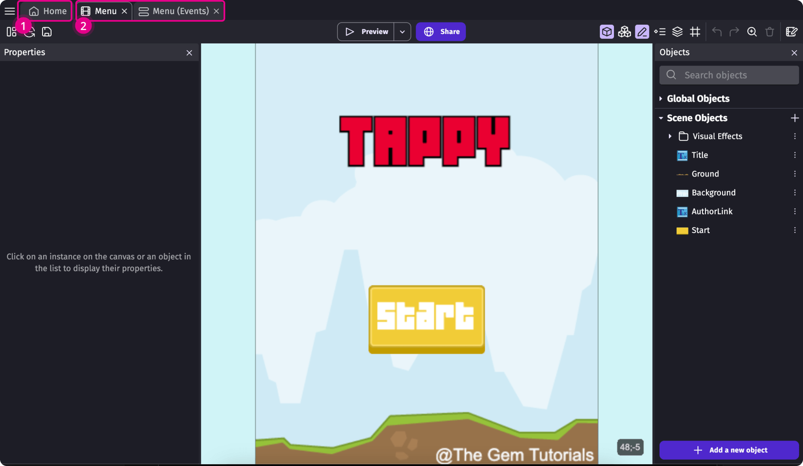
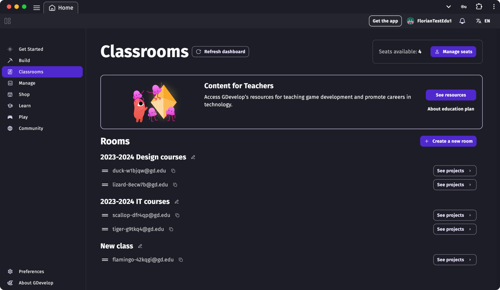
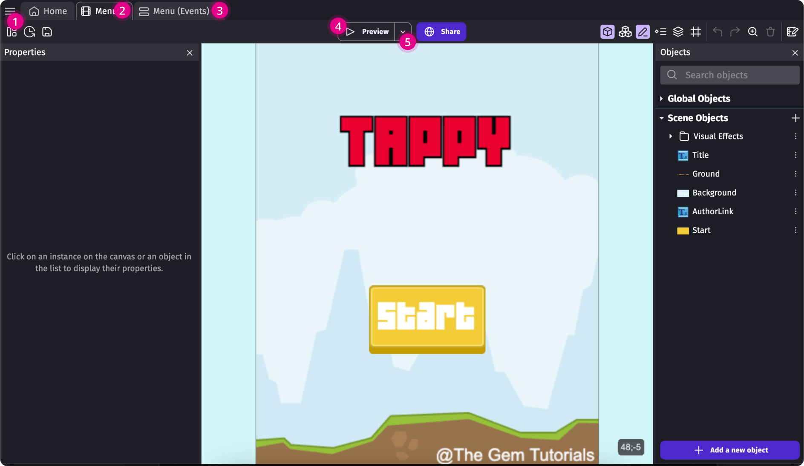
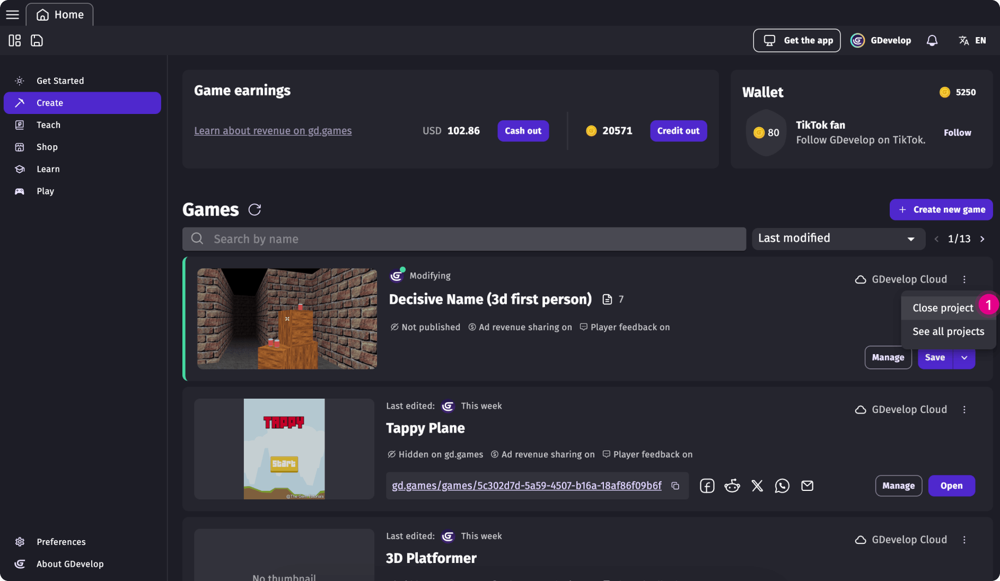
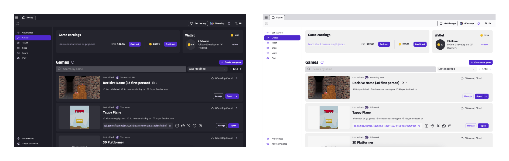

# GDevelop's user interface

GDevelop's main game creation interface is divided into multiple tabs: the **Home Page** (1) and **Project Editors** (2).

Watch an overview of GDevelop's layout:

  <iframe src="https://www.youtube.com/embed/bR2BjT7JG0k" frameborder="0" allowfullscreen></iframe>

## Home Page tab

The **Home Page** appears when you first launch GDevelop. It consists of multiple sections:

 1. Get Started
 2. Create
 3. Teach
 4. Shop
 5. Learn
 6. Play

### 1. Get Started
The **Get Started** section offers resources and updates tailored for new users. To disable this section on startup, check "Don't show this screen on next startup" at the bottom of the page.

### 2. Create (Games section)
The **Games section** serves as a central hub for managing your game projects, providing tools to access, analyze, and organize files. Learn more about the [Games section](/gdevelop5/interface/games/).

### 3. Teach
The Teach section is designed for educational use, offering tools for teachers and schools, including anonymous student accounts and teacher management interfaces. It is available exclusively with an [Education Subscription](https://gdevelop.io/pricing/education). Learn more about the advantages of [Teacher accounts](/gdevelop5/education/#teacher-accounts-managing-students-and-their-work).

### 4. Shop
GDevelop's Marketplace offers pre-made assets, including:

 * Character animations
 * Backgrounds and props
 * Particles and visual effects
 * User interface parts
 * Smart, ready-to-use objects
 * Ready-made game templates
 * Sounds and music

Creators can contribute and sell their assets. [Learn more about selling assets here](gdevelop5/community/sell-asset-pack-store/).

### 5. Learn
The **Learn section** includes courses, tutorials, videos, and documentation to help users start their game creation journey with GDevelop.

### 6. Play
The Play section showcases community-made games published on gd.games, including multiplayer titles. [Providing written feedback](/gdevelop5/interface/games-dashboard/player-feedback/#giving-feedback) to creators through GDevelop's player feedback interface gives you [credits](/gdevelop5/interface/profile/credits/) in exchange. These credits are redeemable in the Shop.

## Project editors

When editing a game with GDevelop, multiple editors can be opened in tabs next to the home page:

 1. Project manager
 2. Scene editor
 3. Events editor
 4. Preview
 5. Debugger

### 1. Project manager

Located in the upper-left corner, the **[Project manager](/gdevelop5/interface/project-manager/#project-manager)** becomes active when a project is open. It provides access to:

 * [Global variables](/gdevelop5/all-features/variables/global-variables/#global-variables)
 * [Resources](/gdevelop5/interface/project-manager/resources)
 * [Scenes](/gdevelop5/interface/scene-editor/)
 * [Extensions](/gdevelop5/extensions/tiers/#extension-tiers)
 * [External events](/gdevelop5/interface/events-editor/external-events/#external-events)
 * [External layouts](/gdevelop5/interface/scene-editor/external-layouts/#external-layouts)

Use the project manager to add new elements to your project.

!!! note

    GDevelop doesn't close a project automatically. Even if all project tabs are closed, GDevelop still considers the project to be open and active.

To close a project, click the three-dot menu on the project's card and select "Close Project." Ensure all changes are saved beforehand.

### 2. Scene editor

The **Scene editor** is where you design and build game levels and menus by placing and configuring objects. The first scene in the list is loaded when the game starts.

Learn more about the scene editor [here](/gdevelop5/interface/scene-editor).

### 3. Events editor
The Events Editor allows you to define your game's logic using GDevelop's visual no-code system.

Learn more about [its usage on this page](/gdevelop5/interface/events-editor) or check [the help about events](/gdevelop5/events).

### 4. Preview
You can preview your project at any time using the **[Preview](/gdevelop5/interface/preview/#previewing-your-game)** button in the toolbar. Additional options are available in the drop-down menu next to the button.

### 5. Debugger
The **[debugger](/gdevelop5/interface/debugger/profile-your-game/)** allows you to inspect a running game, helps identify performance bottlenecks, and optimize resource usage.

## Other sections of the app

Additional sections include:

 1. **GDevelop account (profile):** Manage subscriptions and account settings. [Learn more](/gdevelop5/interface/profile/#cancelling-your-subscription)
 2. **Preferences:** Customize language, theme, and keyboard shortcuts. [Learn more](/gdevelop5/preferences/#preferences)
 3. **About GDevelop:** View update history and check for [available updates](/gdevelop5/interface/updates).

!!! note

     At startup, GDevelop will check for new updates. If a new update is available, it will automatically be downloaded (unless deactivated in preferences).

### GDevelop UI themes

GDevelop provides two official themes: **GDevelop Default Dark** and **GDevelop Default Light**, as well as multiple community-contributed themes. You can choose them from the app preferences.

