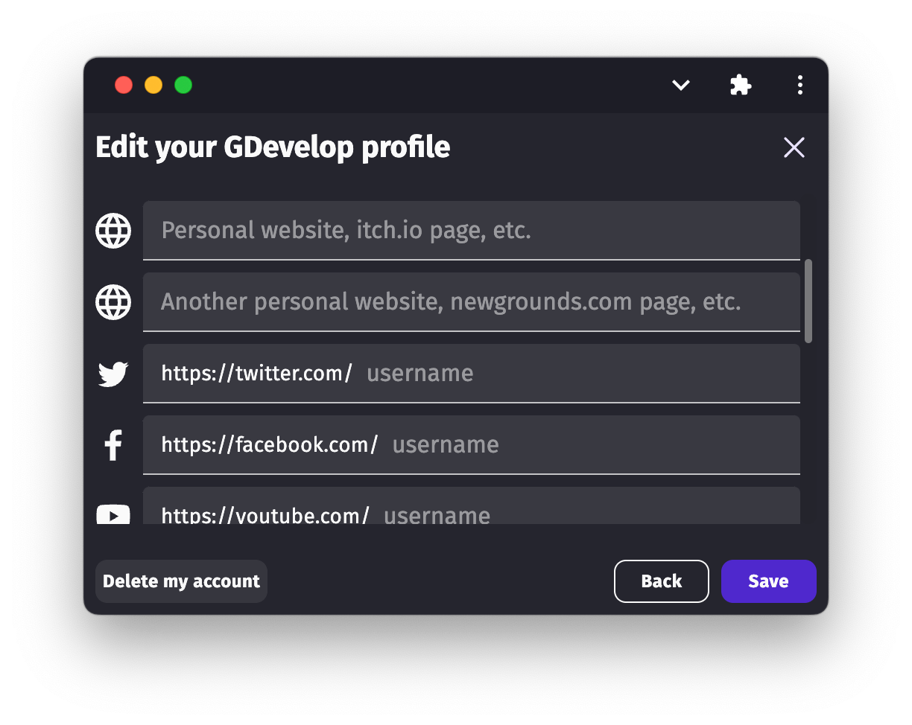

# Account Deletion

You can request at any time your whole GDevelop account to be deleted.

This will remove access to:

- All your cloud projects,
- Projects shared with you,
- Your purchases on the asset store (assets, game templates),
- Your access to all online services provided by GDevelop for your published games: administration of games on gd.games, leaderboards, analytics, player feedbacks...

This will also:

- Make your account unavailable as a player account for games using GDevelop authentication.

Before doing so, it's recommended that you *manually check or remove everything* on your account to verify you don't need anything that would become inaccessible once your account is deleted.

## Only remove some published games

In case you just want to remove something related to a game, but not your full account, you can do so from the **Game Dashboard** in GDevelop. Find the game that was published (it can be on gd.games or anywhere else). You can then:

- Uncheck the option to display it on gd.games. This is all that is needed to avoid it being visible on gd.games
  

- You can also administrate various online services provided by GDevelop for games: leaderboards, analytics, player feedbacks...

- For other websites or app stores, you have to contact them or follow the procedure to get your game removed - remember that GDevelop is not responsible or linked to games published on other app stores.

## Delete my entire GDevelop account

!!! danger

    This will delete your access to your GDevelop account, your cloud projects, administrator access to published games, leaderboards, analytics, player feedbacks, cloud projects shared with you, purchases on the asset store and you won't be able to create a new account in the future.

To initiate a full account deletion, follow these steps:

1. Open the GDevelop app (mobile app, desktop app or the [web app](https://editor.gdevelop.io/)).
2. Login with your profile, if it's not already done.
3. Open your profile page by clicking on your username in the GDevelop homepage.
4. In your **Profile**, click **Edit my profile**.
5. At the bottom, click **Delete my account**.

!!! note

    Before your account can be deleted, make sure you've cancelled your subscription/membership, if any, to GDevelop. You will lose any premium feature related to the subscription.

Validate your choice after clicking on **Delete my account**. Your account will be removed and inaccessible soon after.

You may also want to remove your account on the GDevelop forums or from social media associated with GDevelop, like Discord. For each of these, check directly on the website of the community.
