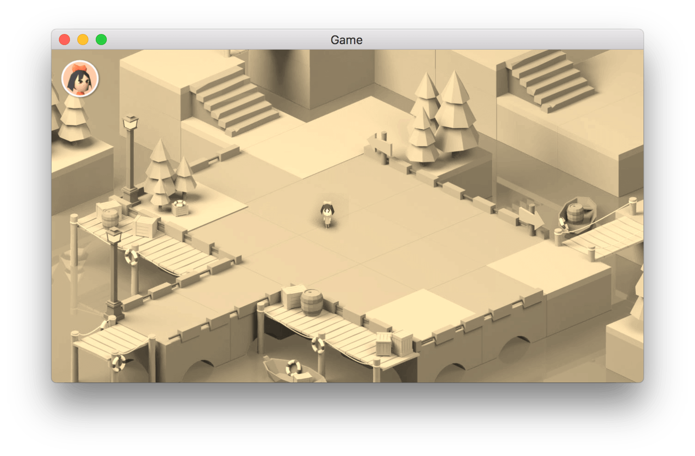
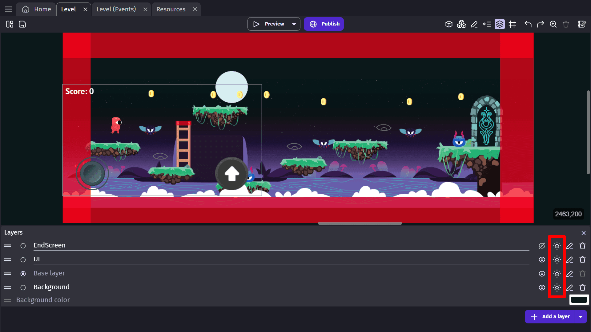
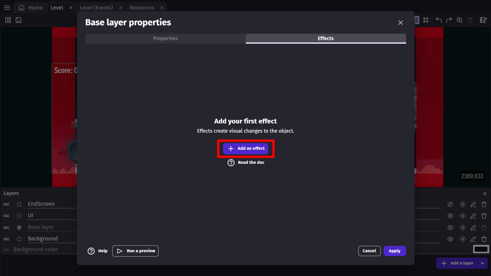
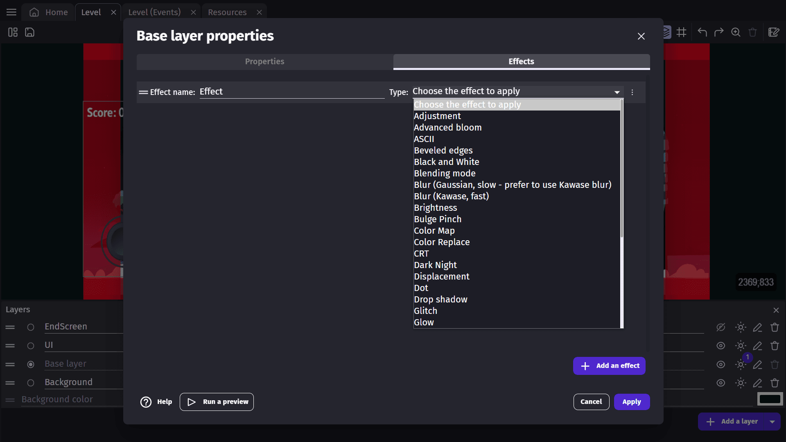
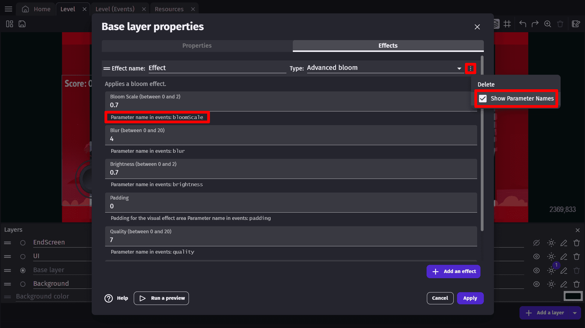
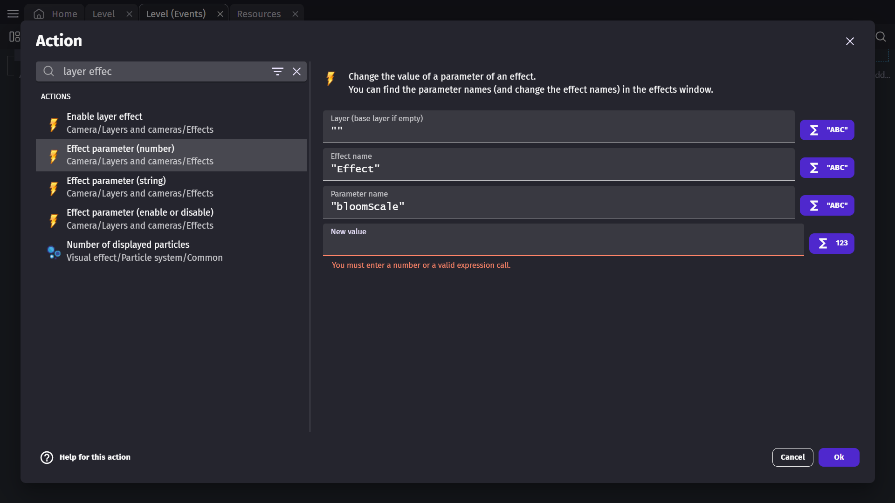

# Layer Effects

You can add effects to the layers of your scene. These effects allow you to quickly change the atmosphere and rendering of your game. For example, here is the _sepia_ effect added to the isometric-game example:

!!! tip

    You can also add [effects to objects on the screen](/gdevelop5/objects/effects) - useful to create advanced visual effects in your game.

## Adding an effect to a layer

In the scene editor, open the [Layers panel](/gdevelop5/interface/scene-editor/layers-and-cameras). Choose the Base Layer, or another layer, and click on the **Edited effects** button to edit and add effects to that layer.

The window that opens will prompt you to **Add an effect**. If you click on this button you'll add a new effect to your layer.

A new layer effect is named "Effect" when created. This name will be useful later for modifying the parameters of the effect during the game.

From the drop-down menu, you can choose the type of effect you'd like to have on your layer.

The window will then show the parameters for the effect - these parameters depend on the effect type that was chosen.

You can leave the default parameters as they are or change them from this window.

## Try the game with the effect

Launch a preview to see the effect applied. The effect is applied on the whole layer, so all the objects on the layer will be part of the effect.

If a preview is already running, you can see **the changes you've made in real-time** by clicking on **Apply changes to preview**. Read more about [Live Previews here](/gdevelop5/interface/preview).

If you have multiple layers, you can add the same effect to all of your layers.

!!! note

    For example, if you have a Background layer, the base layer and a UI layer (showing the interface of the game), you might want to add effects to the Background layer and the base layer - but not to the UI layer.

!!! warning

    The background color of the scene cannot have any effect applied. For a background that is more than a single color, you can use a [Tiled Sprite](/gdevelop5/objects/tiled_sprite) and apply an effect to the layer that object is on.

## Enabling or disabling an effect during the game

You can toggle an effect on or off without removing it entirely. Use the **Enable effect on a layer** action, specifying the layer name, the effect name, and whether to enable or disable it. The **Layer effect is enabled** condition lets you check the current state of an effect.

This is useful for gameplay feedback — for example, enabling a color-distortion effect when the player takes damage, then disabling it a moment later.

## Changing effect parameters during the game

Using events, you can manipulate a layer effect's parameters during the game. It can be useful for different situations: a day-night cycle, a flashback effect, etc...

First, check out the name of the effect and the name of the parameter to change in the [Layers panel](/gdevelop5/interface/scene-editor/layers-and-cameras). For this, open the Layers panel, then click to edit the effects of the layer. Then from the drop-down menu, toggle the display of parameter names.

In this example, the Advanced bloom effect is called "Effect" and has several parameters, but one of them is called "bloomScale".

You can then add an event with an action called "Effect Parameter":

* Enter first the layer name (be sure to add quotation marks). For the base layer, enter an empty string (`""`).
* Enter the name of the effect, in this case `"Effect"`.
* Enter the name of the parameter, in this case `"bloomScale"`.
* Finally, enter the new value to be set for this parameter.

!!! danger

    All of these names are case-sensitive. Be sure to double-check the name of your effect and parameters.

There are three different actions depending on the type of parameter you want to change:

- **Effect property (number)** — for numeric values such as blur strength or brightness.
- **Effect property (string)** — for text values such as the texture file path used by the Displacement effect.
- **Effect property (boolean)** — for yes/no toggles exposed by some effects.

## Advanced effects usage

## Reference

All effects are listed in [the effects reference page](/gdevelop5/all-features/effects/reference/).

!!! warning

    While most effects are intuitive enough to be used directly, some might require a bit more knowledge to understand what they do. Dedicated pages explain some of the advanced effects.